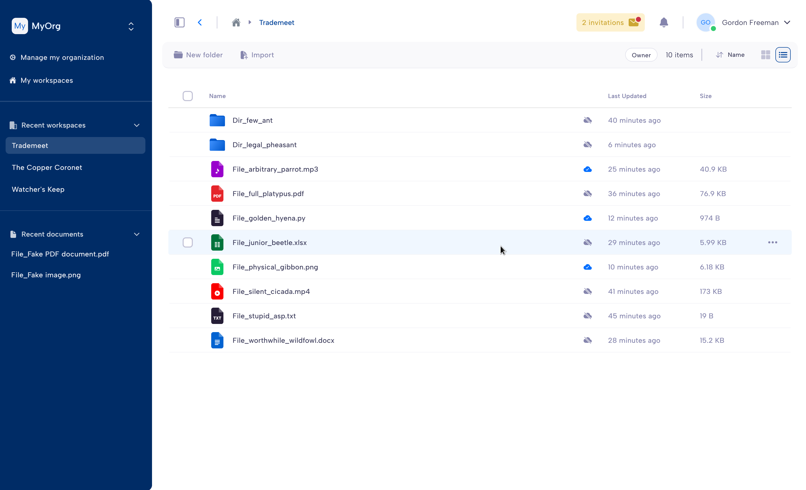

.. image:: docs/parsec_doc_logo.png
    :align: center

======
Parsec
======

.. image:: https://github.com/Scille/parsec-cloud/actions/workflows/ci.yml/badge.svg
    :target: https://github.com/Scille/parsec-cloud/actions/workflows/ci.yml
    :alt: Continuous Integration

.. image:: https://github.com/Scille/parsec-cloud/actions/workflows/package-server.yml/badge.svg
    :target: https://github.com/Scille/parsec-cloud/actions/workflows/package-server.yml
    :alt: Latest Server Packaging CI

.. image:: https://github.com/Scille/parsec-cloud/actions/workflows/package-desktop.yml/badge.svg
    :target: https://github.com/Scille/parsec-cloud/actions/workflows/package-desktop.yml
    :alt: Latest Desktop App Packaging CI

.. image:: https://github.com/Scille/parsec-cloud/actions/workflows/package-webapp.yml/badge.svg
    :target: https://github.com/Scille/parsec-cloud/actions/workflows/package-webapp.yml
    :alt: Latest Web App Packaging CI

.. image:: https://img.shields.io/pypi/v/parsec-cloud.svg
    :target: https://pypi.python.org/pypi/parsec-cloud
    :alt: Pypi Status

.. image:: https://readthedocs.org/projects/parsec-cloud/badge/?version=latest
    :target: http://parsec-cloud.readthedocs.io/en/latest/?badge=latest
    :alt: Documentation Status

.. image:: https://img.shields.io/badge/code%20style-ruff-D7FF64
  :target: https://github.com/charliermarsh/ruff
  :alt: Code style: ruff

Parsec is a cloud-based application for simple, yet cryptographically secure file sharing.

Key features:

- Client-side encryption to ensure your data is only accessed by you and the people you share it with.
- Cryptographic signature to identify the author of each change.
- Easily and securely invite users to join your organization via link and token code.
- Virtual drive on your computer so you can access your data with your preferred software as usual.
- Browse data history and recover files from any point in time.
- Easy to self-host

🛡️ Security
==========

We take the security of our software products and services seriously.

If you believe you have found a security vulnerability, please report it to us
through coordinated disclosure as described in our `Security Policy <SECURITY.md>`_.

📘 Docs
======

See `Parsec Documentation <https://docs.parsec.cloud/>`_.

📦 Install
=========

Windows
-------
Download latest Windows installer from `Releases <https://github.com/Scille/parsec-cloud/releases/latest>`_.

Linux
-----
Install latest snap from the `Snap Store (parsec) <https://snapcraft.io/parsec>`_.

macOS
-----
Download latest macOS installer from `Releases <https://github.com/Scille/parsec-cloud/releases/latest>`_.

You will also need to download and install `MacFUSE <https://osxfuse.github.io/>`_.

Self-hosted
-----------

Take a look at `Parsec Server Deployment <https://docs.parsec.cloud/en/latest/hosting/deployment/index.html>`_.
