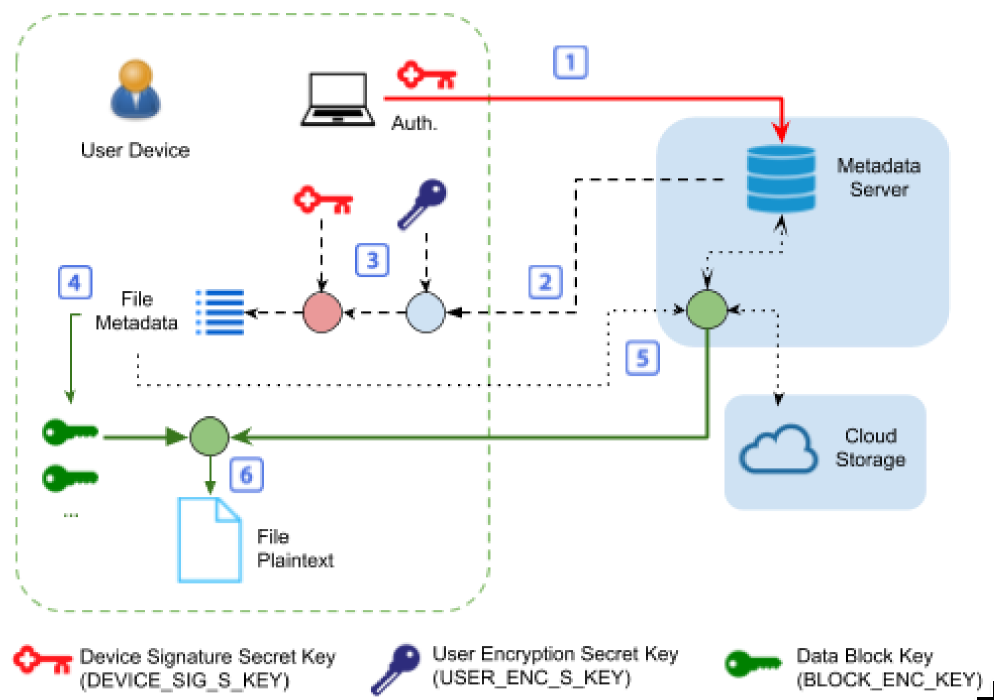

.. Parsec Cloud (https://parsec.cloud) Copyright (c) BUSL-1.1 (eventually AGPL-3.0) 2016-present Scille SAS

.. _doc_cryptography:

============
Cryptography
============

Overview
========
The Parsec solution involves many cryptographic concepts in order to allow, for example, key exchanges between users of the same work-group, or user registration without involving private keys other than those created by the new user for himself and those of the inviting administrator.

A user can own one or more devices that can be used transparently, and it is able to add new devices from already registered devices anytime.

An organization can be bootstrapped without the backend administrator knowing the root key of the organization.

In this section, the mechanisms allowing Parsec to reach this Zero-Trust level of confidentiality will be briefly explained (in this context, Zero-Trust means that no trust has to be placed in the back-end for the solution to be secure).

Creating an Organization
========================

1. The administrator of the metadata server registers the name of the organization and obtain an **initialization token** to be transmitted to the person selected to be the first administrator of the organization.
2. The application creates on the administrator's device **an organization key** (ORG_ROOT_SIG_S_KEY, ORG_ROOT_SIG_P_KEY), **a user key** (USER_ENC_S_KEY, USER_ENC_P_KEY), and a **device key** (DEVICE_SIG_S_KEY, DEVICE_SIG_P_KEY). The application certifies user and device public keys with the organization's signature key and upload them on the back-end. Only the public part of the organization root key (ORG_ROOT_SIG_P_KEY) is uploaded to the metadata server, the secret part of the key is intentionally discarded, which makes it nonrecoverable.

Adding a new User
=================

The creation of a new user can only be done by an existing user, already registered in the organization and having the Administrator profile. Let's consider the case where Alice is Administrator and wants to register Bob:

1. Alice signals to the back-end that Bob is invited to the organization and transmits his email address.

2. The metadata server sends an email to Bob with an invitation URL containing the organization ID and an unique identifier for the invitation canal.

3. Alice and Bob proceed to an `authenticated Diffie Hellman exchange <https://en.wikipedia.org/wiki/Diffie%E2%80%93Hellman_key_exchange>`_ (DH) :
    a. Alice and Bob create asymmetric ephemeral keys and exchange public parts of that keys using the metadata server as a transmission canal to deduce a secrete key shared in the style of DH.
    b. To prevent a malicious metadata server to modify the DH canal (Man-in-the-middle attack), Alice and Bob authenticate their secrete key using the `Short Authentication String <https://www.iacr.org/archive/crypto2005/36210303/36210303.pdf>`_ (SAS) protocol. Each party share verbally a SAS token that his pair must validate from a set of tokens `(accordingly to the recommendations of the scientific community) <https://www.cs.columbia.edu/~nieh/pubs/eurosys2019_e3.pdf>`_ .

4. Bob generate his user keys (USER_ENC_P_KEY, USER_ENC_S_KEY), his device keys (DEVICE_SIG_P_KEY, DEVICE_SIG_S_KEY) and use the authenticated channel to share their public parts with Alice.

5. Alice signs those two keys with the help of her private key (DEVICE_SIG_S_KEY) and upload those certified keys to the metadata server. Since each user key is signed by a device registered in the organization and the one of the first user is signed by the root key (ORG_ROOT_SIG_S_KEY), re-validating the signature trust-chain, a client is able to verify that a key has been added to Parsec by a legitimate terminal and can be considered as valid. Each user is attributed an email address at its creation in order to reflect his correspondence to a natural person. For a given email address, it exists at least one non-revoked user in the organization (i.e. revocation of the existing user then creation of a new user with the same email address), while enabling other users to find him with the same email address.

Adding a new Device
===================

The creation of a new device works in a similar way to the creation of a new user, except that the new device doesn't have to create a user key (USER_ENC_P_KEY, USER_ENC_S_KEY). Instead it is the role of the inviting device to transmit that information in a secure way. The same authenticated DH mechanism described in the previous section is used. The new device key is certified in the same way using the existing device signature key (DEVICE_SIG_S_KEY) before being uploaded to the metadata server.

Management of file reads
========================

The Parsec client tries to prioritize local access to data when reading a file. This isn't always possible and the consultation of the metadata server can be mandatory.

Reading of a file is described in the following figure:

1. If the Parsec client doesn't locally possess the File Manifest, it authenticates itself to the metadata server and ask for it ;
2. The metadata server ensures that the client has the right to access it and then sends the File Manifest ;
3. The Parsec client decrypts the resulting manifest and verifies its signature (notice that the retrieval phase of the public key of the device that has signed the manifest is analogous to the mechanism presented in the chapter dedicated to the management of the users/devices) ;
4. The Parsec client can then find all the blocks necessary to read the file ;
5. Blocks that aren't available locally are requested by the Parsec client from the metadata server. Once downloaded, the Parsec client decrypts them and check their hashes ;
6. Finally, the Parsec client combine the decrypted blocks to form the content of the requested file.

The user interacts with files using his usual regular software. Data are first stored on the local drive for performance and resilience reasons (e.g. to enable Parsec working offline). Then, the Parsec client sends data modifications to the metadata server.

The history enables the user to list all versions of a file, and to restore its content at one of those versions.

Management of Workspaces and access control
===========================================

In order to be able to store files, the user has to create a workspace and save the access information (unique identifier WS_ID and symmetric encryption key WS_ENC_KEY) in his User Manifest.

The sharing of a workspace consists in two operations:

1. Provide access data (WS_ID and WS_ENC_KEY) to the Workspace Manifest. This is done by sending encrypted messages between users and is handled automatically by the Parsec client. The new user then stores that information in its User Manifest ;
2. Inform the metadata server that a new user can read (and, where applicable, write) the elements linked to a given workspace.
