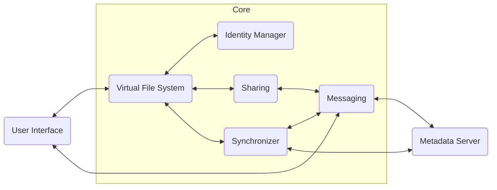

<!-- Parsec Cloud (https://parsec.cloud) Copyright (c) BUSL-1.1 2016-present Scille SAS -->

# Parsec client functional components

Note: This is a work in progress.

- [Parsec client functional components](#parsec-client-functional-components)
  - [Mountpoint](#mountpoint)
  - [Gui](#gui)
  - [Core](#core)
  - [Metadata server](#metadata-server)

## Mountpoint

The `mountpoint` component provides a virtual filesystem allowing external applications to access data managed by Parsec.
Any operation performed on this virtual file system, such as reading a directory or creating a file, goes from the OS filesystem's API through the `mountpoint` component.

## Gui

The `GUI` component provides a graphical interface and interacts directly with the `core` or the OS filesystem (but never with the `mountpoint`).
In contrast to the `mountpoint` component, the `GUI` component subscribes to events provided by the `metadata server` in order to notify the user in case of concurrent operation, deletion of a group, etc.

## Core

The `core` component is responsible for the client side logic and his composed of 5 sub-modules (see figure below):

- The `Virtual File System` (VFS): Receive filesystem-related requests originating from the `mountpoint`, exposing a filesystem like API.
  To optimize its performance, this component doesn't push the changes to the `metadata server`, instead it only stores the encrypted changes locally on the machine.

- The `Synchronizer`: This component periodically transfers the locally stored changes to the `metadata server`.
  It listens the server for notifications about remote changes and handles version conflicts between the local and remote metadata.

- The `Identity manager`: Save the user's identity in memory (as a session).
  The user's pass-phrase of the user (which isn't stored) concatenated with a SALT encrypts the device private key (`DEVICE_SIG_S_KEY`) and the user private key (`USER_ENC_S_KEY`) which is shared between the other devices used by the user.
  The `DEVICE_SIG_S_KEY` is used to sign a modification. The `USER_ENC_S_KEY` is used to encrypt user's manifest.

- `Messaging`: Listens for notifications sent by the `metadata server` (the `core` is linked to the `metadata server` with a TCP stream).
  These messages can:

  - Ask the `core` to perform a specific action (like when file is shared)
  - Be purely informative, and are thus displayed as a notification on the client application.

- `Sharing`: Handles the sharing operations. When it receives a workspace share event, it decrypts the message and adds the entries to the user manifest.
  If messages are sent but the user isn't logged in, they are kept on the `metadata server` until the user is connected.

## Metadata server

The `metadata server` is a remote server that contains 4 sub-modules:

- `Messaging`: Send technical notifications to users.

- `Data/Metadata Storage`: Stores file's data blocks (`BLOCKS`) to the configured object storage provider (AWS, OpenStack Swift or others), The metadata (Versioned Blobs => `VLOBS`) are stored on the server's PostgreSQL database.

- `Notification`: Notifies connected clients when a data is modified or when receiving a new message.

- `Public Key Infrastructure` (PKI): Links a user/device identity with its public keys (`USER_ENC_P_KEY`, `DEVICE_ENC_P_KEY`).
