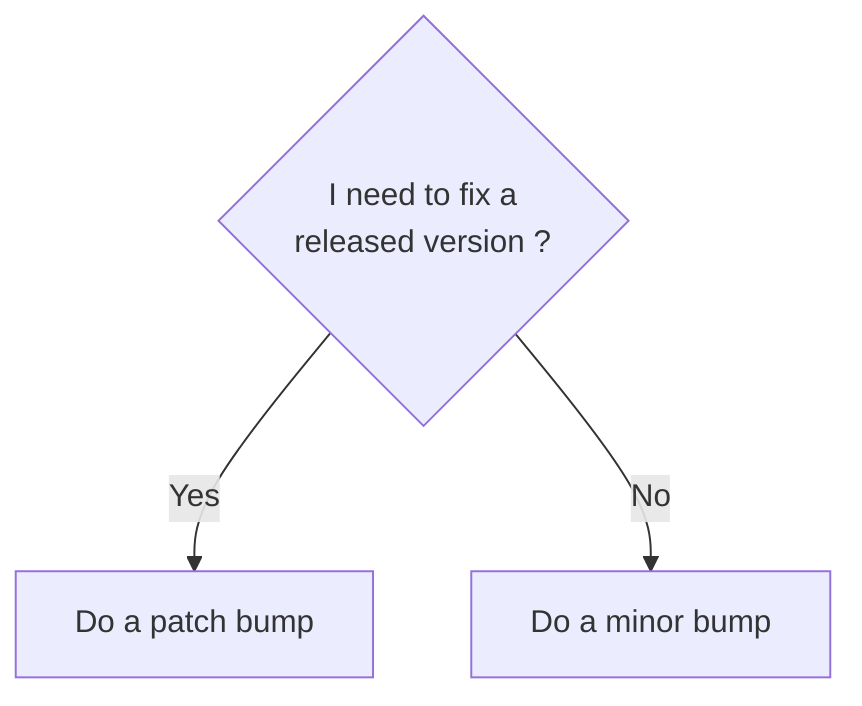
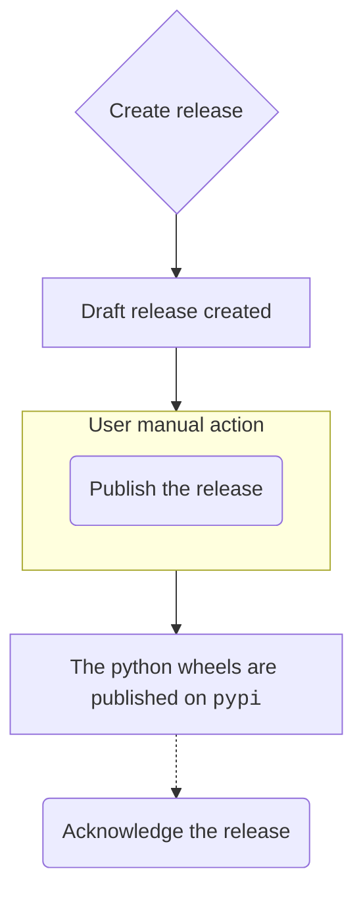

<!-- Parsec Cloud (https://parsec.cloud) Copyright (c) BUSL-1.1 2016-present Scille SAS -->

# Release Cheat-Sheet

- [Major/minor vs patch versions](#majorminor-vs-patch-versions)
- [Release Checklist](#release-checklist)
- [Release major/minor version](#release-majorminor-version)
  - [Create release candidate version](#create-release-candidate-version)
  - [Create the release](#create-the-release)
    - [After the release build script: outcome](#after-the-release-build-script-outcome)
    - [After the release build script: Windows signing](#after-the-release-build-script-windows-signing)
    - [After the release build script: publishing](#after-the-release-build-script-publishing)
  - [Continue stabilizing the release](#continue-stabilizing-the-release)
  - [Once the release is stable](#once-the-release-is-stable)
  - [Acknowledge the release](#acknowledge-the-release)
  - [The release train diagram](#the-release-train-diagram)
- [Release patch version](#release-patch-version)
  - [(Re)create the version branch](#recreate-the-version-branch)
  - [Preparing the patched version](#preparing-the-patched-version)
  - [Follow the major/minor guide](#follow-the-majorminor-guide)
  - [All done](#all-done)

> [!IMPORTANT]
> If you need to create a release (i.e. create a release branch and a tag),
> you need to be a part of `Parsec-Deploy` GitHub team else you will get blocked when trying to push the branch and tag.

## Major/minor vs patch versions

When the need for release comes, the obvious question is:

> What is going to be the next version ?

The flowchart is:



In other words, the patch bump should only be used to cherry-pick a subset of
changes present on the master on a previous version.

## Release Checklist

For each release types, apply the following checklist:

- The newsfragment were squashed to generate the block added to [`HISTORY.rst`](/HISTORY.rst).
- The updated [`HISTORY.rst`](/HISTORY.rst) is correctly formatted (Some news fragment may introduce invalid syntax that can break the RST file).
- The translations are up-to-date (check the translations in [`client/src/locales/en-US.json`](/client/src/locales/en-US.json) and [`client/src/locales/fr-FR.json`](/client/src/locales/fr-FR.json)).
- The `releaser.py` correctly update the version in the expected files (Non-exhaustive list: `server/pyproject.toml`, `LICENSE`, `server/parsec/_version.py`, `npm` `package.json` files, `Cargo.toml` files).

> Most of the work can be done using the `misc/releaser.py` script (It won't check if the translation are up-to-date).

## Release major/minor version

In the following we will consider we want to release version `v3.2.0` from `3.1.1-a.0+dev`.

### Create release candidate version

Release is complex and fails pretty often, so you should create release
candidate versions.

As a matter of fact you should only consider creating a final version only
if you already have a release candidate that doesn't need any correction.

Yes, even this ultra small 1 line typo fix. We've all been there, we all
know how it ends up ;-)

Release candidate versions must have the naming `3.2.0-rc.0`, `3.2.0-rc.1`, etc.

> The important part is pre-release part `-rc.N`.
> You can start the release candidate numbering to either 0 or 1, depends on your taste.

### Create the release

The script `misc/releaser.py` provides an automated workflow to generate a new release/build.

Note: The commits and release tag are annotated & signed, so you must have your GPG key
at the ready (and this key should be configured in your github account).

To create a new release, simply execute:

```shell
git fetch
python misc/releaser.py build --base=origin/master --version 3.2.0-rc.0
```

> `git fetch` is used to update the remote ref, that is used to get the latest remote change on `master`.
> We specify `--base=origin/master` to be able to use that script from any branch.

The script will:

- Ensure the release version is greater than the current version.
- Ensure _git env_ is clean (no changes to be committed).
- Create the release branch `releases/3.2` (and switch to it).
- Update the license Date & version.
- Update the parsec version across different files in our repository.
- Update `HISTORY.rst` with a new block generated using the news fragments found in `newsfragments/`.

  At this step, the script will ask you to review the changes made so far (mostly to check if [`HISTORY.rst`](/HISTORY.rst) was correctly generated).

  For instance, if some release candidate versions have been released before this one,
  now is the time to merge back the corresponding release notes.

- Create the release commit with the message `Bump version 3.1.1-a.0+dev -> v3.2.0-rc.0`.

  The commit will contains the change made to `HISTORY.rst`, the various files referencing the parsec version, the updated license and the removed news fragments.

- Create the release tag `v3.2.0-rc.0`.

  The script will display the tag information, it needs to be reviewed before proceeding (check the tag signature).

- Create the dev commit with the message `Bump version v3.2.0-rc.0 -> v3.2.0-rc.1+dev`.

- Push the branch `releases/3.2` & the tag `v3.2.0-rc.0`

  The script will require confirmation before pushing.

#### After the release build script: outcome

After the script has finished and pushed the release branch & tag to the repository,
this will trigger the `releaser` workflow that will:

1. Create the release as a draft in <https://github.com/Scille/parsec-cloud/releases>.
2. Package the server code in Python wheels.
3. Package the client code in multiple formats (Linux: AppImage/Snap, Windows: unsigned MSI, MacOS: DMG)

#### After the release build script: Windows signing

Once the workflow done Windows builds require to be manually signed. This is done by running a script:

```shell
python misc/sign_windows_release.py --version 3.2.0
```

This command will download the GUI & CLI artifacts, sign them (you obviously need to have
the signing certificate on your machine !), and finally re-upload the result on the release.

#### After the release build script: publishing

With the release published, this will trigger the workflow `publish` that will upload the generated python wheels to `pypi`.

### Continue stabilizing the release

When we prepare a release we first mark-it as a pre-release denoted by the release candidate part of the version (the `-rc.N` thingy).
Once a pre-release is published, it goes through a test campaign to assess its stability.

If the tests suite reveal that the current release candidate is stable, you can go to next step [Once the release is stable](#once-the-release-is-stable)

Else, you will need to add fixes to the release branch (cf [Preparing the patched version](#preparing-the-patched-version)) and create the next release candidate.

To create the next RC once you've added the fixes you wanted, you execute the following command:

```shell
python misc/releaser.py build --current
```

> [!NOTE]
> We don't specify the version here but use the `--current` flag as the current version of the release branch at this step is `v3.2.0-rc.1+dev`

Like in [create the release](#create-the-release), follow the steps in [after the release build script](#after-the-release-build-script)

### Once the release is stable

Once the release candidate is considered stable and ready for a stable (that the public can use) release

```shell
python misc/releaser.py build --version 3.2.0
```

Then follow the remaining steps described in [after the release build script](#after-the-release-build-script)

### Acknowledge the release

Acknowledge (or "ack") is the process of merging changes from a release branch (`releases/3.2`)
back into the base branch (`master`). This is particularily important when there are hotfix commits
in the release branch and those changes are not yet in `master`.

1. Make sure your local branches `master` and `releases/3.2` are up to date

    ```shell
    git fetch origin master:master releases/3.2:releases/3.2
    ```

2. Acknowledge the release with the following command:

    ```shell
    python misc/releaser.py acknowledge 3.2.0
    ```

    This command will:
      - Ensure the version to acknowledge is indeed a release version (no pre-release, dev or local part).
      - Create a local branch `acknowledges/3.2.0`.
      - Push the acknowledge branch to the remote server.
      - Create a draft pull-request for the acknowledge (using [`Github cli`](https://cli.github.com/))

3. Rebase the acknowledge branch to fix potential merge conflicts (this is common when branches diverged).

    ```shell
    git rebase -i origin/master
    ```

    If there are multiple version bump commits, reorder and `squash` them all together into a single commit (`Bump version A -> B` & `Bump version B -> C` can be squashed into `Bump version A -> C`).

    ⚠️ Fix merge conflicts carefully. If in doubt, do not hesitate to ask the commit authors.

4. (PATCH release) In case you acknowledge a patch version, e.g. `3.2.5`, it is likely that previous versions
   (`3.2.0`-`3.2.4`) have already been acknowledge. In that case, ensure to remove commits from the PR that have already
   been acknowledge. Look for the previous ack PRs and compare descriptions to identify which commits to remove from
   your current ack PR.

5. You may need to add new commits to your ack PR:

   - to fix any CI issue (format, lint)
   - to remove newsfragment files that are already present in the changelog (there shouldn't be any
     newsfragment if rebase was done right and the release branch is up to date).

6. Check the ack PR changes & commit history. If everything seems OK mark it "Ready for review".

### The release train diagram



## Release patch version

In the following we will consider we want to release version ``v3.2.1`` from `v3.2.1-a.0+dev`.

### (Re)create the version branch

If the release branch ``releases/3.2`` used for the ``3.2.0`` release has been
removed, it needs to be recreated.

> [!IMPORTANT]
> The release branch should live on their own and should not be deleted

In that case, use the git tag `v3.2.0` and push it to the branch `releases/3.2`

Of course the version branch should be reused if a previous patch release has
already been done (e.g. you're planning to release ``v3.2.2``).

### Preparing the patched version

To include some fixes for the patch version, you can do that in 2 different ways:

- Using a Pull-Request:

  Directly open a PR with the changes you want to include in the patch version targeting the branch `release/3.2`.

  You're not required to open 2 PR (one for master and one for the release branch)

  > This is okay since at the end of a release, it should be acknowledged thus adding the fixes into master.

- Cherry-pick the commit:

  If the fixes are already on master, you could cherry-pick the commits into a branch based on the release branch and open a PR.

> [!TIP]
> For the cherry-pick approach, it's recommended to do it ASAP once the PR is merged on the main branch to prevent forgetting it (or forgetting which commits to include in the cherry-pick)

### Follow the major/minor guide

You know the drill, creating the release:

> [!CAUTION]
> For the following steps, your current git branch **MUST** be `releases/3.2`.

- Creating the first release candidate:

  ```shell
  python misc/releaser.py build --version 3.2.1-rc.0
  ```

- Iterating on the release candidates:

  ```shell
  python misc/releaser.py build --current
  ```

- Finally, releasing the patch version:

  ```shell
  python misc/releaser.py build --version 3.2.1
  ```

### All done

Like the major/minor release, you need to [acknowledge the release](#acknowledge-the-release).
Here you will need to rebase the branch to remove the previous commit of the release branch that are already included in the main branch.
