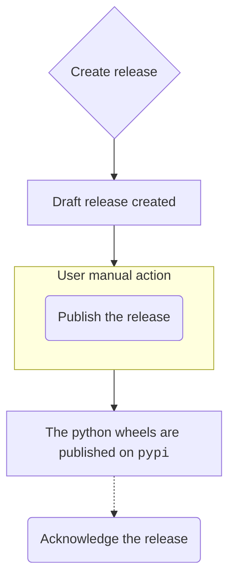

<!-- Parsec Cloud (https://parsec.cloud) Copyright (c) BUSL-1.1 (eventually AGPL-3.0) 2016-present Scille SAS -->

# Release Cheat-Sheet

- [Release Cheat-Sheet](#release-cheat-sheet)
  - [Major/minor vs patch versions](#majorminor-vs-patch-versions)
  - [Release Checklist](#release-checklist)
  - [Release major/minor version](#release-majorminor-version)
    - [Create release candidate version](#create-release-candidate-version)
    - [Create the release](#create-the-release)
    - [Sign the installers](#sign-the-installers)
    - [Acknowledge the release](#acknowledge-the-release)
    - [The release train diagram](#the-release-train-diagram)
  - [Release patch version](#release-patch-version)
    - [(Re)create the version branch](#recreate-the-version-branch)
    - [Cherry-pick the changes](#cherry-pick-the-changes)
    - [Follow the major/minor guide](#follow-the-majorminor-guide)
    - [All done](#all-done)

## Major/minor vs patch versions

When the need for release comes, the obvious question is:

> what is going to be the next version ?

The flowchart is:

- You want to release what's on the tip of master ⟶ do a minor bump
- Otherwise ⟶ do a patch bump

In other words, the patch bump should only be used to cherry-pick a subset of
changes present on the master on a previous version.

## Release Checklist

For each release types, apply the following checklist:

- The newsfragment were squashed to generate the block added to [`HISTORY.rst`](/HISTORY.rst).
- The updated [`HISTORY.rst`](/HISTORY.rst) is correctly formated (Some news fragment may introduce invalid syntax that can break the RST file).
- The translations are up-to-date (check the translations in [`oxidation/client/src/locales/en-US.json`](/oxidation/client/src/locales/en-US.json) and [`oxidation/client/src/locales/fr-FR.json`](/client/src/locales/fr-FR.json)).
- The `releaser.py` correctly update the version in the expected files (`server/pyproject.toml`, `licenses/BUSL-Scille.txt`, `server/parsec/_version.py`).

Note: Most of the work can be done using the workflow [`release-starter`](https://github.com/Scille/parsec-cloud/actions/workflows/release-starter.yml) (_most_ because it won't cherry pick the commit need to patch a release).

## Release major/minor version

In the following we will consider we want to release version ``v2.9.0``.

### Create release candidate version

Release is complex and fails pretty often, so you should create release
candidate versions.

As a matter of fact you should only consider creating a final version only
if you already have a release candidate that doesn't need any correction.

Yes, even this ultra small 1 line typo fix. We've all been there, we all
know how it ends up ;-)

Release candidate versions must have the naming ``v2.9.0-rc1``, ``v2.9.0-rc2`` etc.

### Create the release

The script `misc/releaser.py` provides an automated workflow to generate a new release/build.

Note: The commits and release tag are annotated & signed, so you must have your GPG key
at the ready (and this key should be configured in your github account).

To create a new release, simply execute:

```shell
git fetch
python misc/releaser.py build --base=origin/master v2.9.0
```

> `git fetch` is used to update the remote ref, that is used to get the latest remote change on `master`.
> We specify `--base=origin/master` to be able to use that script from any branch.

The script will:

- Ensure the release version is greater than the current version.
- Ensure _git env_ is clean (no changes to be commited).
- Create the release branch `releases/2.9` (and switch to it).
- Update the license Date & version.
- Update the parsec version across different files in our repository.
- Update `HISTORY.rst` with a new block generated using the news fragments found in `newsfragments/`.

  At this step, the script will ask you to review the changes made so far (mostly to check if [`HISTORY.rst`](/HISTORY.rst) was correctly generated).

  For instance, if some release candidate versions have been released before this one,
  now is the time to merge back the corresponding release notes.

- Create the release commit with the message `Bump version v2.8.1+dev -> v2.9.0`.

  The commit will contains the change made to `HISTORY.rst`, the various files referencing the parsec version, the updated license and the removed news fragments.

- Create the release tag `v2.9.0`.

  The script will display the tag information, it needs to be reviewed before proceeding (check the tag signature).

- Create the dev commit with the message `Bump version v2.9.0 -> v2.9.0+dev`.

- Push the branch `releases/2.9` & the tag `v2.9.0`

  The script will require confirmation before continuing.

After the script has finished and pushed the release branch & tag to the repository,
this will trigger the `releaser` workflow that will:

1. Package the application in different format (python wheels, snap, macos app, windows raw nsis files).
2. Create the release as a draft in <https://github.com/Scille/parsec-cloud/releases>.

   At this step, you need to [sign the installers](#sign-the-installers)

Once you have signed the installers, you need to upload them to the generated draft release.
After that you can publish the release (You need to edit the [draft release](https://docs.github.com/en/repositories/releasing-projects-on-github/managing-releases-in-a-repository#editing-a-release)).

With the release published, this will trigger the workflow `publish` that will upload the generated python wheels to `pypi`.

### Acknowledge the release

If you were dealing with a final release (e.g. ``v2.9.0``)

You need to acknowledge the release (that means merge it back to the main branch).

Use the following command:

```shell
python misc/releaser.py acknowledge v2.9.0
```

This command will:

- Ensure the version we want to acknowledge is indeed a release version (no pre-release, dev or local part).
- Create the acknowledge branch `acknowledges/2.9.0`.
- Push the branch to the remote server.
- Create the pull-request using [`Github cli`](https://cli.github.com/)

### The release train diagram



## Release patch version

In the following we will consider we want to release version ``v2.9.1``.

### (Re)create the version branch

If the release branch ``releases/2.9`` used for the ``2.9.0`` release has been
removed, it needs to be recreated.

> Note: the release branch should live on their own and should not be deleted

In that case, the branch MUST be recreated at the commit ``Bump version v2.9.0 -> v2.9.0+dev``
(i.e. the commit right after the release tag) and not release tag itself.

Of course the version branch should be reused if a previous patch release has
already been done (e.g. you're planning to release ``v2.9.2``).

### Cherry-pick the changes

Most of the time, the changes needed on the patch release are also expected to
end up in the master branch.

In this case, a main PR should be opened against master, then once merge it commits
can be cherry-picked to create another PR against the version branch.

### Follow the major/minor guide

You know the drill, creating the release:

```shell
python misc/releaser.py build 2.9.1
```

> From the step above, your current git branch MUST be `releases/2.9`.

### All done

Unlike the major/minor release, we don't merge back the version branch into master.
This is of course because our version branch is decorrelated from master and merging
would mess things around.

However this has one downside: if a third party repo use git subtree on a patch version,
it won't be able to automatically update the subtree to a newer non-patch version.
