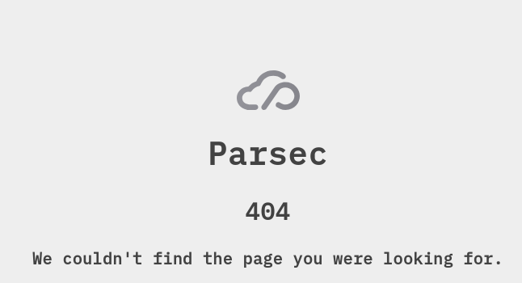

.. Parsec Cloud (https://parsec.cloud) Copyright (c) BUSL-1.1 2016-present Scille SAS

.. only:: fr

   |english-only|

===================
Cryptpad Deployment
===================

Cryptpad deployment allows to edit documents directly in the application.

It's incredibly useful on :ref:`web <doc_hosting_deployment_webapp>` since users won't have access to the file system mountpoints provided by the desktop application.

Obtaining the patched server
============================

.. _cryptpad-repo: https://github.com/Scille/cryptpad

Parsec maintain a `soft-fork of cryptpad <cryptpad-repo_>`_ source as it requires some light modifications to better integrate in parsec.

.. _cryptpad-server-repo: https://github.com/Scille/cryptpad-server
.. _cryptpad-docker: https://github.com/Scille/cryptpad-server/pkgs/container/cryptpad-server%2Fcryptpad
.. _cryptpad-server-static-build: https://github.com/Scille/cryptpad-server/releases/download/v0.3/cryptpad-server.zip

We have a repository used to `build the cryptpad server <cryptpad-server-repo_>`_ either as a `linux container <cryptpad-docker_>`_ format or `the resources needed for a nodejs server <cryptpad-server-static-build_>`_.

Deploying using the docker testing infra
========================================

To deploy cryptpad using :ref:`the docker-compose stack <doc_hosting_deployment_with_docker>`, we will need to patch some configuration:

#. We will deploy alongside the parsec server our patched cryptpad server.

   The new server will be accessible at ``https://cryptpad.parsec.localhost``

   .. note::

      To use a different URI change every instance of ``https://cryptpad.parsec.localhost`` with the desired URI.

.. _parsec-specific-config:

#. Create a new env file for parsec-server

   For the server to announce that client should use the configured Cryptpad server, you need to set ``PARSEC_CRYPTPAD_SERVER_URL`` (or set the option ``--cryptpad-server-url``):

   .. admonition:: editics/parsec-cryptpad.env
      :collapsible: open

      .. literalinclude:: ./parsec-cryptpad.env
         :language: bash

   That value must be the same as ``CRYPTPAD_HTTP_UNSAFE_ORIGIN`` (see next step) when configuring the cryptpad server

#. Retrieve the patch file for the docker-compose file

   .. _cryptpad-domain-doc: https://docs.cryptpad.org/en/admin_guide/installation.html#admin-domain-config

   .. _cryptpad-specific-config:

   For the cryptpad server, we need to set the following env variables:

   - ``CRYPTPAD_CUSTOM_PROTOCOL``: We need to set that value to ``parsec-desktop:`` to allow desktop user to use the Cryptpad service.
   - ``CRYPTPAD_HTTP_SAFE_ORIGIN``: The URL that Cryptpad should considered safe/sandboxed, it should be different than ``CRYPTPAD_HTTP_UNSAFE_ORIGIN`` (more information on `Cryptpad domain documentation <cryptpad-domain-doc_>`_).
   - ``CRYPTPAD_HTTP_UNSAFE_ORIGIN``: The URL used to reach the Cryptpad server.

   .. admonition:: editics/parsec-server.docker.yaml.cryptpad.patch
      :collapsible: open

      .. literalinclude:: ./parsec-server.docker.yaml.cryptpad.patch
         :language: diff

   .. important::

      You need to use a reverse proxy if you want to configure TLS (see next step) as Cryptpad does not allow to configure it.

   In addition of the Cryptpad service, we also update the `parsec-server` service configuration to load the newly created env file ``editics/parsec-cryptpad.env``.

#. Retrieve the patch file for nginx configuration

   .. admonition:: editics/parsec-nginx.conf.cryptpad.patch
      :collapsible: open

      .. literalinclude:: ./parsec-nginx.conf.cryptpad.patch
         :language: diff

#. Apply the patches

   .. code-block:: shell

      patch -t -i editics/parsec-nginx.conf.cryptpad.patch
      patch -t -i editics/parsec-server.docker.yaml.cryptpad.patch

.. note::

  The path of the different files above contain the ``editics/`` prefix, because that's where those files are stored on our public repository.
  You are free to download them somewhere else, but note that you will need to update the path to `parsec-cryptpad.env` in the docker file (``services.parsec-server.env_file[]``)

Next you need to start the updated ``docker-compose`` stack:

.. code-block:: shell

   docker compose --file ./parsec-server.docker.yaml up --detach

If you have an already running stack, you need to:

#. Start cryptpad:

   .. code-block:: shell

      docker compose --file ./parsec-server.docker.yaml up --detach parsec-cryptpad

#. Stop & Start parsec server (``restart`` is not enough to reload the service configuration):

   .. code-block:: shell

      docker compose --file ./parsec-server.docker.yaml stop parsec-server
      docker compose --file ./parsec-server.docker.yaml up --detach parsec-server

Other deployment methods
========================

.. _Cryptpad server README: https://github.com/Scille/cryptpad-server

For other deployment methods refer to https://github.com/Scille/cryptpad-server/blob/master/README.md

Further more you need some specific configure of both :ref:`Parsec <parsec-specific-config>` and :ref:`Cryptpad <cryptpad-specific-config>`.

Verify the deployment
=====================

Before trying to use CryptPad in parsec, open the server URL (https://cryptpad.parsec.localhost) in the browser, you should get the following page:

If you have the following, it means the Cryptpad server is somewhat working, to confirm how can now try to use it in Parsec.
