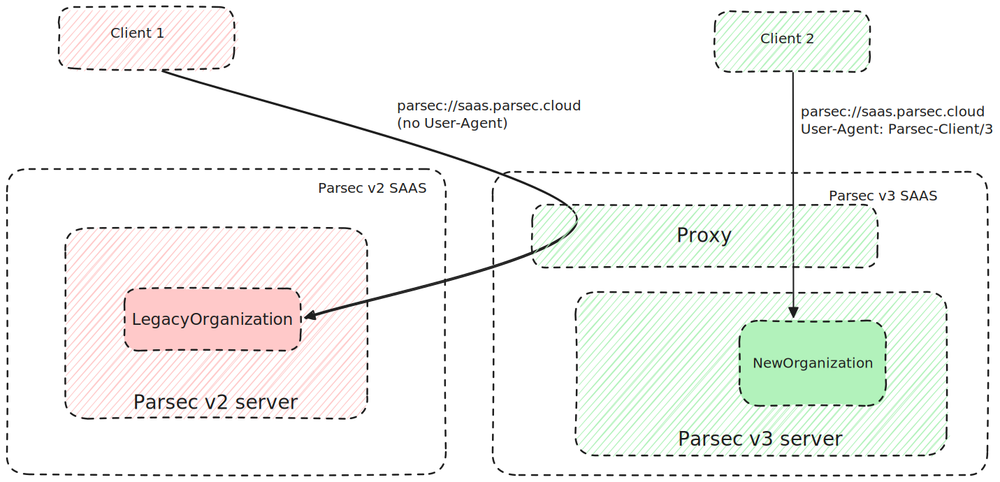

<!-- Parsec Cloud (https://parsec.cloud) Copyright (c) BUSL-1.1 2016-present Scille SAS -->

# No-re-encryption Realm key rotation

## 0 - Abstract

This RFC proposes a way to rotate realm keys without requiring re-encryption of all data.

## 1 - Background

The current realm key rotation system works by replacing the realm key, then re-encrypting
all realm's vlobs with the new key.

The rational for this approach was that the client only have to deal with a single key at any given time.
However this has some downsides:

- Re-encrypting all vlobs takes some time (though not that much in practice given it's only
  metadata, the empirical rule being 1000 times less metadata than actual data in Parsec).
- This concept must be exposed to the user so that he can decide when to do the re-encryption
  maintenance procedure. This is a concept complex to explain so not great for UX :/
- A realm encryption revision index is kept server-side and send to the client to ensure
  it is not using the wrong key to decrypt
- A re-encryption API is needed (the `realm_(start|stop)_reencryption_maintenance` &
  `vlob_maintenance_(get|save)_reencryption_batch` commands)
- The concept of maintenance has been introduced: a realm under maintenance cannot be read/write
- Due to the maintenance, a re-encryption must finish no matter what. So all realm owners have to
  watch for ongoing maintenance and participate in it (even if they are not the initiator of it),
  just in case the initiator disconnects (to be never seen again) before completion.

On top of that the added security is small (remember, this was a practical choice) given
the client could have downloaded all metadata when it has access (typically when doing
file content a search on the workspace mountpoint).
In addition since Parsec 2.16 the manifests are eagerly downloaded (instead of the
previous lazy approach), so the re-encryption really has no security benefit.

And now the final blow: the maintenance preventing read/write access was such a strong
limitation that we ended up adding a feature to keep read access possible.
Now what that means is the client has to in fact deal with up to *two* keys:

1. when a maintenance starts, the client receives the new key
2. it overwrites the realm key with the new one in the user manifest
3. now it tries to access some realm data
   - the maintenance is done, so the new key works. All is good.
   - the maintenance is still ongoing, so the client has to look into the previous
     versions of the user manifest to find the old key. This is messy :'(

## 2 - General approach

The idea is as follow:

- Remove the whole maintenance logic: a realm is always accessible in read&write.
- Remove the whole re-encryption logic: realm vlobs are never reencrypted.
- Remove the whole message logic (i.e. sending arbitrary message between users, currently
  only used to communicate workspace keys during sharing): we use a special ad-hoc
  API command to access the realm's keys (see below).
- A realm now has its manifests encrypted with multiple keys, at any time a new
  key can be added.
- Each key for a given realm has an index.
- Only the last key should be used to encrypt new manifests.
- All those keys are serialized together in a `RealmKeysBundle` which is encrypted by the
  "keys-bundle key" symmetric key and stored in a dedicate table in the server database.
- The "keys-bundle key" is serialized in a `RealmKeysBundleAccess`. This document is for
  each member of the realm and is encrypted with their public key.
- For sharing a realm, the last `RealmKeysBundleAccess` is encrypted for the new user.
- Keys-bundle & keys-bundle access are never stored on-disk client-side: they are instead
  lazily fetched from server when needed and kept on RAM.
- Realm initial key is lazily created by doing the very first key rotation (typically during
  minimal sync right after having created the realm).
- Key rotation also involves the creation of a `RealmKeyRotationCertificate` certificate to
  allow auditability (knowing when and by whom the key rotation occurred).
- Key rotation certificate contains the index of the key along with its algorithm and a
  canary (i.e. an encrypted payload to ensure the key obtained from the keys-bundle is genuine).
- Key rotation consists of creating a new `RealmKeysBundle` with one additional
  key, then submit it (along with the `RealmKeyRotationCertificate` and the per-user
  `RealmKeysBundleAccess`) to the server with the new `workspace_rotate_keys` API command.
- Given each key rotation is expected to add a single key to the bundle, the key index is
  also used to identify the key rotation and the keys-bundle.
- Vlob create/update/read API commands contains a field with the index of the key being used.
- The name of the workspace is stored in a `RealmNameCertificate` certificate that is
  provided through the `realm_rename` API command. This allow the name to be global and
  modifiable by the owner of the realm.
- User manifest no longer has to store any information about the realms. The realm keys
  are only fetched when needed (i.e. in case of out/in sync) by using the new
  `workspace_get_keys_bundle` API command.
- In case no `RealmNameCertificate` is available, then the realm ID is used instead.
- It is no longer possible to customize the name of a workspace only for oneself (it is
  possible to re-add this feature later if needed though).
- `workspace_get_keys_bundle` allows to get previous keys-bundles if any, this is needed
  to self-heal in case the new keys-bundle is corrupted.


Client-side, the detection of a new certificate automatically triggers a key rotation
when needed (i.e. user revoked or user role removed).
This is totally transparent for the end user \o/

On top of that, user manifest is totally empty (no more realm key, workspace name or
last processed message index). Which means no user synchronization is needed whatsoever \o/
(user ops is still needed to store the workspace name before the `RealmNameCertificate`
can be uploaded though)

The elephant in the room is of course compatibility with Parsec v2 (and APIv3). Here we
go the simple way:

- Parsec v2 server only exposes APIv3 (i.e. a Parsec v3 client cannot connect)
- a migration step has to be made on the server database when switching to Parsec v3 server
- once the migration is done, only Parsec v3 server can run
- Parsec v3 server only exposes APIv4 (i.e. a Parsec v2 client cannot connect)

An alternative compatibility mode is [discussed in chapter 7.2](#72---possible-compatibility-strategy)
This is however complex to implement and test, so shouldn't be implemented it unless
explicitly needed.

## 3 - Changes: Protocol

### 3.1 - Existing commands changes

The following commands are removed:

- `realm_status`
- `realm_start_reencryption_maintenance`
- `realm_finish_reencryption_maintenance`
- `realm_maintenance_get_reencryption_batch`
- `realm_maintenance_save_reencryption_batch`
- `message_get`
- `realm_update_roles`

In `vlob_poll_changes` and `vlob_list_versions` commands:

- Remove the `in_maintenance` response status

In `vlob_create` & `vlob_update` commands:

- Remove the `encryption_revision` field in the request
- Add a `key_index` field (with type `Index`) in the request
- Remove the `bad_encryption_revision` response status
- Remove the `in_maintenance` response status
- Add a `bad_key_index` response status. This error is returned if the key
  index doesn't exist for this realm, or is no longer the last one

In `vlob_read` command:

- Remove the `encryption_revision` field in the request
- Add a `key_index` field (with type `Index`) in the ok response
- Remove the `bad_encryption_revision` response status
- Remove the `in_maintenance` response status

In `events_listen` command:

- Remove the `realm_maintenance_started` event
- Remove the `realm_maintenance_finished` event
- Remove the `message_received` event

### 3.2 - New command: `realm_share`

It is similar to the `realm_update_roles` with the following changes:

- Remove `in_maintenance` response status
- Remove `recipient_message` field
- `role_certificate` must be a `RealmRoleCertificate` with role != None
- Add `recipient_keys_bundle_access` field (with type `Bytes`). This contains the
  `RealmKeysBundleAccess` document encrypted for the recipient.
- Add a `key_index` field (with type `Index`). The server uses this to ensure
  the client is not missing a key rotation (otherwise the recipient would be missing
  some keys)
- Add a `bad_key_index` response status

> **Notes:**
>
> When created, a realm has no keys-bundle, in this state `recipient_keys_bundle_access`
> cannot be created. Hence `realm_rotate_key` must be called at least once for the
> realm before being able to use `realm_share`.
>
> Given the client has to fetch the keys-bundle before doing the `realm_share`, it
> is simple to add a special routine to call `realm_rotate_key` if the realm has
> not keys-bundle yet.

### 3.3 - New command: `realm_unshare`

It is similar to the `realm_update_roles` with the following changes:

- Remove `in_maintenance` response status
- Remove `recipient_message` field
- `role_certificate` must be a RealmRoleCertificate with role == None

> **Note:**
>
> Key rotation is not automatically done in this command, this is for two reasons:
>
> - key rotation is also needed when a user is revoked, hence `realm_rotate_key`
>   command is needed no matter what
> - in case of batch un-sharing (i.e. multiple users losing their role), only a
>   single key rotation can be issued

### 3.4 - New command: `realm_rotate_key`

```json5
[
    {
        "major_versions": [4],
        "req": {
            "cmd": "realm_rotate_key",
            "fields": [
                {
                    // Signed `RealmKeyRotationCertificate` certificate,
                    // contains realm_id & key_index
                    "name": "realm_key_rotation_certificate",
                    "type": "Bytes"
                },
                {
                    // Per-participant (including self) signed&encrypted
                    // `RealmKeysBundleAccess` document, contains the key to
                    // decrypt `keys_bundle` field
                    "name": "per_participant_keys_bundle_access",
                    "type": "Map<UserID, Bytes>"
                },
                {
                    // Signed&encrypted `RealmKeysBundle` document, contains all the
                    // keys ever in use for this realm
                    "name": "keys_bundle",
                    "type": "Bytes"
                },
                {
                    // If set to `true`, a `legacy_reencrypted_realm` error will be
                    // returned if the realm has been created in Parsec < v3.0.
                    //
                    // This is required for the initial key rotation: realms created
                    // in Parsec < v3.0 have they data encrypted with a single key
                    // that may be replaced by a reencryption mechanism.
                    // Hence the initial key rotation must use the key actually used
                    // to encrypt the data.
                    //
                    // So with this flag the client can always start with a regular
                    // key rotation (i.e. with a randomly generated key), then fallback
                    // to searching the key in the user manifest history if the
                    // realm is actually a legacy one.
                    //
                    // Note the fact the server can lie to the client about which key
                    // should be use is not a security issue: the server never controls
                    // the key and at most the realm data will end-up unreadable (which
                    // the server can already achieved by providing dummy data when the
                    // client fetch a vlob/blob).
                    "name": "never_legacy_reencrypted_or_fail",
                    "type": "Boolean"
                }
            ]
        },
        "reps": [
            {
                "status": "ok"
            },
            {
                // If the user doesn't have OWNER role in the realm
                "status": "author_not_allowed"
            },
            {
                "status": "realm_not_found"
            },
            {
                "status": "legacy_reencrypted_realm",
                "fields": [
                    {
                        "name": "encryption_revision",
                        "type": "Index"
                    }
                ]

            },
            {
                // If the `key_index` in the certificate is not currently the realm's last one
                "status": "bad_key_index"
            },
            {
                "status": "participant_mismatch"
            },
            {
                "status": "invalid_certificate"
            },
            {
                // Returned if the timestamp in the certificate is too far away compared
                // to server clock.
                "status": "timestamp_out_of_ballpark",
                "fields": [
                    {
                        "name": "ballpark_client_early_offset",
                        "type": "Float"
                    },
                    {
                        "name": "ballpark_client_late_offset",
                        "type": "Float"
                    },
                    {
                        "name": "server_timestamp",
                        "type": "DateTime"
                    },
                    {
                        "name": "client_timestamp",
                        "type": "DateTime"
                    }
                ]
            },
            {
                // Returned if another certificate or vlob in the server has a timestamp
                // posterior or equal to our current one.
                "status": "require_greater_timestamp",
                "fields": [
                    {
                        "name": "strictly_greater_than",
                        "type": "DateTime"
                    }
                ]
            }
        ]
    }
]
```

> Notes:
>
> - Each `realm_rotate_key` command is expected to provide a `RealmKeysBundle` that differs
>   from the previous one by exactly appending a single key. This will be checked client-side.
> - Certificate and keys-bundle must all be signed by the same author
>   with the same timestamp. This will be checked client-side.
> - Only `realm_rotate_key` command updates the keys-bundle, hence a newly created realm
>   has no keys-bundle.

### 3.5 - New command: `realm_get_keys_bundle`

```json5
[
    {
        "major_versions": [4],
        "req": {
            "cmd": "realm_get_keys_bundle",
            "fields": [
                {
                    "name": "realm_id",
                    "type": "VlobID"
                },
                {
                    "name": "key_index",
                    // `None` to get the last bundle, client only needs to use this
                    // field for self-heal when the last bundle is corrupted
                    "type": "RequiredOption<Index>"
                }
            ]
        },
        "reps": [
            {
                "status": "ok",
                "fields": [
                    {
                        // Key index
                        "name": "key_index",
                        "type": "Index"
                    },
                    {
                        // `RealmKeysBundleAccess` document encrypted for ourself
                        "name": "keys_bundle_access",
                        "type": "Bytes"
                    },
                    {
                        // Signed&encrypted `RealmKeysBundle`
                        "name": "keys_bundle",
                        "type": "Bytes"
                    }
                ]
            },
            {
                // Realm doesn't exist, or user has no access on it
                "status": "author_not_allowed"
            },
            {
                // `key_index` argument doesn't correspond to a `RealmRotateKeyCertificate`
                "status": "bad_key_index"
            }
        ]
    }
]
```

As stated before, client is expected to call `realm_get_keys_bundle` the first time it
needs to fetch/upload vlob to/from the server, and to store the resulting keys in RAM.

This brings three benefits:

- Keys are no longer stored in each user manifest, which save storage space and avoid
  having to sync a new version of the user manifest each time a key rotation is done.
- When access is removed, the user is no longer able to get back the decryption keys
  (instead of having them in its user manifest). The client can of course save them when
  it has access to them, but it requires a modified Parsec client.
- The decryption keys are no longer at rest on the client storage.

### 3.6 - New command: `realm_rename`

```json5
[
    {
        "major_versions": [4],
        "req": {
            "cmd": "realm_rename",
            "fields": [
                {
                    // Signed `RealmNameCertificate` certificate,
                    // contains realm_id, key_index & encrypted realm name
                    "name": "realm_name_certificate",
                    "type": "Bytes"
                },
                {
                    // If set to `true`, an `initial_name_already_exists` error will
                    // be returned if a name certificate already exist for this realm.
                    "name": "initial_name_or_fail",
                    "type": "Bool"
                }
            ]
        },
        "reps": [
            {
                "status": "ok"
            },
            {
                "status": "initial_name_already_exists"
            },
            {
                // Realm doesn't exist, or user has no access on it
                "status": "author_not_allowed"
            },
            {
                "status": "bad_key_index"
            },
            {
                "status": "invalid_certificate"
            },
            {
                "status": "realm_not_found"
            },
            {
                // Returned if the timestamp in the certificate is too far away compared
                // to server clock.
                "status": "timestamp_out_of_ballpark",
                "fields": [
                    {
                        "name": "ballpark_client_early_offset",
                        "type": "Float"
                    },
                    {
                        "name": "ballpark_client_late_offset",
                        "type": "Float"
                    },
                    {
                        "name": "server_timestamp",
                        "type": "DateTime"
                    },
                    {
                        "name": "client_timestamp",
                        "type": "DateTime"
                    }
                ]
            },
            {
                // Returned if another certificate or vlob in the server has a timestamp
                // posterior or equal to our current one.
                "status": "require_greater_timestamp",
                "fields": [
                    {
                        "name": "strictly_greater_than",
                        "type": "DateTime"
                    }
                ]
            }
        ]
    }
]
```

> **Notes**
>
> - `initial_name_or_fail` flag makes the initial rename idempotent, which is especially
>   useful to deal with legacy workspaces (given they may have multiple OWNER that
>   will concurrently do the initial rename).
> - Subsequent rename are not idempotent nor concurrency safe (i.e. last one blindly
>   overwrites the previous one). This is considered okay given 1) concurrency is not
>   high here, and 2) the name history is still available nevertheless by consulting
>   the older certificates.

## 4 - Changes: Data

### 4.1 - Existing data: messages

All the messages types are removed:

- `sharing.granted`
- `sharing.reencrypted`
- `sharing.revoked`

On top of that, a special logic is added in the client to ignore those messages
types.

> **Note:**
>
> Ignoring those messages means the client may end up with invalid data (e.g. a
> user hasn't started its client in a while, he does it after the Parsec v3 migration
> and now all the workspaces it has been part of that have been re-encrypted in the
> meantime fail to load with an "decryption error" error message...).
>
> However those errors can simply be fixed by removing and re-adding the access rights
> to the user, which is the obvious "IT, have you tried to turn it off and on again ?" way.

### 4.2 - Existing data: `UserManifest`

- Remove `last_processed_message` field.
- Deprecate `workspaces` field. The field is only kept for backward compatibility
  as its `name` and `key` fields are needed to generate the initial realm name
  certificate and realm key rotation certificate.

`workspace` field uses an updated `WorkspaceEntry` type:

```json5
{
  "label": "WorkspaceEntry",
  "fields": [
    {
      "name": "id",
      "type": "VlobID"
    },
    {
      "name": "name",
      "type": "EntryName"
    },
    {
        "name": "key",
        "type": "SecretKey"
    },
    {
        "name": "encryption_revision",
        "type": "Index"
    }

    // Ignored fields (useless for our backward compatibility needs)
    // - `encrypted_on`
    // - `role_cache_timestamp`
    // - `role`
  ]
}
```

> **Notes:**
>
> - In practice, this means the user manifest should never get updated as it only
>   contains data used for backward compatibility.
>   However this might change in the future (typically for storing user-specific
>   configuration should be shared between his devices).
> - The initial key rotation on a workspace created with Parsec < v3 requires to
>   retrieve the key currently in use. While the key is most likely in the last
>   version of the user manifest, this may require searching in previous versions
>   (typically if a reencryption was started but never finished before the migration
>   to Parsec v3).

### 4.3 - New certificate: `realm_key_rotation_certificate`

This certificate can only be issued by a user with OWNER role on the given realm.

```json5
{
    "label": "RealmKeyRotationCertificate",
    "type": "realm_key_rotation_certificate",
    "other_fields": [
        {
            "name": "author",
            "type": "DeviceID"
        },
        {
            "name": "timestamp",
            "type": "DateTime"
        },
        {
            "name": "realm_id",
            "type": "VlobID"
        },
        {
            "name": "key_index",
            "type": "Index"
        },
        {
            "name": "encryption_algorithm",
            "type": "SecretKeyAlgorithm"
        },
        {
            "name": "hash_algorithm",
            "type": "HashAlgorithm"
        },
        {
            // Empty message encrypted with the key, this is used to ensure the
            // key retrieved in the keys-bundle hasn't been tempered (given
            // each key rotation author generates a new keys-bundle from the
            // previous bundle and his one additional key).
            //
            // Note since the message is empty, we are doing here AEAD-without-data
            // given we only care of the MAC part.
            "name": "key_canary",
            "type": "Bytes"
        }
    ]
}
```

When processing this certificate (in addition to regular access checks), the
client must make sure the `key_index` field strictly follow the value of the
previous key rotation certificate for this realm. (i.e. we reject the
certificate if there is a gap in key indexes)

`SecretKeyAlgorithm` has one possible values: `XSALSA20-POLY1305`.
`HashAlgorithm` has one possible value: `SHA256`.

> **Note:**
>
> `encryption_algorithm` & `hash_algorithm` fields are discussed in RFC-1006.
>
> In a nutshell, those fields allows for future evolution, typically to switch to
> Chacha20-Poly1305 given it is a more scrutinized algorithm with audited implementations.

### 4.4 - New certificate `RealmNameCertificate`

This certificate can only be issued by a user with OWNER role on the given realm.

`key_index` must correspond to `KeyRotationCertificate`.

```json5
{
    "label": "RealmNameCertificate",
    "type": "realm_name_certificate",
    "other_fields": [
        {
            "name": "author",
            "type": "DeviceID"
        },
        {
            "name": "timestamp",
            "type": "DateTime"
        },
        {
            "name": "realm_id",
            "type": "VlobID"
        },
        {
            "name": "key_index",
            "type": "Index"
        },
        {
            // `EntryName` encrypted with the key
            "name": "encrypted_name",
            "type": "Bytes"
        }
    ]
}
```

The certificate might be valid while containing invalid data:

- the `name` field cannot be decrypted by the key
- the decrypted content of `name` is not a valid `EntryName`

In this case, the naming fallback to the realm ID.

> **Note:**
>
> This certificate can only be uploaded with `realm_rename` API command, though
> `realm_create` may seem appropriated to also have it.
> However this is not the case (i.e. realm creation an realm name certificate upload
> are not one atomic operation), this is for three reasons:
>
> - It simplifies code.
> - User realm doesn't need realm name, hence this certificate would need to be optional
>   or set to a dummy value.
> - This allows legacy (i.e. realm created, but no realm name certificate) to be treated
>   just like the regular case.

### 4.5 - New document `RealmKeysBundle`

```json5
{
    "label": "RealmKeysBundle",
    "type": "realm_keys_bundle",
    "other_fields": [
        {
            // Author must be equal to the one in the `RealmRoleCertificate`
            "name": "author",
            "type": "DeviceID"
        },
        {
            // Timestamp must be equal to the one in the `RealmRoleCertificate`
            "name": "timestamp",
            "type": "DateTime"
        },
        {
            "name": "realm_id",
            "type": "VlobID"
        },
        {
            "name": "keys",
            // Keys ordered by index
            "type": "List<Bytes>"
        }
    ]
}
```

> **Note:**
>
> It could be tempting not to sign the `RealmKeysBundle`, given the keys can be
> checked against their corresponding key rotation certificate.
>
> However this doesn't take into account that a key that doesn't match its key
> rotation certificate must be kept in the bundle nevertheless (as removing
> it would mess the key index for the subsequent key rotations).
>
> So if the client encounter a realm keys bundle containing an invalid key it
> cannot tell if it's normal (i.e. due to a previous invalid key rotation), or
> an attack by the server (no signature means the server can craft a keys bundle
> with the right number of keys, but with all of them invalid)

### 4.6 - New document `RealmKeysBundleAccess`

```json5
{
    "label": "RealmKeysBundleAccess",
    "type": "realm_keys_bundle_access",
    "other_fields": [
        {
            "name": "keys_bundle_key",
            "type": "SecretKey"
        }
    ]
}
```

> **Note:**
>
> `RealmKeysBundleAccess` is not signed, this is because it only role it to give
> access to `RealmKeysBundle`.
>
> Hence forging a `RealmKeysBundleAccess` is possible for the server, but only
> prevent from accessing `RealmKeysBundle` which also can be done by just returning
> invalid data in place of the actual encrypted `RealmKeysBundle` data.

## 5 - Changes: Server-side

### 5.1 - Change HTTP `Server` header

Currently the HTTP `Server` value is `parsec`, we should change it to `parsec/3` to
simplify the [detection of an incompatible server](#7---backward-compatibility--migration)

### 5.2 - Datamodel

The main issue with data migration is handling realm currently under maintenance given
it asks the question of which key to keep:

- Keeping only the last key doesn't work as some data are not encrypted for it
- Keeping the n-1 key only makes migration complicated on client-side (the server
  no longer has concept of realm under migration, however the client has to find
  a way to know that. On top of that the migration process requires accessing
  older version of the user manifest which add complexity)
- Keeping both n-1 and n adds basically the same issues with client-side

So we go simple on this and only allow server migration if all the realms have
finished their maintenance, or if a realm doesn't contain any data (see below).

To avoid being blocked by a workspace forever in maintenance (e.g. workspace owned by
a single user that got revoked while it was re-encrypting it), we also provide a cli for
removing realm vlobs (cannot remove a realm given it is related to certificates) or
organization form the database.

### 5.3 - Server data migration

Drop tables:

- `vlob_encryption_revision`
- `message`

Table `vlob_atom`:

- Remove all rows that contains old encryption revision data (i.e. the table only contains
  the vlob currently accessible by the users).
- Remove column `vlob_encryption_revision`
- Add column `key_index` (`INTEGER NOT NULL`). This defaults to 1 when migrating data.

Table `realm`

- Remove columns `encryption_revision`, `maintenance_started_by`, `maintenance_started_on` and `maintenance_type`

## 6 - Changes: Client-side

### 6.1 - Certificate Ops

`RealmKeyRotationCertificate` should be checked (only OWNER of the realm can create such
certificate).

`RealmNameCertificate` should be checked (only OWNER of the realm can create such
certificate).

### 6.1 - Workspace name synchronization & default value

There is no atomicity between realm creation an the upload of the first `RealmNameCertificate`.

Hence a client may end up with a realm without realm name certificate (and in such case the
name of the realm defaults to the realm ID).

So that any realm OWNER detecting the `RealmNameCertificate` is missing should look in
it local user manifest if a workspace name is specified, and do a `realm_rename` in
that case.

This approach has the benefit of transparently handling the legacy (i.e. realm created,
but no realm name certificate).

### 6.2 - Workspaces listing

The client has to rely on both the certificates and the local user manifest to get
the list of workspaces and their corresponding name:

1) Get all the realm for which the user has a realm role certificate with currently
   active role.
2) Get the name from the `RealmNameCertificate` if available and valid.
3) Otherwise, look in the local user manifest for a workspace name entry.
4) Otherwise default to the realm ID

### 6.3 - Fetching keys-bundle

The client lazily fetch the realm keys-bundle: it does the fetch operation when a server
operation requires it (i.e. `realm_share`, `vlob_read`, `vlob_create` and `vlob_update`).

The realm keys-bundle is only kept in RAM, not on disk.

Once fetched, keys-bundle must be checked against its corresponding `RealmKeyRotationCertificate`
for same author/timestamp/realm_id/key_index.

Each key in the Keys-bundle must be checked against the canary in `RealmKeyRotationCertificate`
that introduced it.

At any time, `realm_share`/`vlob_read`/`vlob_create` can return `bad_key_index` if the client
consider the wrong key to be the last one. In this case the client simply forgets its realm
keys-bundle and re-do the fetch operation.

### 6.4 - Keys-bundle self-healing

A keys-bundle can be corrupted in multiple ways:

- Invalid data: bad signature, bad encryption, bad serialization
- Additional keys
- Missing keys

On top of that, a faulty key rotation may end up with a key rotation certificate and an
invalid corresponding key (i.e. the encryption key is forever lost). However no matter
what the key-bundle must contains as much key as there is key rotation certificates.

Hence a keys-bundle containing tempered key is not considered corrupted: as long
the document is properly signed and contains the right number of keys, it is
considered valid. And, of course, any key in the key bundle must first be checked
against the canary contained in it corresponding key rotation certificate before
actually be used.

Hence the self-healing process consist of recursively fetching the previous key rotation
certificate until either one of them is valid, or there is no more available for us (i.e.
the key bundle was already broken when the realm got shared with us).

In any case, client should dispatch internally an event to inform of corruption
(including the author of the faulty key rotation) and self-healing outcome. This event
typically ends up as a warning logged and gets displayed in the GUI.

> **Note:**
>
> We cannot simply get the keys-bundle that originally created a given key given
> the realm might have been shared with the user later on.

### 6.5 - Automatic key rotation

For automatic key rotation, a new "key rotation manager" is to be introduced. Its function
is very simple:

1. Wait for new `UserRevokedCertificate`, `RealmRoleCertificate` and
   `RealmKeyRotationCertificate` certificates.
2. For `UserRevokedCertificate`, call `realm_unshare` for each realm we are owner (and
   the revoked user is part of).
3. For `RealmRoleCertificate`, if the role is None and we are owner of the realm:
    3.1. Wait a random time between 30 and 60 seconds.
    3.2a. If a new `RealmRoleCertificate` certificates arrives for a realm we are waiting on,
      reset the wait (i.e. the key rotation is still required, but must wait a bit more before it).
    3.2b. If a new `RealmKeyRotationCertificate` certificates arrives for a realm we
      are waiting on, cancel the wait (i.e. there is nothing more to do).
    3.2c. Otherwise (i.e. once the wait is done) call `realm_rotate_key`.

The wait at step 3.1 is here for two reasons:

- Give priority to the author of the certificates to do the key rotation. This is
  typically needed if he is doing un-sharing batch (and hence will do the key rotation
  only once all un-sharing have been done)
- Avoid all owners to send key rotation command at the same time to the server.

### 6.6 - Existing local data: `LocalUserManifest`

`LocalUserManifest` has to be modified to reflect changes in `UserManifest`:

- remove `last_processed_message` field
- change `workspace` field to use a updated `WorkspaceEntry` type

```json5
{
  "label": "WorkspaceEntry",
  "fields": [
    {
      "name": "id",
      "type": "VlobID"
    },
    {
      "name": "name",
      "type": "EntryName"
    },
    {
        "name": "name_origin",
        "type": "WorkspaceNameOrigin",
        "introduced_in_revision": 300
    },
    {
        "name": "role",
        // This field should be mandatory, however it must be optional for backward compatibility.
        // In Parsec < v3.0, a `None` value means the workspace was no longer shared with us.
        // Hence the entry should be ignored during deserialization if this field is `None`.
        "type": "RequiredOption<RealmRole>",
    },
    {
        "name": "role_origin",
        "type": "CertificateBasedInfoOrigin",
        "introduced_in_revision": 300
    },

    // Legacy ignored fields
    // - `key`
    // - `encryption_revision`
    // - `encrypted_on`
    // - `role_cache_timestamp`
  ]
}
```

With `CertificateBasedInfoOrigin`:

```json5
{
    "name": "CertificateBasedInfoOrigin",
    "discriminant_field": "type",
    "variants": [
        // Info comes from a certificate, this is the eventually consistent outcome.
        {
            "name": "Certificate",
            "discriminant_value": "CERTIFICATE",
            "fields": [
                {
                    "name": "timestamp",
                    "type": "DateTime"
                }
            ]
        },
        // Workspace has no certificate for this info that we are aware yet.
        //
        // The most likely reason for this is that the workspace has just been created locally.
        //
        // If the info is the realm's name, another reason is that the workspace has been
        // shared with us before it has a realm name certificate.
        // This is theoretically possible, though unlikely: it should only be encountered
        // when dealing with a workspace shared with Parsec < v3 (as, at that time, realm
        // name certificate didn't exist, and in Parsec >= v3 we ensure the workspace is
        // bootstrapped before sharing it).
        //
        // In any case, this is a temporary state and the eventual outcomes are:
        // - A realm certificate is fetched and it info overwrite the placeholder.
        // - We are the ones uploading the initial info certificate, in which case
        //   the placeholder will become the official info.
        {
            "name": "Placeholder",
            "discriminant_value": "PLACEHOLDER"
        }
    ],
    "introduced_in_revision": 300
}
```

> **Note**
>
> Regarding backward compatibility, legacy key is only important if it has been used to
> upload data, which is supposed to occured only after a minimal sync on the realm.
> And at this point the user manifest has been synced with the new workspace entry
> containing this key.
> Hence we only need to fetch the legacy key from the user manifest (ergo the `key` field
> in local user manifest's workspaces gets deprecated).

### 6.7 - Add HTTP `User-Agent` header

Currently the client send no `User-Agent` header to the server.

Instead we should set it `Parsec-client/<version>`. (e.g. `Parsec-Client/3.0.1`).

This allows us to use reverse proxy in front of the SAAS server to
[deal with Parsec v2 vs Parsec v3 client](#71---server-side-organization-migration)

## 7 - Backward compatibility & migration

As stated, we don't support APIv3 and APIv4 in the same Parsec server.

An APIv3 Parsec server can be migrate to APIv4.

After that it will deny any APIv3 request, hence forcing all it users to upgrade
their Parsec client at once.

### 7.1 - Server-side organization migration

This is typically for the SAAS version Parsec: some clients may want to be able
to control when the switch from v2 to v3 should come for their organization.

The solution for that is to create a new separate Parsec instance running on v3:

- All existing organizations stay on the legacy Parsec v2 instance
- A non-bootstrapped organization is created in the new Parsec v3 instance for
  each existing organization. This in practice reserves the name of the
  organization to avoid future clashes when migration is requested.
- All new organizations are created on the new Parsec v3 instance
- When organization owner requests it, his organization can be migrated from
  legacy to the new Parsec v3 instance.

The migration goes as follow:

1) A partial database export is done from the Parsec v2 instance containing only the
  organization(s) to migrate
2) The organization(s) to migrate are then disabled in the Parsec v2 server, this is to
   avoid Parsec v2 client to access the old data (instead of Parsec v3 server)
3) The partial export is a valid Parsec v2 database on its own. Hence the Parsec v2 -> v3
   database migration script can be run on it.
4) Each organization of the migrated database is inserted in the Parsec v3 instance
   database. A check should be made to ensure the organization doesn't already exist.

On top of that, migration requires to be able to access Parsec v3 and v2 servers with the
same url (i.e. saas.parsec.cloud/). This is done with a proxy using the user-agent header:

- No user-agent roots to Parsec v2 server
- `Parsec-Client/3` roots to Parsec v3 server



### 7.2 - Possible compatibility strategy

A compatibility mode can be introduced and set on a per-organization basis.
In this mode both Parsec v2 and v3 can connect to the server and use the organization,
with the only limitation to not being able to do APIv3 maintenance or APIv4 key rotation
(i.e. only a single key is used for a given realm and it never changes).

At any time, the compatibility mode can be switched off, at which point only Parsec v3
clients can interact with the organization.

How it works:

- a migration step has to be made on the server database when switching to Parsec v3 server
- in the server database, an organization can be marked as in APIv3 compatibility mode
- the Parsec v3 server only exposes the new APIv4
- a special Parsec v3-apiv3-compat server exists:
  - it uses the server database model of Parsec v3
  - it exposes only the APIv3
  - it only works with organization in APIv3 compatibility mode
- organization in APIv3 compatibility mode only have single encryption key that
  never changes. Hence both APIv3 maintenance system and APIv4 key-rotation systems
  are disabled.
- APIv4 `realm_update_roles` command still contains the `recipient_message` field
  along with a new `recipient_keys_bundle_access` field (that contains the `RealmKeysBundleAccess`
  structure that will be passed through `realm_get_keys_bundle`). `not_in_apiv3_compatibility_mode`
  status is returned if `recipient_message` is provided while not in compatibility mode.
- APIv4 `message_get` command is still present
- APIv4 `message_get` and `realm_update_roles`'s `recipient_message` field are not
  available outside of the compatibility mode (returns `not_in_apiv3_compatibility_mode`
  status otherwise)
- Parsec v3 and v3-apiv3-compat servers are behind a proxy: `/ws` route is redirected to
  v3-apiv3-compat server (given it is only used by APIv3), the rest goes to regular v3 (
  hence bootstrap and administration commands can only be done with a Parsec v3 client).
