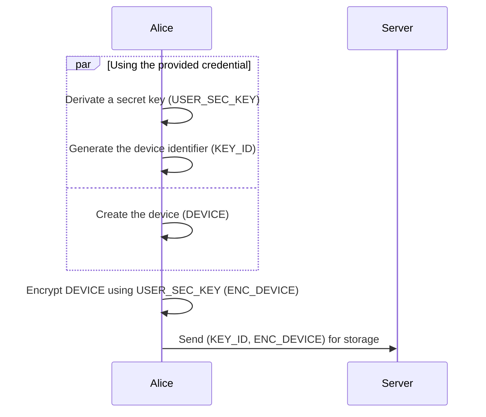
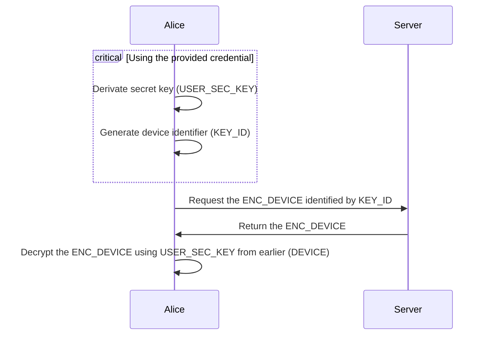
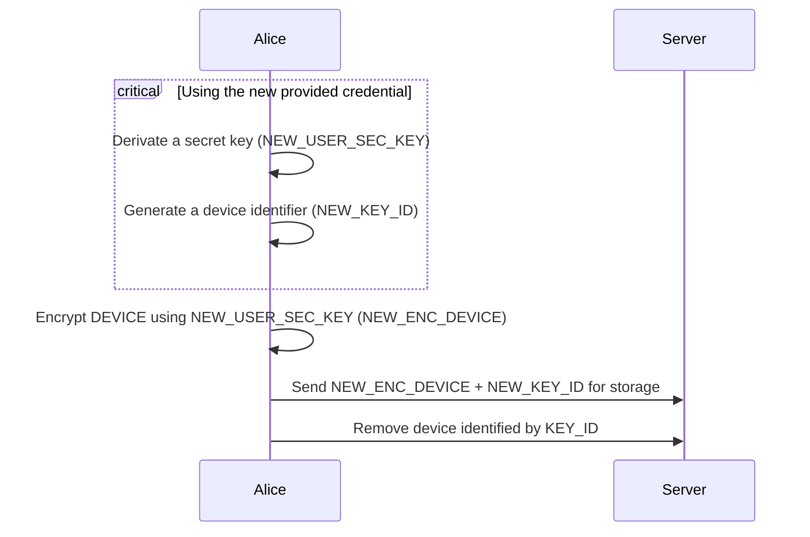
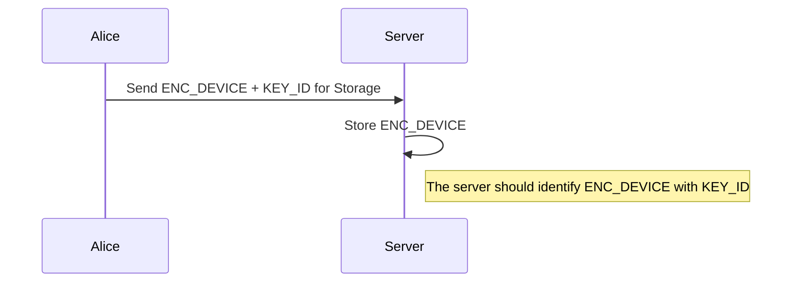

<!-- Parsec Cloud (https://parsec.cloud) Copyright (c) BUSL-1.1 2016-present Scille SAS -->

# My First Remote Device Storage

- [Preface](#preface)
- [Problem](#problem)
- [Pre-requisite of this RFC](#pre-requisite-of-this-rfc)
- [A Device per User](#a-device-per-user)
  - [Concept](#concept)
    - [Concept `USER_SEC_KEY`](#concept-user_sec_key)
    - [Concept `KEY_ID`](#concept-key_id)
      - [Generating `CRED_HASH`](#generating-cred_hash)
    - [Concept `DEVICE`](#concept-device)
  - [Registration](#registration)
  - [Login](#login)
  - [Change credential](#change-credential)
  - [Server storage](#server-storage)

## Preface

We want to provide a Web app to not force our clients to install the desktop application.

## Problem

User need to authenticate on the app using a device + password, on the desktop application that device is stored on the computer.
The problem with the web app is that we can't store the device on the local storage of the browser since it can be easily wipe up.

## Pre-requisite of this RFC

- We don't want the user to download/upload a file containing the device information to register/logging on the web app.
- We want the user to share the same device across multiple browser.

## A Device per User

Basically, we could have a single device per user that is stored encrypted on the server.

That allows the user to access the organization on any systems that don't have a local device for it by just providing its mail (`MAIL`) + organization ID (`ORG_ID`).

### Concept

#### Concept `USER_SEC_KEY`

A secret key used for encrypting a `DEVICE`.

It is generated from the credential provided by the user (could be a password, smartcard, ...)

#### Concept `KEY_ID`

An unique identifier used to identify a `DEVICE` on the server side.

The goal of this ID is to limit how an users can access/retrieve their encrypted device.

The limitation is done by requiring the user to provide information about the desired device:

- `ORG_ID`
- `MAIL`
- `CRED_HASH`: It's used as a challenge for the user, it's generated from the same credential that encrypted the device.

> [!TIP]
>
> The idea of identifying a device with `ORG_ID` + `MAIL` comes from `Slack`:
>
> When connecting to slack, you need to provide a `workspace` + `email` to login, see <https://slack.com/workspace-signin>

##### Generating `CRED_HASH`

The hash is generated from the provided credential using either:

- PBKDF (Password Based Key Derivation Function)

  It's not the optimal solution since we already do a PBKDF operation to generate the secret key `USER_SEC_KEY`.

  PBKDF are slow operations to limit brute-force of credential.

  That also means we should use different parameters to not result in the same blob of bytes after the operation (to not leak `USER_SEC_KEY`).

  > Likely only the salt will need to be changed as it's unlikely we would choose to tweak the security parameters.

- an HMAC of a well known value.

  We could use `USER_SEC_KEY` to generate an HMAC of a well know value (could be a constant or other).

#### Concept `DEVICE`

A device, will likely be the same as [`LocalDevice`](../../libparsec/crates/types/schema/local_device/local_device.json5)

It's stored encrypted on the server-side identified by `KEY_ID`.

### Registration

During the registration, instead of saving the device to the local storage, the user sends the new device to the server as an encrypted blob.

### Login

On login the user identifies itself to the server by providing the `KEY_ID`.

### Change credential

To change the credential of a device, we just re-encrypt the current device and overwrite it on the server.

### Server storage

