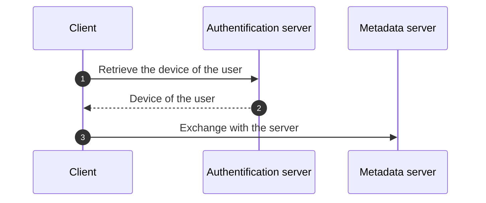
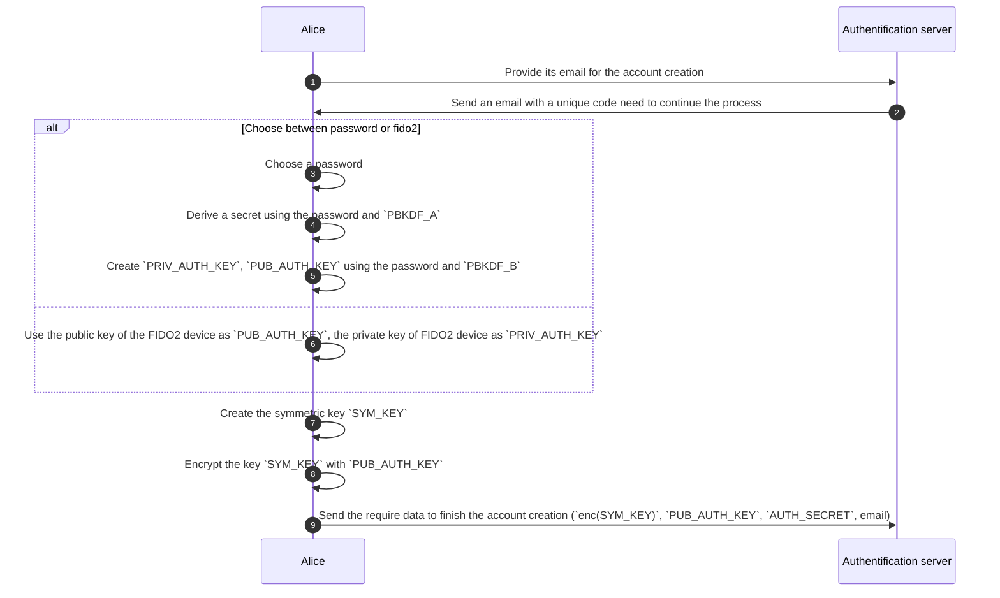
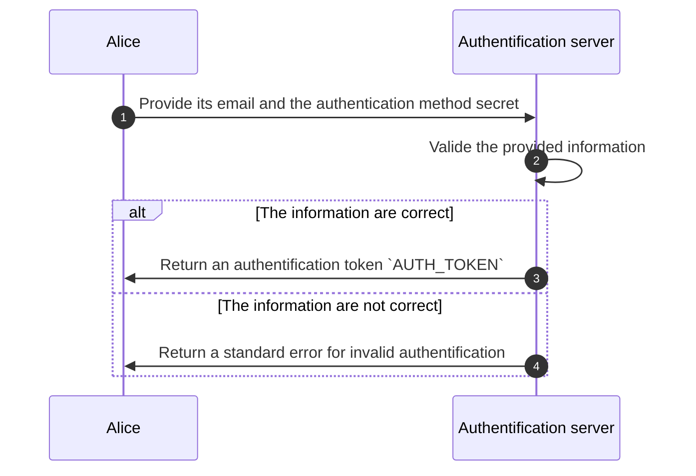
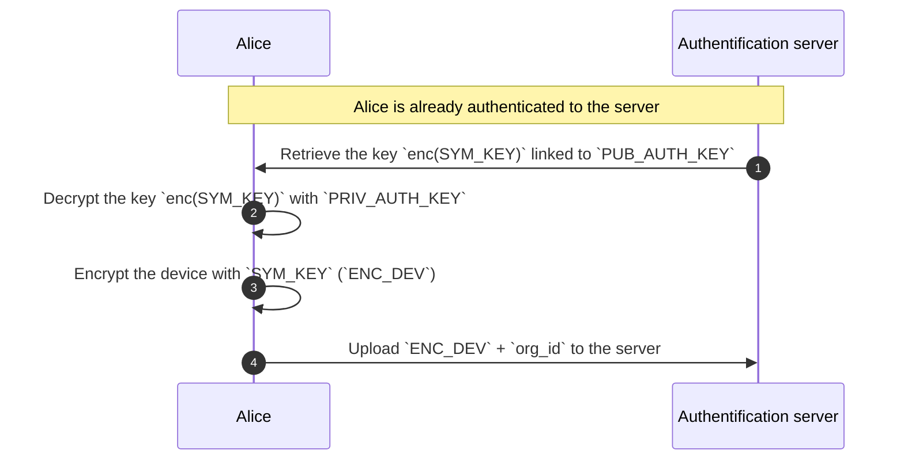
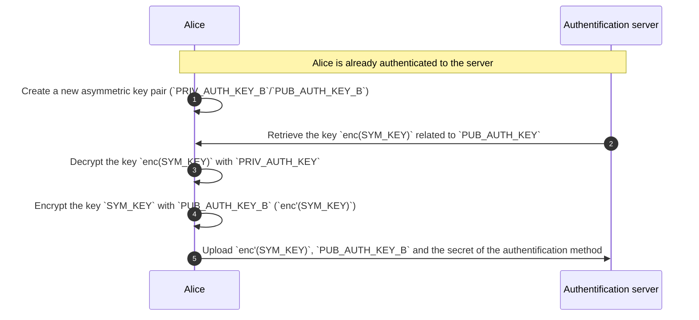
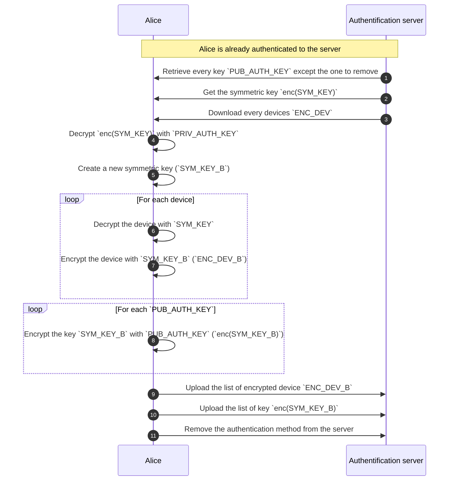

<!-- Parsec Cloud (https://parsec.cloud) Copyright (c) BUSL-1.1 2016-present Scille SAS -->

# Store Parsec device on a remote server

## Overview

This RFC will discuss the implementation of a new service to store the user's devices remotely while still ensuring that only the user can use them.

> [!NOTE]
> The creation of Parsec devices is not discussed in this RFC
> as this is still performed as usual by the client application.

## Background & Motivation

During our discussions about providing a client application that could run in a web-browser, came up the following questions:

- How should we store the device in the browser?.

  Some concerns were raised about the persistence of a Parsec device in the browser.

- What would the user experience be like?

  - What should happen when the user uses a different browser?
  - What is the user expecting when using another computer?

  We assume that the user should be able to connect from any browser/computer.

That is how we came to the idea of storing the device on a remote server.

- That will solve the issue of the browser cleaning its data.
- The devices would be accessible from anywhere (given the user is online).

## Goals

1. Describe how to store/access the user devices on a remote service.
2. Propose an API to implement this feature.

## Non-Goals

- Discuss security concerns regarding the web client application.

## Design

### General principles

An authentication service (Parsec Auth) would be used to store user devices. This service will be requested before connecting to the metadata server (Parsec server) in order to retrieve a specific user device. The device will then be used to authenticate to the metadata server.

<!-- Device stored on a third-party service -->

### Account creation

Creating the account for a user will require some information for the system to work:

- An identifier for the user (email)

  The service needs to verify that the user has access to the email (using a code or sending a link to continue the process).

- A secret to identify the user (password, Fido2, ...)

  For the password, it's not used as is, but it's derived to create a new secret using the function `PBKDF_A` (this operation is done on the client side to not leak the master password).
  The new secret will be provided as is to the server (like a password).

  In the FIDO2 case the included challenge is used as is since the private key is not shared with the server.

- An asymmetric key pair (`PUB_AUTH_KEY`, `PRIV_AUTH_KEY`)

  When using a password, the private key is generated by using the function `PBKDF_B` with the password

  > A key property here is we only need the password to generate the required keys.
  > Another approach would be to use the password as a symmetric key to encrypt a randomly generated private key that is sent alongside the public key.
  > But we would lose that property.

  For FIDO2, the private key already exists in the FIDO2 device so we can use it directly.

  > [!NOTE]
  > Should verify if it's possible to use fido2 to encrypt random blob of data.

- A symmetric key (`SYM_KEY`) that is generated client-side at the final step of the account creation.
  It's encrypted with `PUB_AUTH_KEY` and then uploaded to the service.

> [!CAUTION]
> The output of `PBKDF_A` and `PBKDF_B` should be different to avoid leaking the private key.

At the end of the process, the server should save the following information in a new entry:

- A UUID (`user_id`)

  > It's not related to a `user_id` inside a parsec organization.

- The email of the user
- The secret of the authentication method (`AUTH_SECRET`)

  > [!NOTE]
  > For password, it would be hashed using a strong hashing function.

- The public key of the authentication method (`PUB_AUTH_KEY`)
- The encrypted symmetric key (`enc(SYM_KEY)`).

> [!WARNING]
> A user should be able to register multiple authentication methods,
> so the user entry should allow for multiple `AUTH_SECRET`, `PUB_AUTH_KEY` and `enc(SYM_KEY)`.

### The authentication process

To be able to authenticate the user, it will need to provide the following information:

- Their email
- The secret for the chosen authentication method (`AUTH_SECRET`)

The server then verifies the provided information and return a token `AUTH_TOKEN` if the information is correct.
That token would need to be provided to each request requiring to be authenticated.

### Uploading a new device

To upload a new device, the user would need to:

0. Authenticate on the server to obtain the `AUTH_TOKEN` (see previous section).
1. Retrieve the symmetric key `enc(SYM_KEY)` from the server.
2. Decrypt the key with `PRIV_AUTH_KEY`.
3. Encrypt the new device with `SYM_KEY` (`ENC_DEV`).
4. Upload the encrypted device (`ENC_DEV`) and the ID of the organization (`org_id`) to the server.

The server creates an entry whose primary key is the tuple `user_id` and `org_id`.

> `user_id` is the ID of the account in the service not the organization.

> That means a single device per user per organization.

### List available devices

Once authenticated, the user can list the devices associated to its account.

The list returned by the authenticated service will contain only the IDs of the organizations for which the user has uploaded a device.

> Note that the list should not contain the associated blobs `ENC_DEV` because most of the time the user will only need one device (a specific API is proposed for that in the next section).

### Retrieve a specific device

The server provides an API to retrieve the blob `ENC_DEV` of a device for a user and a given organization.
The client application can then decrypt the blob on its side to obtain the device.

### Adding a new authentication method

To add a new authentication method, it requires the client application to:

1. Create a new asymmetric key pair (`PUB_AUTH_KEY_B`, `PRIV_AUTH_KEY_B`) from the new method.
2. Retrieve the symmetric key `enc(SYM_KEY)` from the server.
3. Decrypt the key with `PRIV_AUTH_KEY`.
4. Encrypt the symmetric key with `PUB_AUTH_KEY_B` (`enc'(SYM_KEY)`).
5. Upload `enc'(SYM_KEY)`, `PUB_AUTH_KEY_B` and the secret of the new authentication method to the server.

> [!NOTE]
> Since the symmetric key `SYM_KEY` does not change,
> devices already stored in the server do not need to be re-encrypted.

### Removing an authentication method

To remove an authentication method from a user, it requires the client application to:

1. Retrieve all `PUB_AUTH_KEY` except the one to remove.
2. Retrieve `enc(SYM_KEY)` related to the current authentication method.
3. Get all devices `ENC_DEV`.
4. Decrypt `enc(SYM_KEY)` with `PRIV_AUTH_KEY`.
5. Create a new symmetric key `SYM_KEY_B`.
6. For each device:

   1. Decrypt the device with `SYM_KEY`.
   2. Encrypt the device with `SYM_KEY_B`.

7. For each `PUB_AUTH_KEY`, encrypt `SYM_KEY` with it.
8. Upload new list of encrypted devices, the list of `enc(SYM_KEY_B)` of each `PUB_AUTH_KEY`
9. Remove the authentication method from the server.

### Integration with the Parsec server

The parsec client would use the authentication service to store a special device, who will only be used to create a new local device.

That new device would be stored on the local storage and if the storage happens to be cleaned, the user could still re-create a new device from the special one stored on the service.

For already existing organizations and devices, the client could create and upload a special device to the service (cf [Uploading a new device](#uploading-a-new-device)).

## Alternatives Considered

N/A

## Operations

That require managing a new service that will store the devices of the user.

## Security/Privacy/Compliance

Consideration should be taken about the method used to save the device on the remote server.
The service would need to identify the user so we will need to have some information about the user (email mostly).
### Consideration on PBKDF algorithms

The `PBKDF_A` (used to derive a secret from the password) and `PBKDF_B` (used to derive the private key from the password) output should be different in order to avoid leaking the private key.

> TODO: explain how to get different output and/or what should be considered for that.
## Risks

The devices are not stored securely to only allow the user to access them.

## Remarks & open questions

- The client application will need to communicate with the authentication service: should this be integrated into `libparsec`? Or it's the JS side that handle that?
