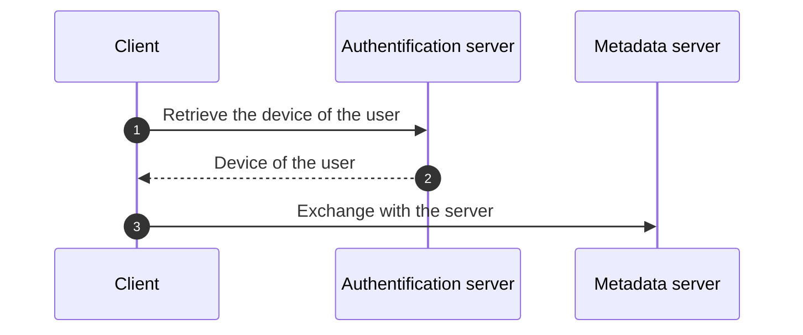
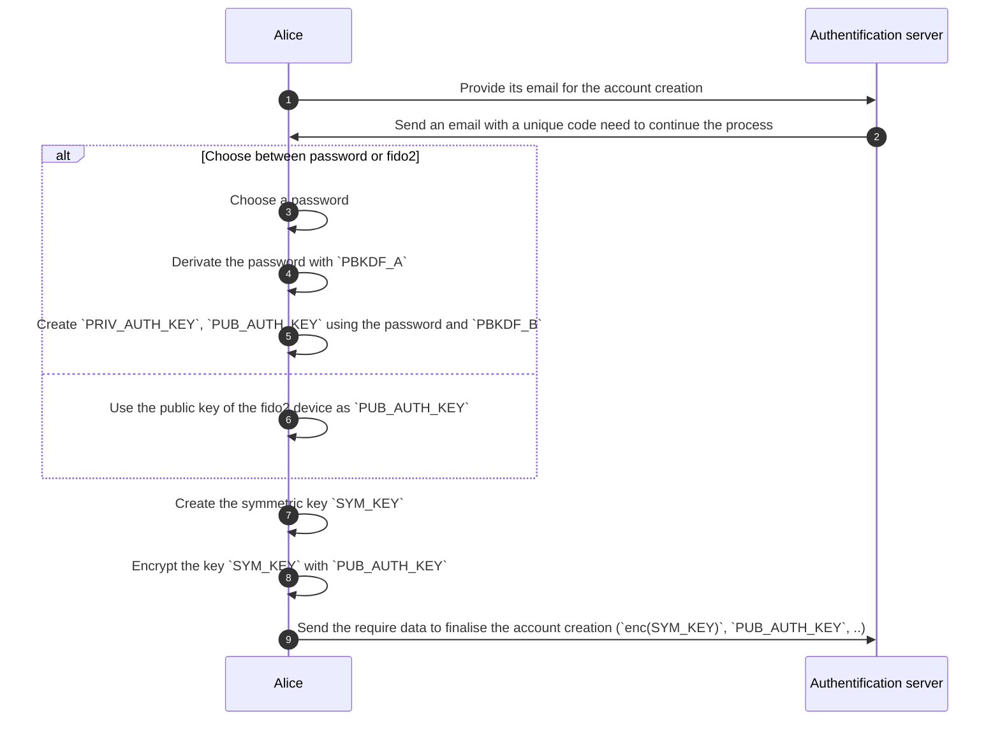
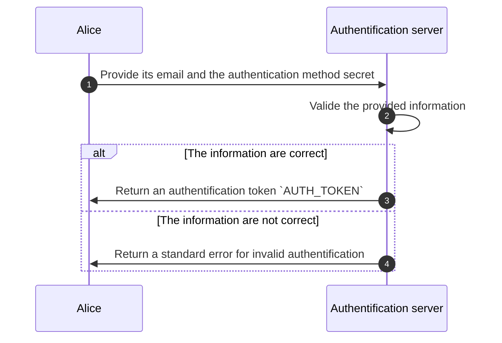
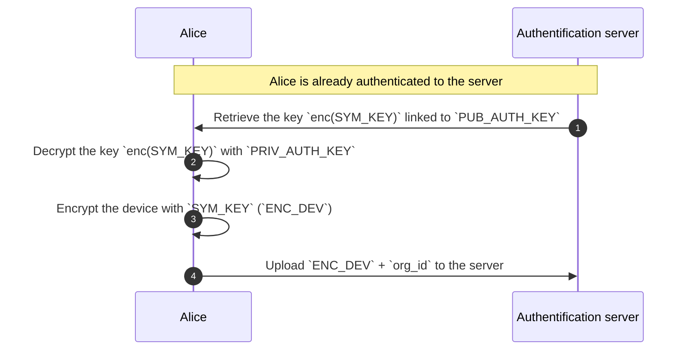
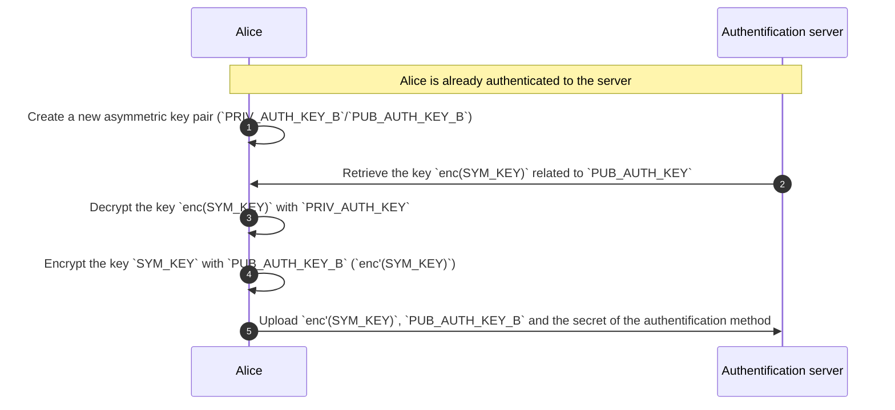
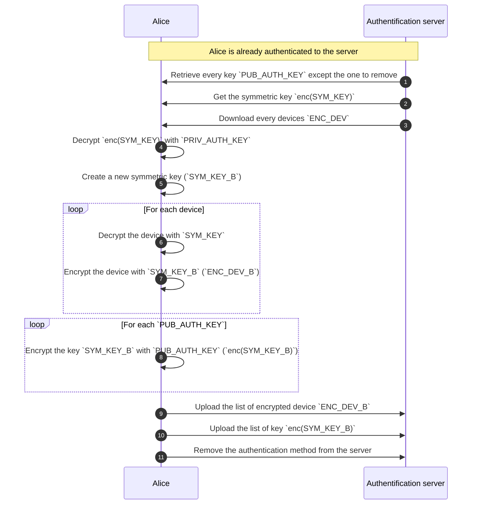

<!-- Parsec Cloud (https://parsec.cloud) Copyright (c) BUSL-1.1 2016-present Scille SAS -->

# Save parsec device on a remote server

## Overview

This RFC will discuss the implementation of a new service that will keep the user's devices remotely while still ensuring that only the user can use them.

## Background & Motivation

During our reflexion about providing a client that could run in a web-browser came the questions:

- How should we store the device in the browser?.

  Some concern where raised about the persistance of a parsec device in the browser.

- What would the user experience be like?

  - What should happen when the user use a different browser?
  - What the user is expecting when using another machine?

  We assume that the user expect to be able to connect from any browser/machine.

That how we came to the idea of storing the device on a remote server:

- That solve the issue where the browser may clean it's data.
- The device would be accessible anywhere (given a network connection).

## Goals

How would a user would store/access its devices from a remote service.
What are the API that would be needed to implement this feature.

## Non-Goals

How to ensure that the client is not compromised.

## Design

The authentification service would be a used before connecting to the parsec-cloud server to retrieve the device of the user that will then be used to authenticate to parsec-cloud.

<!-- Device stored on a third-party service -->

### Creation of a user account on the service

Creating the account for an user will require some information for the system to work:

- A identifier for the user (email)

  The service need to verify that the user as access to the email (using a code or sending a link to continue the process).

- A secret to identify the user (password, Fido2, ...)

  For the password, it's not used as is but it's derived to create a new secret using the function `PBKDF_A` (this operation is done on the client side to not leak the master password).
  The new secret will be provided as is to the server (like a password).

  In the Fido2 case we just use the included challenge since the private key is not shared with the server.

- An asymmetric key pair (`PUB_AUTH_KEY`, `PRIV_AUTH_KEY`)

  When using a password, the private key is generated by using the function `PBKDF_B` with the password

  > A key property here is we only need the password to generate the require keys.
  > Another approach would be to use the password as a symmetric key to encrypt a randomly generated private key that is send alongside the public key.
  > But we would loose that property.

  For Fido2, the private already exist in the fido2 device so we use it directly.

  > [!NOTE]
  > Should verify if it's possible to use fido2 to encrypt random blob of data.

- A symmetric key (`SYM_KEY`) that is generated during the account creation at the end by the client.
  It's encrypted with `PUB_AUTH_KEY` and then uploaded to the service.

> [!CAUTION]
> The output of `PBKDF_A` and `PBKDF_B` should be different to avoid leaking the private key.

At the end of the process, the server should save the following information in a new entry:

- The id of the user (email)
- The secret of the authentification method (`AUTH_SECRET`)

  > [!NOTE]
  > For password, it would be hashed using a strong hashing function.

- The public key of the authentification method (`PUB_AUTH_KEY`)
- The encrypted symmetric key (`enc(SYM_KEY)`).

> [!WARNING]
> A user should be able to register multiple authentification methods,
> so the user entry should allow for multiple `AUTH_SECRET`, `PUB_AUTH_KEY` and `enc(SYM_KEY)`.

### The authentification process

To be able to authenticate the user, it will need to provide the following information:

- Its id (email)
- The secret of is authentification method (`AUTH_SECRET`)

The server then verify the provided informations and return a token `AUTH_TOKEN` if the informations are correct.
That token would need to be provided to each request requiring to be authenticated.

### Uploading a new device

To upload a new device, the user would need to:

1. Retrieve the symmetric key `enc(SYM_KEY)` from the server.
2. Decrypt the key with `PRIV_AUTH_KEY`.
3. Encrypt the new device with `SYM_KEY` (`ENC_DEV`).
4. Upload the encrypted device (`ENC_DEV`) and the id of the organisation (`org_id`) to the server.

The server create a entry whose primary key is the tuple `user_id` and `org_id`.

> That mean a single device per user per organisation.

### List available device on the service

Once authenticated, the user can list the device associated to the account.

> That list does not contain the blob `ENC_DEV`.

### Retrieve a device from the service

The server provide an API to retrieve the blob `ENC_DEV` of a device.
The user can then decrypt the blob on its side.

### Adding a new authentification method

To add a new authentification method, it require the use to:

1. Create a new asymmetric key pair (`PUB_AUTH_KEY_B`, `PRIV_AUTH_KEY_B`) from the new method.
2. Retrieve the symmetric key `enc(SYM_KEY)` from the server.
3. Decrypt the key with `PRIV_AUTH_KEY`.
4. Encrypt the symmetric key with `PUB_AUTH_KEY_B` (`enc'(SYM_KEY)`).
5. Upload `enc'(SYM_KEY)`, `PUB_AUTH_KEY_B` and the secret of the new authentification method to the server.

### Removing an authentification method

To remove an authentification method from a user, it require the user to:

1. Retrieve all `PUB_AUTH_KEY` except the one to remove.
2. Retrieve `enc(SYM_KEY)` related to the current authentification method.
3. Retrieve all devices `ENC_DEV`.
4. Decrypt `enc(SYM_KEY)` with `PRIV_AUTH_KEY`.
5. Create a new symmetric key `SYM_KEY_B`.
6. For each devices:

   1. Decrypt the device with `SYM_KEY`.
   2. Encrypt the device with `SYM_KEY_B`.

7. For each `PUB_AUTH_KEY`, encrypt `SYM_KEY` with it.
8. Upload new list of encrypted devices, the list of `enc(SYM_KEY_B)` of each `PUB_AUTH_KEY`
9. Remove the authentification method from the server.

### Using the service alongside the parsec-cloud server

The parsec client would use the authentification service to store a special device, who will only be use to create a new local device.

That new device would be stored on the local storage and if the storage happen to be cleaned, the user could still re-create a new device from the special one stored on the service.

For already existing organisations and devices, the client could device to create and upload a special device to the service (cf [Uploading a new device](#uploading-a-new-device)).

## Alternatives Considered

N/A

## Operations

That require managing a new service that will store the devices of the user.

## Security/Privacy/Compliance

Consideration should be taken about the method used to save the device on the remote server.
The service would need to identify the user so we will need to have some information about the user (email mostly).

## Risks

The device are not stored securely to only allow the user to access them.

## Remarks & open questions

Should a client API be integrated in `libparsec` to communicate with the service is needed? or it's the js side that handle that?
