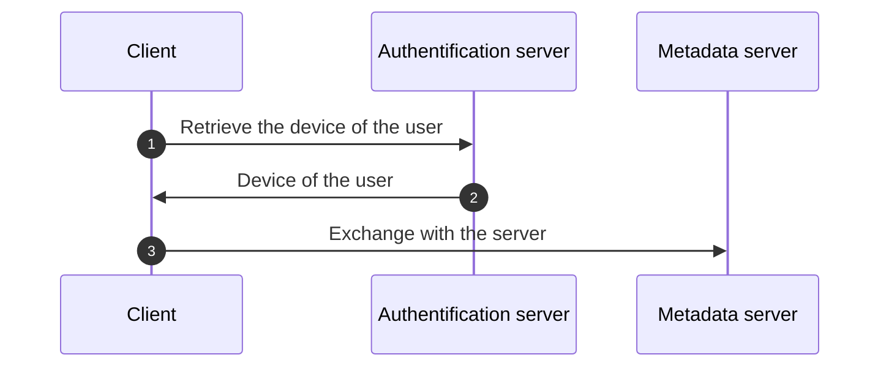
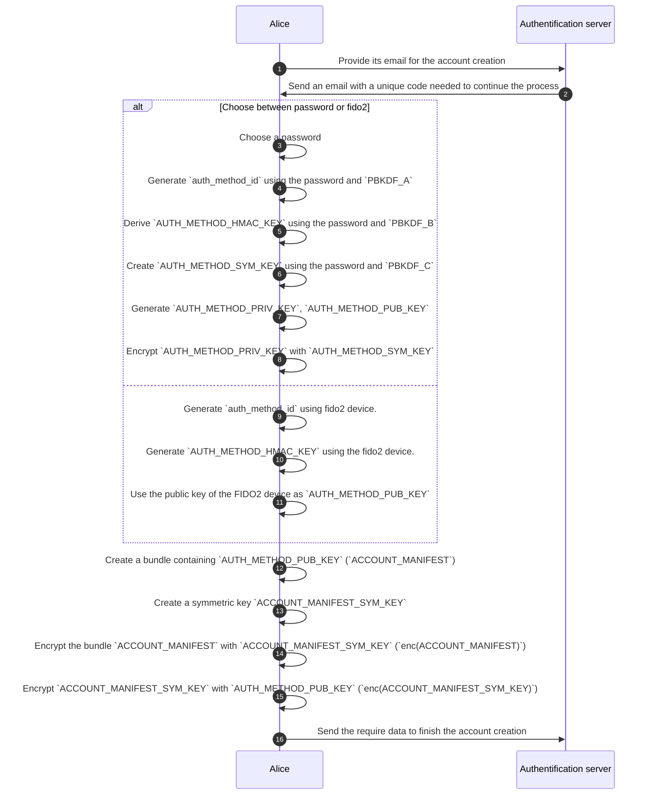
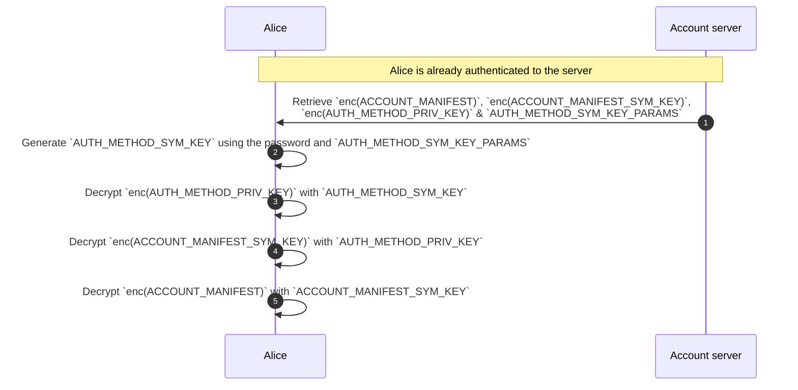
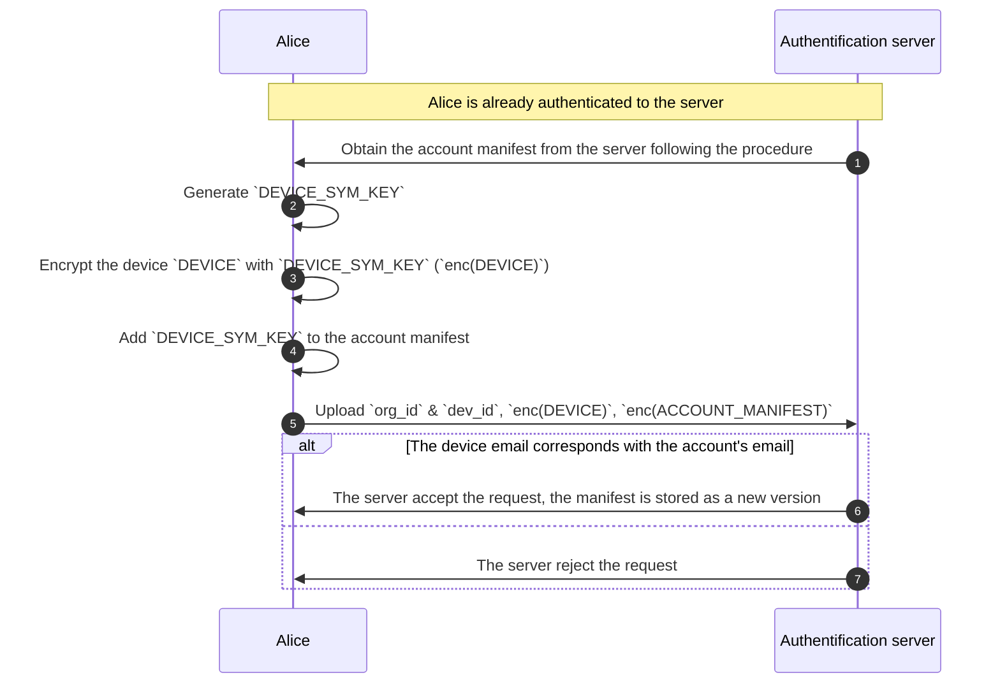
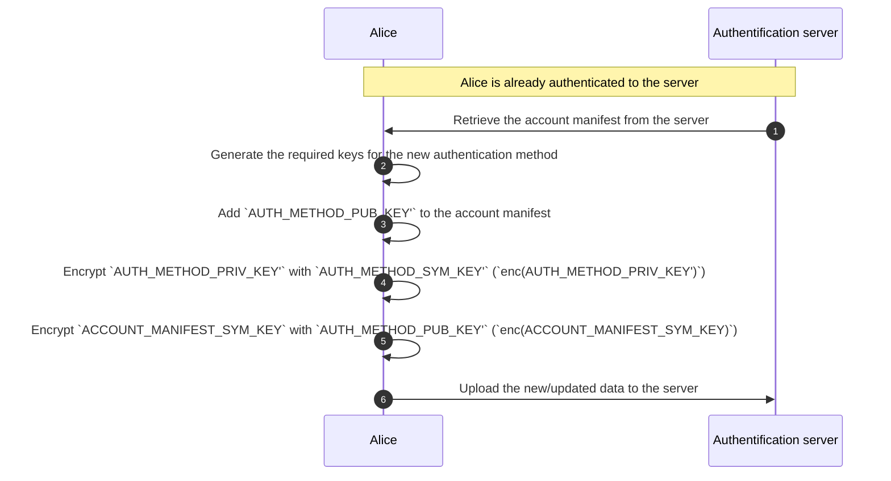
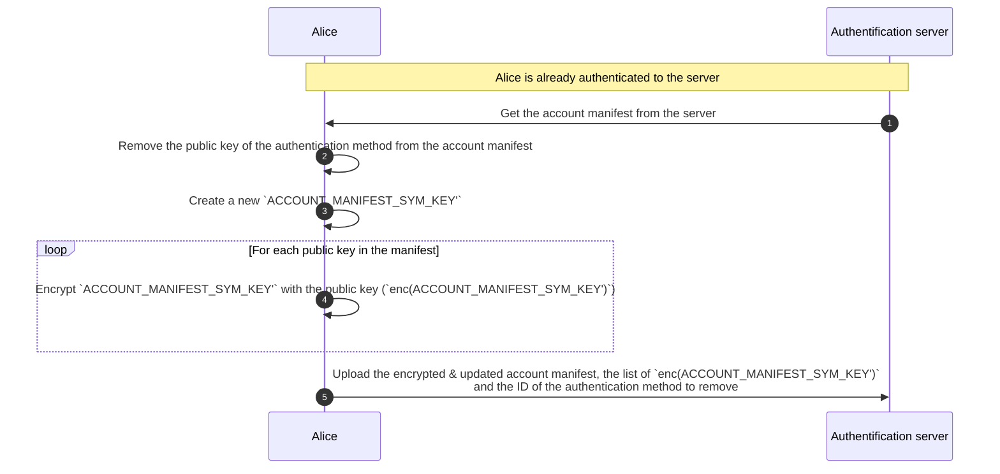
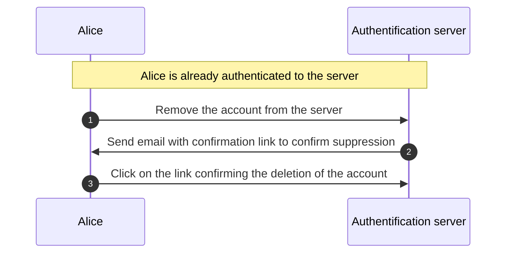
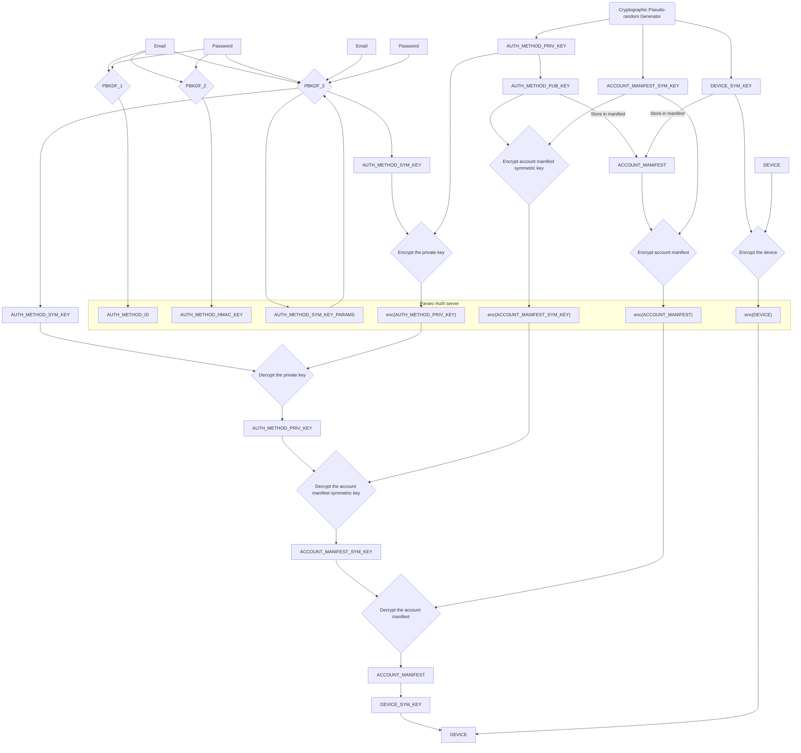

<!-- Parsec Cloud (https://parsec.cloud) Copyright (c) BUSL-1.1 2016-present Scille SAS -->

# Store Parsec device on a remote server

## Overview

This RFC will discuss the implementation of a new service to store the user's devices remotely while still ensuring that only the user can use them.

> [!NOTE]
> The creation of Parsec devices is not discussed in this RFC
> as this is still performed as usual by the client application.

> [!IMPORTANT]
> Mentions to FIDO2 as an alternative authentication method should not be taken as decision made in stone.
> We are currently lacking actual experience to be able to correctly specify what is needed.
> For instance a FIDO2 extension allows generating a symmetric key that could be used as password
> (so FIDO2 implementation would only be a small layer on top of the password).

## Background & Motivation

During our discussions about providing a client application that could run in a web-browser, came up the following questions:

- How should we store the device in the browser?.

  Some concerns were raised about the persistence of a Parsec device in the browser.

- What would the user experience be like?

  - What should happen when the user uses a different browser?
  - What is the user expecting when using another computer?

  We assume that the user should be able to connect from any browser/computer.

That is how we came to the idea of storing the device on a remote server.

- That will solve the issue of the browser cleaning its data.
- The devices would be accessible from anywhere (given the user is online).

## Goals

1. Describe how to store/access the user devices on a remote service.
2. Propose an API to implement this feature.

## Non-Goals

- Discuss security concerns regarding the web client application.

## Design

### General principles

An authentication service (Parsec Auth) would be used to store user devices. This service will be requested before connecting to the metadata server (Parsec server) in order to retrieve a specific user device. The device will then be used to authenticate to the metadata server.

<!-- Device stored on a third-party service -->

### Account creation

Creating the account for a user will require some information for the system to work:

- Some information about the user:

  - Its username (would be used to pre-fill the label part of the human handle when creating a device)
  - An identifier for the user (email)

    The service needs to verify that the user has access to the email (using a code or sending a link to continue the process).

- An ID for the authentication method

  That value is generated from the chosen method since it needs to be deterministic from the values available to the user and specific to the method itself.
  For password, it means the value will likely be derived from itself using `PBKDF_A`

- A HMAC shared key to authenticate the user (`AUTH_METHOD_HMAC_KEY`)

  When using a password, the HMAC key is derived from it using the function `PBKDF_B` (this operation is performed on the client side to avoid leaking the password).

  When using FIDO2, the included challenge is used as is for the HMAC key since the private key is not shared with the server.

- An asymmetric key pair `AUTH_METHOD_PUB_KEY`/`AUTH_METHOD_PRIV_KEY` used to encrypt `ACCOUNT_MANIFEST_SYM_KEY` described below

  When using a password, the asymmetric key pair is generated using a cryptographic secure pseudo-random number generator (CSPRNG).

  When using FIDO2, it already provides the asymmetric keys securely so they are used as is.

- A symmetric key (`AUTH_MEDIUM_SYM_KEY`) used to encrypt `AUTH_MEDIUM_PRIV_KEY` alongside the parameters used to generate it `AUTH_MEDIUM_SYM_KEY_PARAMS`.

  When using a password, it's generated from the function `PBKDF_C`

  For FIDO2, the symmetric key is not needed because `AUTH_METHOD_PRIV_KEY` is not shared since it's stored on the device.

- A randomly generated symmetric key `ACCOUNT_MANIFEST_SYM_KEY` used to encrypt the account manifest.

- Generate the account manifest `ACCOUNT_MANIFEST` to store:

  - The list of authentication public keys (`AUTH_METHOD_PUB_KEY`)
  - The list of keys used to encrypt the devices (the list is empty at the beginning)

  > The manifest will be encrypted to prevent the server to temper with it.

> [!CAUTION]
> The output of `PBKDF_{A,B,C}` should be different to avoid leaking the private key.

At the end of the process, the server should save the following information:

- An entry for the user account:

  - A UUID (`account_id`)
  - Username

  - The email of the user

- An entry for the account manifest

  - Identified with the provided `account_id`
  - A UUID (`account_manifest_id`)
  - Denoted as the first version of the manifest
  - The encrypted account manifest (`enc(ACCOUNT_MANIFEST)`)

- An entry for the authentication method linked to the user:

  - An ID that is provided by the user (`auth_method_id`)

    > That require the ID to be generated by the user with information available at the moment (likely derived from its secret).

  - The ID of the related account manifest (`account_manifest_id`)

  - The HMAC secret (`AUTH_METHOD_HMAC_KEY`)

    The secret should be securely stored by either encrypting its value or using a vault.

  - The encrypted private key (`enc(AUTH_METHOD_PRIV_KEY)`)

    > Could be empty when the user uses a FIDO2 device.

  - The encrypted key used to decrypt the account manifest (`enc(ACCOUNT_MANIFEST_SYM_KEY)`)
  - The parameters used to generate the symmetric key (`AUTH_METHOD_SYM_KEY`) that encrypted `enc(AUTH_METHOD_PRIV_KEY)` (`AUTH_METHOD_SYM_KEY_PARAMS`)

> [!WARNING]
> A user should be able to register multiple authentication methods.

### The authentication process

We use a HMAC to authenticate each request to the server with the secret `AUTH_METHOD_HMAC_KEY` that was previously shared.

The HMAC code is generated using:

- `auth_method_id` (It will be provided in the header of the request)
- A timestamp (used as a nonce value to prevent replay attack)
- The checksum of the body

### Obtain the account manifest from the server

The server stores the encrypted account manifest that contain the important information about the user.
For the user to obtain the account manifest from the server they will do the following:

1. Authenticate with the server.
2. Retrieve the following encrypted data from the sever:

   1. Account manifest (`enc(ACCOUNT_MANIFEST)`)
   2. Account manifest symmetric key (`enc(ACCOUNT_MANIFEST_SYM_KEY)`)
   3. Authentication method private key (`enc(AUTH_METHOD_PRIV_KEY)`)
   4. The parameters used to generate the symmetric key that encrypt the private key (`AUTH_METHOD_SYM_KEY_PARAMS`)

   > The retrieve data is related to the used authentication method

3. Re-generate `AUTH_METHOD_SYM_KEY` from the parameters and the password
4. Decrypt `enc(AUTH_METHOD_PRIV_KEY)` with `AUTH_METHOD_SYM_KEY` to obtain the private key (`AUTH_METHOD_PRIV_KEY`)
5. Decrypt `enc(ACCOUNT_MANIFEST_SYM_KEY)` with `AUTH_METHOD_PRIV_KEY` (`ACCOUNT_MANIFEST_SYM_KEY`)
6. Decrypt `enc(ACCOUNT_MANIFEST)` with `ACCOUNT_MANIFEST_SYM_KEY`
7. Decrypt the account manifest

### Uploading a new device

To upload a new device, the user would need to:

1. [Obtain the account manifest from the server](#obtain-the-account-manifest-from-the-server).
2. Create a new symmetric key for encrypting the device (`DEVICE_SYM_KEY`).
3. Encrypt the new device with `DEVICE_SYM_KEY` (`enc(DEVICE)`).
4. Add `DEVICE_SYM_KEY` to the account manifest.
5. Encrypt the account manifest with the symmetric key `ACCOUNT_MANIFEST_SYM_KEY`.
6. Upload the organization and device ID, the updated encrypted account manifest and the encrypted device.
7. The server verify the device's email (by asking the metadata server) if it corresponds to the account email

   > Later we could add a list of verified email to allow uploading devices using different emails.

> [!NOTE]
> The user can upload multiple devices for the same organization.

### List available devices

Once authenticated, the user can list the devices associated to their account.

The list contains the information about each device like:

- `organization_id`
- `device_id`
- `user_id` (information retrieved from the metadata server)
- `human_handle` (information retrieved from the metadata server)
- `created_on`
- `revoked_on` (information retrieved from the metadata server)

The list will not contain the `enc(DEVICE)` because most of the time the user will only need one device (a specific API is proposed for that in the next section).

### Retrieve a specific device

The server provides an API to retrieve the blob `ENC_DEV` of a device for a user and a given organization.
The client application can then decrypt the blob on its side to obtain the device using the appropriate key store in its account manifest.

### Adding a new authentication method

To add a new authentication method, it requires the client application to:

1. Be already authenticated to the server.
2. [Obtain the account manifest from the server](#obtain-the-account-manifest-from-the-server).
3. Generate `AUTH_METHOD_HMAC_KEY'`, `AUTH_METHOD_SYM_KEY'`, `AUTH_METHOD_SYM_KEY_PARAMS'`, `AUTH_METHOD_PRIV_KEY'`, `AUTH_METHOD_PUB_KEY'` for the added authentication method.
4. Add `AUTH_METHOD_PUB_KEY'` to the account manifest.
5. Encrypt `AUTH_METHOD_PRIV_KEY'` with `AUTH_METHOD_SYM_KEY'` (`enc(AUTH_METHOD_PRIV_KEY')`).
6. Encrypt `ACCOUNT_MANIFEST_SYM_KEY` with `AUTH_METHOD_PUB_KEY'` (`enc(ACCOUNT_MANIFEST_SYM_KEY)`).
7. Upload the updated manifest, `enc(AUTH_METHOD_PRIV_KEY')`, `enc(ACCOUNT_MANIFEST_SYM_KEY)` and `AUTH_METHOD_SYM_KEY_PARAMS'`.

   > The server will store the updated manifest as a new version

### Removing an authentication method

To remove an authentication method from a user, it requires the client application to:

1. Be already authenticated to the server.
2. [Obtain the account manifest from the server](#obtain-the-account-manifest-from-the-server).
3. Remove the public of the authentication method to remove from the account manifest.
4. Create a new `ACCOUNT_MANIFEST_SYM_KEY'`.
5. For each public key `AUTH_METHOD_PUB_KEY` in the account manifest, encrypt `ACCOUNT_MANIFEST_SYM_KEY` with it (`enc(ACCOUNT_MANIFEST_SYM_KEY)`).
6. Upload the encrypted & updated account manifest and the list of `enc(AUTH_METHOD_SYM_KEY')`.

   > The server will store the updated manifest as a new version

### Removing the account

If the user wants to remove its account, it requires to just send a request to the server.

> [!IMPORTANT]
> Only account data stored in the authentication server is deleted (see [Account creation](<#Account creation>)), no data is deleted in the metadata server.

### Recovering access to the account

In case the user forget is authentication method, they still could recover access to their account.

The server we use their registered email to send a recovery code.
The process will then be pretty similar to the [Account creation](#account-creation) beside that the server will not delete their previous manifest/device (cf [How the account manifest are stored](#a-word-about-how-the-account-manifests-are-stored)).

### A word about how the account manifests are stored

On the server, we want to limit concurrency issue so we try to reduce the number of deletion operations.
For this reason the account manifests stored in the server are versioned to prevent concurrency deletions/modifications from two connections to the same account.

That also provide nice characteristic when the user needs to recover its account due to loosing access to is authentication method:

If it happens that they remember their old password, they could decrypt their old manifest and merge it with the new manifest they have created from the recovery process.

### Integration with the Parsec server

The parsec client would use the authentication service to store a special device (let's call it remote device), which will only be used to create new local devices.
The new local device would be stored on the local storage. If the storage happens to be cleaned, a new local device could still be created from the remote device.

We could have directly used the remote device to communicate with the metadata server,
but this approach (similar to the one used to create devices from a recovery device)
has the advantage of allowing to provide a list of linked browsers/computers.

For existing devices (created before/without the authentication service) the client would need to create and upload a remote device to the service (cf [Uploading a new device](#uploading-a-new-device)) in order to access Parsec from a web environment.

### Global flow diagram

## Alternatives Considered

N/A

## Operations

- The authentication service storing users devices will need to be managed and probably be deployed separately from the Parsec metadata service
- GDPR will need to be considered for the data stored by the service. T&Cs will need to be adapted in order to mention the service and how to obtain and delete the data stored.

## Security/Privacy/Compliance

Consideration should be taken about the method used to save the device on the remote server.
The service would need to identify the user so we will need to have some information about the user (email mostly).

### Consideration on PBKDF algorithms

The `PBKDF_A` (used to generate `auth_method_id`), `PBKDF_B` (used to derive a secret from the password) and `PBKDF_C` (used to derive the private key from the password) output should be different in order to avoid leaking the private key.

To make the output different, we could:

- Use different algorithms (e.g.: `argon2id`, `scrypt`)
- Choose different salt (but they need to be deterministic from the information provided by the user only).
- Use different parameters (but that may reduce the security)

To keep things simple, we will use different salt, as we could easily create multiple salt using the email + constant value.

To limit the cost of deriving the same secret multiple time,
we could derivate the secret a first time using the costly algorithm then create sub-derivation the obtained secret using faster algorithms.

## Risks

The devices are not stored securely to only allow the user to access them.
In the case of using a password to login and to generate the asymmetric key pair,
consideration should be taken to ensure that we obtain the key pair from the derivation of the password.

In [Account creation](<#Account creation>), we use the password to generate 3 things:

- The authentication method ID using `PBKDF_A`.
- An intermediate secret using `PBKDF_B` provided as is to the server.
- The key pair using `PBKDF_C`.

We have the section [Consideration of PBKDF algorithms](<#Consideration on PBKDF algorithms>) that state some of the requirement.

## Remarks & open questions

- The client application will need to communicate with the authentication service: should this be integrated into `libparsec`? Or it's the JS side that handle that?

  > Since the communication between the client/server is done with `libparsec`, we will continue with that
  >
  > @touilleMan

- What to do when a user is revoked from an organization?
  Should we remove the device, or should we just provide the information that the device for the given organization is revoked?

  > Just inform the user about the revocation
  >
  > @touilleMan

- A similar question applies for devices that are no longer used (e.g. a linked browser that is no longer used)

  > The uploaded device in parsec-account are not linked to a specific browser, so this does not apply
  >
  > @FirelightFlagboy
