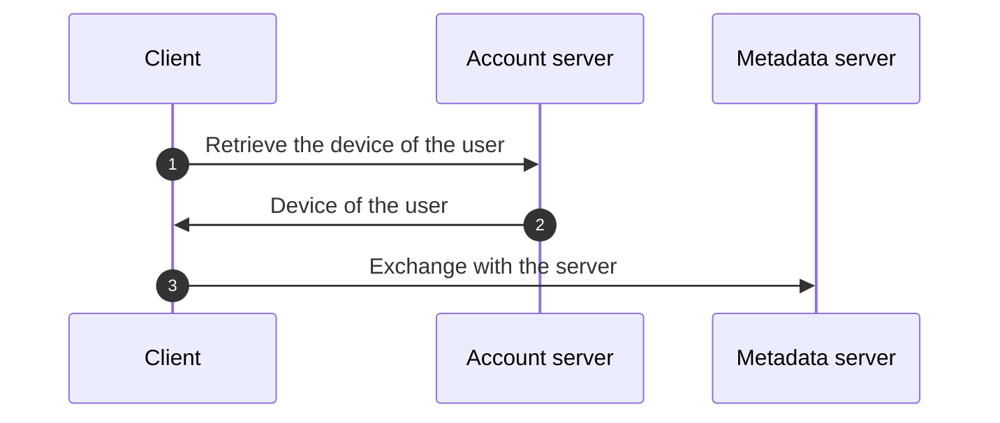

<!-- Parsec Cloud (https://parsec.cloud) Copyright (c) BUSL-1.1 2016-present Scille SAS -->

# Store Parsec device on a remote server

## Overview

This RFC will discuss the implementation of a new service to store the user's devices remotely while still ensuring that only the user can use them.

## Background & Motivation

During our discussions about providing a client application that could run in a web-browser, came up the following questions:

- How should we store the device in the browser?.

  Some concerns were raised about the persistence of a Parsec device in the browser.

- What would the user experience be like?

  - What should happen when the user uses a different browser?
  - What is the user expecting when using another computer?

  We assume that the user should be able to connect from any browser/computer.

That is how we came to the idea of storing the device on a remote server.

- That will solve the issue of the browser cleaning its data.
- The devices would be accessible from anywhere (given the user is online).

## Goals

- Describe how to store/access the user devices on a remote service.
- Propose an API to implement this feature.
- Focus on allowing users to connect using a password

## Non-Goals

- Discuss security concerns regarding the web client application.
- How the devices are created (nothing new, the creation is performed as usual by the client)
- Support authentication methods other than password (will be addressed in a new RFC)

## Design

### General principles

An authentication service (Parsec Account) would be used to store user devices.
This service will be requested before connecting to the metadata server (Parsec server) in order to retrieve a specific user device.
The device will then be used to authenticate to the metadata server.

<!-- Device stored on a third-party service -->


### Glossary

- **Parsec Account:** The name of the new service that will store the devices for a user.
- **Account:** The user's account inside Parsec account.
- **Vault:**: A pool of encrypted data accessible to a group of authentication methods.
- **Protected device**: The devices that the user want to protect.

- `auth_method_master_key`: A secret obtained from the authentication method.
- `auth_method_hmac_key`: A secret used for HMAC based authentication.
- `auth_method_secret_key`: A symmetric key to encrypt the vault key
- `vault_key`: A symmetric key used to encrypt the vault.

### Key generation

- `auth_method_master_key` is generated from a password using a PBKDF algorithm (likely `argon2`).
- `auth_method_hmac_key` and `auth_method_secret_key` are generated from `auth_method_master_key` using a KDF algorithm (the algorithm will be configured differently to not use the same key).
- `vault_key` is generated from a CSPRNG.


### How we authenticate the request

Some indices are already present above, we will use an HMAC based authentication.

> The reason for this choice is that we do not need additional request to get an OAuth token.

The HMAC code will be put in the `Authorization` HTTP header and will have the following format:

```bash
PARSEC-HMAC-BLAKE2B.${id}.${account_email}.${timestamp}.${signature}
```

The signature is generated like so:

```math
\begin{gather}
body\_sha256 = sha256(body) \\
content = \text{"PARSEC-HMAC-BLAKE2B"} \Vert email \Vert timestamp \Vert body\_sha256 \\
code = hmac_{black2b}(shared\_secret, content) \\
signature = base64(code)
\end{gather}
```

> [!TIP]
> $\Vert$ is the concatenation operator.

> We pass the checksum of the body and not the body itself to simplify generating the signature on low-power device (smartcard)
> since they would have less data to process.

### The data model

#### Account

[`Account`]: #account

```yaml
{
  "label": "Account",
  "type": "account",
  "other_fields": {
    "email": "EmailStr",
    "label": "EmailLabel"
  }
}
```

The `label` is not used by Parsec Account server but will be used by the client to pre-fill the device label information (and the email field).

#### Vault

[`Vault`]: #vault

```yaml
{
  "label": "Vault",
  "type": "vault",
  "other_fields": {
    "created_on": "Timestamp",
    "created_by": "Creator"
  }
}
```

> `Creator` is a string-like value containing IP address and User-Agent to
> identify the creator of the vault.

- There may be multiple vaults for an account.
- For any given account, only a single vault is active.
- The older vaults are kept for recovery purposes.

#### Auth Method

[`AuthMethod`]: #auth-method

```yaml
{
  "label": "AuthMethod",
  "type": "auth_method",
  "other_fields": {
    "algorithm": "KeyAlgorithm",
    "hmac_key": "HMACKey",
    "account_id": "AccountID",
    "vault_id": "VaultID",
    "vault_encrypted_key": "EncryptedSymKey",
    "created_on": "Timestamp",
    "created_by": "Creator"
  }
}
```
- The algorithm field contains the full configuration needed to do the derivations operations. Typically, for the password it should be `{"name": "Argon2iBlake2", "argon2i_opslimit": 65536, "argon2i_memlimit_kb": 3, "argon2i_parallelism": 1}`
- There can be only a single password authentication method per vault.
- Other authentication methods (such as FIDO2) may be added in the future.

#### Protected Device

[`ProtectedDevice`]: #protected-device

```yaml
{
  "label": "ProtectedDevice",
  "type": "protected_device",
  "other_fields": {
    "organization_id": "OrganizationID",
    "device_id": "DeviceID",
    "vault_id": "ID",
    "encrypted_device": "EncryptedDevice"
  }
}
```
- Device are protected within a vault
- Any given device can be protected in multiple vaults (this is typically the case when the devices have been recovered from an older vault).

### API

> [!IMPORTANT]
> All requests are authenticated with a [HMAC signature](#how-we-authenticate-the-request) except stated otherwise.

#### Account creation

To create an account, the client starts by requesting an email validation token.

```yaml
{
  "cmd": "account_send_email_validation_token",
  "req": {
    "email": "EmailStr"
  },
  "reps": [
    {
      "status": "ok"
    },
    {
      "status": "invalid_email"
    }
  ]
}
```

> This request is not authenticated with the server.

On `ok`, the server would have sent a mail with a unique token used for next the request used to register the authentication method.

> The token will be valid for a duration that will be defined at the implementation (likely will be configurable)

If the email is already registered in the service, a `ok` response will still be sent (without sending an email)
to avoid creating an oracle about emails registered in the service.

```yml
{
  "cmd": "account_password_create",
  "req": {
    "email_validation_token": "EmailValidationToken",
    "account_label": "String",
    "auth_method_key_params": "KeyAlgorithm",
    "auth_method_hmac_key": "HMACKey",
    "encrypted_vault_key": "EncryptedSymKey"
  },
  "reps": [
    {
      "status": "ok",
    },
    {
      "status": "invalid_email_validation_token"
    }
  ]
}
```

> This request is authenticated with the newly generated key.
> But it's possible that we make it unauthenticated in the implementation to not have a dedicated verification process for the request
> (since it would need to use the data provided in the request vs save in the server).

Upon receiving the request, the server will create the [`Account`], [`AuthMethod`], and [`Vault`].

The IP address and User-agent of the creator are recorded (see Data Model).

#### Uploading a new device

To upload a new device the user need to retrieve the current vault information

```yaml
{
  "cmd": "vault_get",
  "req": {},
  "reps": {
    "ok": {
      "vault_id": "VaultID",
      "encrypted_key": "EncryptedSymKey",
      "created_on": "Timestamp",
      "created_by": "Creator",
      # True if using the active vault (latest vault).
      "active": "bool"
    }
  }
}
```

It returns the vault information associated with the authentication method

```yaml
{
  "cmd": "protected_device_upload",
  "req": {
    # We add the vault_id to limit concurrency issue in case another client perform a vault rotation.
    "vault_id": "VaultID",
    "device": "UploadedDevice"
  },
  "reps": {
    "ok": {},
    # The server compare the human handle of the device to the email of parsec-account.
    "invalid_human_handle": {},
    # Also check if `vault_id` correspond to the latest vault in use.
    "inactive_vault": {}
  }
}
```

The uploaded device correspond to:

```yaml
{
  "label": "UploadedDevice",
  "type": "uploaded_device",
  "other_fields": {
    "organization_id": "OrganizationID",
    "device_id": "DeviceID",
    "encrypted_device": "EncryptedDevice"
  }
}
```

#### List devices

To list the devices linked to the authentication method's vault:

```yaml
{
  "cmd": "protected_device_list",
  "req": {},
  "reps": {
    "ok": {
      "vault_id": "VaultID",
      "devices": "Vec<DeviceInfo>"
    }
  }
}
```

`DeviceInfo` is an aggregation of [`ProtectedDevice`] and additional information retrieved from the metadata server.

```yaml
{
  "label": "DeviceInfo",
  "type": "device_info",
  "other_fields": {
    "organization_id": "OrganizationID",
    "device_id": "DeviceID",
    "user_id": "UserID",
    "HumanHandle": "HumanHandle",
    "created_on": "Timestamp",
    "revoked_on": "Option<Timestamp>",
    "encrypted_device": "EncryptedDevice"
  }
}
```
The encrypted device file is typically ~1Kb in size. Considering the number of devices is generally small, it is included here to simplify the API. In the future, a dedicated route may be added specifically to obtain the encrypted device.

#### Recovery device list

To list all protected device from all vault except current/active one:

```yaml
{
  "cmd": "protected_device_recovery_list",
  "req": {},
  "reps": {
    "ok": {
      "vaults": "Vec<VaultInfo>",
      "devices": "Vec<DeviceInfo>"
    }
  },
  "custom_types": {
    "VaultInfo": {
      "id": "VaultID",
      "created_on": "Timestamp",
      "created_by": "Creator",
      "auth_methods": "Vec<AuthMethod>"
    },
    "AuthMethod": {
      "algorithm": "KeyAlgorithm",
      "created_on": "Timestamp",
      "created_by": "Creator"
    }
  }
}
```

The returned list does not include devices from the current vault (since user already has access to them and do not need to recover them). Only the vaults that still contain to-be-recovered protected devices are listed.

Recovery can be done in two ways:

- By remembering the old authentication method's password (since vaults are not removed)
- By recovering the Vault key. For this purpose, we should consider providing a way to export the vault key.

#### Updating the password

```yaml
{
  "cmd": "auth_method_password_update",
  "req": {
    "algorithm": "KeyAlgorithm",
    "hmac_key": "HMACKey",
    "encrypted_vault_key": "EncryptedSymKey"
  },
  "reps": {
    "ok": {}
  }
}
```

The server will update the unique [`AuthMethod`] linked to the account with the updated field.
At that point, the client will need to use the update key for the next requests.

The current password will be overwritten in the current authentication method.

The IP address and User-agent of the creator are recorded (see Data Model).

#### Rotate the vault key

```yaml
{
  "cmd": "vault_key_rotation",
  "req": {
    "devices": "Vec<UploadedDevice>",
    "encrypted_vault_key": "EncryptedSymKey"
  },
  "reps": {
    "ok": {}
  }
}
```

Upon receiving this request, the server creates a new [`Vault`] and new [`ProtectedDevice`].

> [!IMPORTANT]
> Doing a vault key rotation means the other authentication methods would not have access to the new `vault_key`,
> and therefore would not be able to decrypt the devices encrypted with the new key.

#### Account recovery

```yaml
{
  "cmd": "account_recovery_start",
  "req": {
    "email": "EmailStr"
  },
  "reps": {
    "ok": {},
    "invalid_email": {}
  }
}
```

> This request is not authenticated.

Similar to `account_send_email_validation_token`, the server will send a mail to recover the account.
If the email does not exist the server will still respond with OK status for the same reason as `account_send_email_validation_token`.

```yaml
{
  "cmd": "account_recovery_finish",
  "req": {
    "recovery_token": "RecoveryToken",
    "auth_method_key_paramsS": "KeyAlgorithm",
    "encrypted_vault_key": "EncryptedSymKey"
  },
  "reps": {
    "ok": {},
    "invalid_recovery_token": {}
  }
}
```

The server will create a new [`Vault`] & [`AuthMethod`]

#### Account deletion

```yaml
{
  "cmd": "account_delete",
  "req": {},
  "reps": {
    "ok": {}
  }
}
```

The server will send an email with a token (similar to the creation token) to confirm the suppression of the account.

The client will then send another authenticated request with the token:

```yaml
cmd: account_delete_confirm
req:
  token: DeleteToken
reps:
  ok: {}
  invalid_token: {}
```

At that point the server can remove the client, and it's related data

#### Missing elements to be defined in the future

- Support changing email linked to account
- Support validating device using different email in human handle
- Support for FIDO2
- Multiple auth method support (listing, deletion)
- MFA support
- SSO support
- Improved vault rotation: To share the new `vault_key` with others auth methods
- Clean up of device protected with old vault key?

## Alternatives Considered

N/A

## Operations

- The authentication service storing users devices will need to be managed and probably be deployed separately from the Parsec metadata service
- GDPR will need to be considered for the data stored by the service. T&Cs will need to be adapted in order to mention the service and how to obtain and delete the data stored.

## Security/Privacy/Compliance

Consideration should be taken about the method used to save the device on the remote server.
The service would need to identify the user so we will need to have some information about the user (email mostly).

## Risks

- The devices are not stored securely to only allow the user to access them.

## Remarks & open questions

- The client will interact with parsec-account via `libparsec`, that way we reuse our RPC communication stack.
- Parsec Account will only list device it will not perform cleanup automatically, it's up to the user to do that.
  That mean in case of revocation, the server will not remove the device (but will display that the device was revoked).
