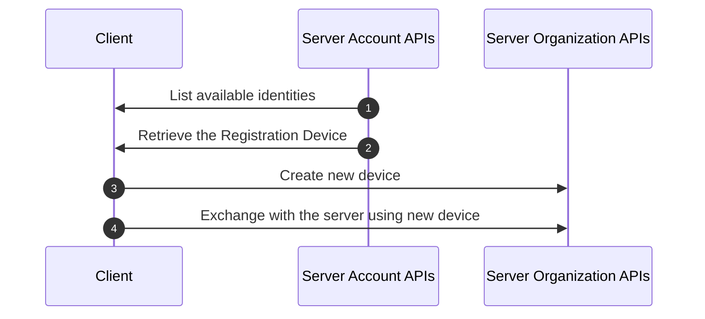
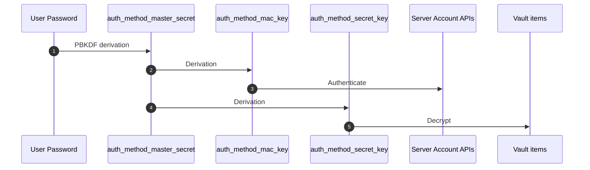

<!-- Parsec Cloud (https://parsec.cloud) Copyright (c) BUSL-1.1 2016-present Scille SAS -->

# Parsec Account

## 1 - Goals

This RFC propose a new account (called "Parsec Account") hosted by the Parsec server
and mandatory for all Parsec users. The idea behind this is to:

1. Simplify user interaction by making Parsec Account a one-size-fits-all solution.
2. Allow simplified use of multiple devices by not requiring device-to-device enrollment
   (see [RFC 1015](1015-registration-device.md)).
3. Provide a centralized view of invitations and Shamir recovery operations.
4. Simplify recovery device handling by storing them in the Parsec Account, only requiring
   the user to store the passphrase on his side.

## 2 - Overview

### 2.1 - Background & Motivation

During our discussions about providing a client application that could run in a web-browser, came up the following questions:

- How should we store the device in the browser?.

  Some concerns were raised about the persistence of a Parsec device in the browser.

- What would the user experience be like?

  - What should happen when the user uses a different browser?
  - What is the user expecting when using another computer?

  We assume that the user should be able to connect from any browser/computer.

That is how we came to the idea of storing the device on a remote server.

- That will solve the issue of the browser cleaning its data.
- The devices would be accessible from anywhere (given the user is online).

Hence this chain of RFCs ([1013](1013-parsec-account.md),
[1014](1014-account-vault-for-device-stored-on-server.md),
[1015](1015-registration-device.md),
[1016](1016-local-device-storage-in-web-client.md),
[1017](1017-web-client-allowed-on-per-org-basis.md),
[1018](1018-server-stored-device-keys.md) and
[1019](1019-deprecate-local-device-user-realm-field.md)) to specify
all those new features.

### 2.2 - Relationship with existing invitation & on-boarding

Currently, the on-boarding process starts by providing an invitation URL to the claimer.

Once this URL is opened with the Parsec client, enrollment dance can proceed right away.

With this RFC, the enrollment process must occur within the context of a Parsec Account:

- If the user is connected to Parsec Account, the list of pending invitations will be displayed.
- If the user is not connected to Parsec Account and opens an invitation URL, the Parsec
  client will ask him to connect to Parsec Account with the email corresponding to the
  invitation (obtained by the querying the server with the `invite_info` command).
- If the user is connected to Parsec Account and opens an invitation URL:
  - If the invitation's email correspond to the Parsec Account, the enrollment can start
    right away.
  - Otherwise the Parsec client will ask the user to connect to the Parsec Account
    matching the invitation (while also prompting the possibility to create such
    Parsec Account).

### 2.3 - Relationship with existing device keys files

Currently, once enrollment is done, a device keys file is written to the machine
hard disk. As its name suggest, this file contains, among other things, the device keys.

There is no change needed to this behavior.

Indeed: once logged in to Parsec Account, the user should see the list of identities
(i.e. couple organization ID + user ID) he can connect to.

Typically identities can be in the following states:

1. Organization expired
2. User revoked
3. Valid, no device locally, and no registration device
4. Valid, no device locally and registration device available
5. Valid, and device present locally

The Parsec Account API allows to obtain:

- The full list of identities
- Which organization is expired
- Which user is revoked
- Which organization allows registration devices
- The list of registration devices

From there, listing the available devices locally allows to fully determine which
identity can connected to.

> [!NOTE]
> In case of offline login (logged into an organization but not to Parsec Account), we only use the login as a filter
> on the user email to only display a subset of devices locally present.

A key point from here is the fact that at this point we can determine if a device
locally exists for an organization without registration device but allowing it.
In this case, the Parsec client should display a message inviting the user to
re-create a registration device.

> [!NOTE]
> This behavior serves two goals:
>
> - Handle legacy to switch to the Parsec Account system.
> - Repair the user account if he lost its Parsec Account password.

### 2.4 - Remember Parsec Account credential in the client

To simplify user experience, we want to default to the OS keyring when protecting the device keys files.

Similarly, we want to be provide an option "remember me" that would store the Parsec Account
password in the OS keyring.

> [!NOTE]
> We might want to improve this in the future by using a dedicated
> authentication method relying on a proper secret key. This way we would avoid
> storing the password.

TODO: Discuss Parsec Account offline login.

### 2.5 - Account Devices Vault for server-side stored devices keys

A key feature of Parsec Account is the possibility to avoid device-to-device
enrollment:

- The user connects to Parsec Account from a new machine.
- The user can then select an identity (organization ID + User ID) to connect to.
  Behind the scene, those identities correspond to already existing device (aka
  Registration Device) that are stored server-side.
- The existing device is then used to create a new device for the machine.

<!-- Registration Device workflow -->


This feature however requires the need to store the Registration Devices securely
on the server.

This feature is described in detail in [RFC 1014](1014-account-vault-for-device-stored-on-server.md)
(for the storing part) and [RFC 1015](1015-registration-device.md) (for how the registration device works).

## 3 - Datamodel

### 3.1 - Glossary

- **Parsec Account**: The generic name of this new service.
- **Account**: The user's account inside Parsec Account.
- **Authentication Method**: A way to authenticate to an Account. Each account can have
  multiple authentication methods (i.e. password, FIDO2 etc.).
- **Vault**: A pool of encrypted data accessible to a group of authentication methods.
  Each account can have multiple Vaults (in case of vault key rotation, or if the account
  access has been reset due to user losing all his authentication methods).
- **Vault item**: A piece of data that is encrypted by the Vault key. This is typically
  an Registration Device (see [RFC 1015](1015-registration-device.md)).
- **Identity**: couple organization ID + user ID. An account can store access to multiple identities.

### 3.2 Keys

- `auth_method_master_secret`: A secret obtained from the authentication method.
- `auth_method_mac_key`: A symmetric key obtained from deriving `auth_method_master_secret`
  and used for MAC based authentication with the server.
- `auth_method_secret_key`: A symmetric key obtained from deriving `auth_method_master_secret`
  and used to encrypt the `vault_key`.
- `vault_key`: A symmetric key used to encrypt the Vault items.

`auth_method_master_secret` is obtained differently depending on the authentication
method used:

- For password, it is obtained from PBKDF derivation of the password.
- For other methods, it might be a randomly generated secret stored securely.

<!-- Account keys workflow -->


### 3.3 - Account

[`Account`]: #33---account

Attributes:

- `email: EmailAddress`. Main identifier for the account.
- `human_label: String`. Not used by Parsec Account but works as a quality-of-life feature
  to allow pre-filling human handle during enrollment.

> [!NOTE]
> In the future we might want to support multiple emails for a given account.
> In such case the initial email would still be used as the main identifier, and we
> would have an additional field containing the list of additional validated emails.

### 3.4 - Authentication Method

[`Authentication Method`]: #34---authentication-method

Attributes:

- `account`. An authentication method is related to a single account.
- `vault`. An authentication method is related to a single vault.
- `auth_method_id: UUID`. Each authentication method has a unique identifier, it is derived from the
  `auth_method_master_secret` and is used in the `Authorization` HTTP header.
- `created_on: DateTime`
- `created_by_ip: String`. IP address of the HTTP request that created the authentication method
  (either by account creation, vault key rotation or account recovery)
- `created_by_user_agent: String`. User agent header of the HTTP request that created the vault.
- `mac_key: SecretKey`. Secret key used for MAC based authentication with the server.
- `vault_key_access: Bytes`. Vault key encrypted with the `auth_method_secret_key`
  (see [RFC 1014](1014-account-vault-for-device-stored-on-server.md) for its internal format).
- `master_secret_algorithm: KeyAlgorithm`. The algorithm to obtain the `auth_method_master_secret`, it depends on
  the authentication method used, this attribute should contains the full configuration
  needed to do this operation (Typically, for the password it should be something like
  `{"name": "ARGON2ID", "opslimit": 65536, "memlimit_kb": 3, "parallelism": 1}`).
- `enabled: bool` (server side-only): Indicate if this method is enabled or not.

> [!NOTE]
>
> - There can be only a single active password authentication method per vault.
> - The password authentication can be overwritten in order to change the password
>   without impacting the vault (see next paragraph).
> - In case of password change, the previous password authentication method is kept
>   in the server database (but marked as inactive). This way the old password can
>   still be used to recover the vault in case of account recovery (see below).
> - Currently only password authentication is supported, other authentication
>   methods (such as FIDO2) may be added in the future.

In case the user loses access to all his authentication methods (e.g. he forget his password),
the account must be recovered to re-gain access (i.e. email-based identity validation, then
re-creation from scratch of authentication method & vault).

### 3.5 - Vault & vault items

[`Vault`]: #35---vault--vault-items

> [!IMPORTANT]
> See [RFC 1014](1014-account-vault-for-device-stored-on-server.md) for the detail about vault & vault item protection.

Attributes:

- `account`. A vault is related to a single account.
- `items: Vec<Bytes>`. A vault contains multiple items that are opaque data encrypted with the `vault_key`.

> [!NOTE]
>
> - An account can have multiple vaults (in case of vault key rotation, or if the account
>   access has been reset due to user losing all his authentication methods).
> - At any given time, only the account's most recent vault is considered active. The
>   other ones can only be accessed for recovery purposes (see [RFC 1014](1014-account-vault-for-device-stored-on-server.md)).

Currently, the vault is able to protect two types of data:

- Registration Devices, see [RFC 1015](1015-registration-device.md)
- Web `LocalDevice` decryption key, see [RFC 1016](1016-local-device-storage-in-web-client.md)

> [!IMPORTANT]
> Each vault item is related to a single organization.

The main idea behind the vault is to encrypt arbitrary data with a symmetric key
(`vault_key`) that is itself encrypted with the `auth_method_secret_key` (see
`vault_key_access` above).

This means the `vault_key` doesn't change when authentication methods are added or removed.

However it is still possible for the user to force a manual vault key rotation. In this
case a new vault (with a new corresponding `vault_key`) is created and all vault items
from the old vault are re-encrypted and transferred to the new one.

Similarly, in case of account recovery (see previous paragraph) a new vault is created
from scratch (i.e. the user has lost access to his previous vault). Further operations
are then needed (see [RFC 1014](1014-account-vault-for-device-stored-on-server.md)) to regain access to the content of the old vault.

### 3.6 - New Parsec action URL for email-validated operations

The Parse Account relies on email address validation for multiple operations:

- [Creating a new account](#43---account-creation-validate-email)
- [Recovering an account](#46---account-recovery-validation) (e.g. in case of password loss)
- [Deleting an account](#48---account-deletion-validation)

For all those cases, the logic is as follow:

1. The Parsec client sends an initial API request to the server
2. The server sends a confirmation email to the user containing a link with a validation token.
3. The user clicks on the link in the email, which open the Parsec client
4. The Parsec client sends a second API request with the validation token to the server.
5. The server proceed with the actual operation.

Hence the need to define a new type of URL link: `ParsecAccountActionAddr`.

The format is similar to the existing `ParsecActionAddr`, the only difference being
that `ParsecActionAddr` specifies the organization ID.

`ParsecAccountActionAddr` format: `parsec3://parsec.example.com?a=<action>&p=<payload>`

New `ParsecAccountActionAddr` format can have three variants:

name              | `action` value     | `payload` value
------------------|--------------------|------------------
`AccountCreation` | `account_create`   | `base64(msgpack(<validation_token>))`
`AccountRecovery` | `account_recovery` | `base64(msgpack(<validation_token>))`
`AccountDeletion` | `account_delete`   | `base64(msgpack(<validation_token>))`

> [!NOTE]
> We should probably rename `ParsecActionAddr` -> `ParsecOrganizationActionAddr`
> to avoid confusion with this new `ParsecAccountActionAddr` (this is a purely internal
> code change, so no risk of backward compatibility issue).

## 4 - API

### 4.1 - New anonymous & authenticated account API families

Similarly to the existing `anonymous` & `authenticated` API families used to access
the organization, we will create a similar API families (i.e. `anonymous_account`
& `authenticated_account`) to access the account.

### 4.2 - Authenticated account API family authentication format

We use a MAC (Message Authentication Code) based authentication similarly to what we do
with the existing `authenticated` API family.

The MAC code will be put in the `Authorization` HTTP header and will have the following format:

```jinja
PARSEC-MAC-BLAKE2B.{{ hex(auth_method_id) }}.{{ timestamp }}.{{ signature }}
```

> [!IMPORTANT]
> We use the URL-safe `base64` variant.

The signature is generated like so:

```math
\begin{gather}
content = \text{"PARSEC-MAC-BLAKE2B"} \Vert \text{"."} \Vert hex(auth_method_id) \Vert \text{"."} \Vert timestamp \\
code = mac_{black2b}(shared\_secret, content) \\
signature = base64(code)
\end{gather}
```

> [!TIP]
> $\Vert$ is the concatenation operator.

### 4.3 - Account creation: validate email

To create an account, the client starts by requesting an email validation token.

Anonymous account API:

```json5
{
  "cmd": "account_create_send_validation_email",
  "req": {
    "fields": [
      {
        "name": "email",
        "type": "EmailAddress"
      }
    ]
  },
  "reps": [
    {
      "status": "ok"
    },
    {
      // The email could not be sent due to SMTP server issue
      "status": "email_server_unavailable"
    },
    {
      // The SMTP server rejected the email recipient
      "status": "email_recipient_refused"
    }
  ]
}
```

> [!NOTE]
> `EmailAddress` is a new type allowing to validate the email address format.

On `ok`, the server would have sent a mail with a unique token used for the next request used to register the authentication method.

If an account already exists with this email, a `ok` response will still be sent (without sending an email)
to avoid creating an oracle about emails registered in the service.
If an account creation has already been requested for an email and the email is not validated yet, a new email with a new token may or may not been sent depending on how long ago the previous one was sent.

The token is valid for a default duration of 24h, which can be changed in the server configuration (
`PARSEC_ACCOUNT_EMAIL_VALIDATION_TOKEN_VALIDITY` specifying the duration in seconds).

TODO: Use a Proof of work based solution (see [Anubis](https://anubis.techaro.lol/)) to protect against DOS

To avoid DOS (Deny Of Service) attack, the server will limit the number of requests:

- Per IP address of the client using the API
- Per email address

### 4.4 - Account creation: actual creation

Anonymous account API:

```json5
[
  {
    "major_versions": [
      5
    ],
    "cmd": "account_create_with_password_proceed",
    "req": {
      "fields": [
        {
          // Token received by email following use of `account_create_send_validation_email`
          "name": "validation_token",
          "type": "EmailValidationToken"
        },
        {
          // Quality-of-life field to pre-fill the human handle's label during enrollment
          "name": "human_label",
          "type": "String"
        },
        {
          // Algorithm used to turn the password into the `auth_method_master_secret`
          // (itself used to generate `auth_method_hmac_key` and `auth_method_secret_key`).
          "name": "password_algorithm",
          "type": "PasswordAlgorithm"
        },
        {
          // Secret key shared between the client and the server and used for
          // account authenticated API family's HMAC authentication.
          "name": "auth_method_hmac_key",
          "type": "SecretKey"
        },
        {
          // UUID used to identify the authentication method in the `Authorization` HTTP header.
          //
          // This cannot be generated server-side since the client derives it from the
          // `auth_method_master_secret`.
          "name": "auth_method_id",
          "type": "AccountAuthMethodID"
        },
        {
          // `VaultKeyAccess` encrypted with the `auth_method_secret_key`
          "name": "vault_key_access",
          "type": "Bytes"
        }
      ]
    },
    "reps": [
      {
        "status": "ok"
      },
      {
        "status": "invalid_validation_token"
      },
      {
      // In practice this error should never occur since collision on the ID is
      // virtually non-existent as long as the client generates a proper UUID.
      "status": "auth_method_id_already_exists"
      }
    ],
    "nested_types": [
      {
        "name": "PasswordAlgorithm",
        "discriminant_field": "type",
        "variants": [
          {
            "name": "Argon2id",
            "discriminant_value": "ARGON2ID",
            "fields": [
              {
                "name": "salt",
                "type": "Bytes"
              },
              {
                "name": "opslimit",
                "type": "Integer"
              },
              {
                "name": "memlimit_kb",
                "type": "Integer"
              },
              {
                "name": "parallelism",
                "type": "Integer"
              }
            ]
          }
        ]
      }
    ]
  }
]
```

> [!NOTE]
> Since the request is authenticated with the token field it contains, it could
> be tempting to introduce an "invited account" API family that would authenticate on
> the token similarly to the regular `invited` API family used for user/device enrollment.
> However this is not worth the effort since, unlike for enrollment, this token only
> authenticates a single API command (and we would need to introduce a separate API
> family for other token-for-single-API-command such as account recovery & deletion).

Upon receiving the request, the server will create the [`Account`], [`Authentication Method`], and [`Vault`].

The IP address and User-agent of the creator are recorded (see Data Model).

### 4.5 - Get password algorithm parameters

Since the `auth_method_master_secret` is needed to authenticate to the server,
the password algorithm parameters for a given account must be first obtained.

Anonymous account API:

```json5
{
  "cmd": "account_get_password_algorithm",
  "req": {
    "fields": [
      {
        "name": "email",
        "type": "EmailAddress"
      }
    ]
  },
  "reps": [
    {
      "status": "ok",
      "fields": {
        {
          // Algorithm used to turn the password into the `auth_method_master_secret`
          // (itself used to generate `auth_method_mac_key` and `auth_method_secret_key`).
          "name": "password_algorithm",
          "type": "PasswordAlgorithm"
        }
      }
    }
  ],
  "nested_types": [
    {
      "name": "PasswordAlgorithm",
      "discriminant_field": "type",
      "variants": [
        {
            "name": "Argon2id",
            "discriminant_value": "ARGON2ID",
            "fields": [
                {
                    "name": "salt",
                    "type": "Bytes"
                },
                {
                    "name": "opslimit",
                    "type": "Integer"
                },
                {
                    "name": "memlimit_kb",
                    "type": "Integer"
                },
                {
                    "name": "parallelism",
                    "type": "Integer"
                }
            ]
        }
      ]
    }
  ]
}
```

> [!NOTE]
> To prevent this route from being used as an oracle by attackers to guess
> which email address is registered, the server will always return a result.
> If the email address is not registered, the returned value will be a value
> picked randomly (but stable, typically by hashing the email address with
> a secret known only to the server) from a list of possibilities.

### 4.5 - Updating the password

Authenticated account API:

```json5
{
  "cmd": "auth_method_password_update",
  "req": {
    "fields": [
      {
        // Algorithm used to turn the password into the `auth_method_master_secret`
        // (itself used to generate `auth_method_mac_key` and `auth_method_secret_key`).
        "name": "password_algorithm",
        "type": "PasswordAlgorithm"
      },
      {
        // Secret key shared between the client and the server and used for
        // account authenticated API family's MAC authentication.
        "name": "auth_method_mac_key",
        "type": "SecretKey"
      },
      {
        // `VaultKeyAccess` encrypted with the `auth_method_secret_key`
        "name": "vault_key_access",
        "type": "Bytes"
      }
    ]
  },
  "reps": [
    {
      "status": "ok",
    }
  ],
  "nested_types": [
    {
      "name": "PasswordAlgorithm",
      "discriminant_field": "type",
      "variants": [
        {
            "name": "Argon2id",
            "discriminant_value": "ARGON2ID",
            "fields": [
                {
                    "name": "salt",
                    "type": "Bytes"
                },
                {
                    "name": "opslimit",
                    "type": "Integer"
                },
                {
                    "name": "memlimit_kb",
                    "type": "Integer"
                },
                {
                    "name": "parallelism",
                    "type": "Integer"
                }
            ]
        }
      ]
    }
  ]
}
```

In essence, this replace the password authentication method from the current active vault
and replace it by a new one.

> [!NOTE]
> In practice the old password authentication is not removed but only marked as
> inactive. This way it can still be used to recover the vault in case of account recovery
> if the user still remember the old password (see [RFC 1014](1014-account-vault-for-device-stored-on-server.md)).

The IP address and User-agent of the creator are recorded (see Data Model).

### 4.6 - Account recovery: validation

Similar to `account_create_send_validation_email`, the server will send a mail to recover the account.
If the email does not exist the server will still respond with OK status for the same reason as `account_create_send_validation_email`.

Anonymous account API:

```json5
{
  "cmd": "account_recovery_send_validation_token",
  "req": {
    "fields": [
      {
        "name": "email",
        "type": "EmailAddress"
      }
    ]
  },
  "reps": [
    {
      "status": "ok"
    },
    {
      // The email could not be sent due to SMTP server issue
      "status": "email_server_unavailable"
    },
    {
      // The SMTP server rejected the email recipient
      "status": "email_recipient_refused"
    }
  ]
}
```

The server will send an email with a token (similar to the creation token) to confirm the operation.

> [!NOTE]
> To avoid DOS attack, the server will limit the number of requests in a similar
> way as for `account_create_send_validation_email`.

### 4.7 - Account recovery: actual operation

Anonymous account API:

```json5
{
  "cmd": "account_recovery_proceed",
  "req": {
    "fields": [
      {
        "name": "validation_token",
        "type": "Token"
      }
      {
        "name": "auth_method_key_params",
        "type": "KeyAlgorithm"
      }
      {
        "name": "vault_key_access",
        // `VaultKeyAccess` encrypted with the `auth_method_secret_key`
        "type": "Bytes"
      }
    ]
  },
  "reps": [
    {
      "status": "ok"
    },
    {
      "status": "invalid_validation_token"
    }
  ]
}
```

The server will create a new [`Vault`] & [`Authentication Method`]

### 4.8 - Account deletion: validation

The server will send an email with a token (similar to the creation token) to confirm the suppression of the account.

Authenticated account API:

```json5
{
  "cmd": "account_delete_send_validation_token",
  "req": {
    // No email to provide: the email of the authenticated user will be used.
  },
  "reps": [
    {
      "status": "ok"
    },
    {
      // The email could not be sent due to SMTP server issue
      "status": "email_server_unavailable"
    },
    {
      // The SMTP server rejected the email recipient
      "status": "email_recipient_refused"
    }
  ]
}
```

> [!IMPORTANT]
> To avoid DOS attack, the server will limit the number of requests in a similar
> way as for `account_create_send_validation_email`.

### 4.9 - Account deletion: actual operation

Anonymous account API:

```json5
{
  "cmd": "account_delete_proceed",
  "req": [
    {
      "name": "validation_token",
      "type": "Token"
    }
  ]
  "reps": {
    {
      "status": "ok"
    },
    {
      "status": "invalid_validation_token"
    }
  }
}
```

At that point the server can remove the client, and its related data.

> [!NOTE]
> In theory this operation doesn't involve the Parsec client since we only need
> a way to provide the validation token to the server (given, unlike for account
> creation & recovery, we just want to remove data from the server).
>
> For this reason, we could in the validation email a link to a simple HTTP GET
> route in the server that would do the removal (so no Parsec client involved).
>
> Instead, we still use a regular validation link that redirect to the Parsec client
> to be consistent with other operations.

## 5 - Misc

### Missing elements to be defined in the future

- Support changing email linked to account
- Support validating device using different email in human handle
- Support for FIDO2
- Multiple auth method support (listing, deletion)
- MFA support
- SSO support
- Improved vault rotation: To share the new `vault_key` with others auth methods
- Clean up of device protected with old vault key?

### Remarks & open questions

- The client will interact with parsec-account via `libparsec`, that way we reuse our RPC communication stack.
- Parsec Account will only list devices, it will not perform cleanup automatically, it's up to the user to do that.
  That mean in case of revocation, the server will not remove the device (but will display that the device was revoked).
