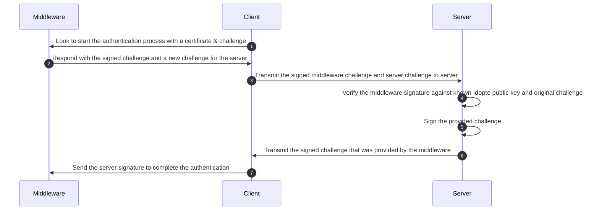

<!-- Parsec Cloud (https://parsec.cloud) Copyright (c) BUSL-1.1 2016-present Scille SAS -->

# PKI Web Idopte Mutual Authentication

## Overview

Describe how we would add the required bits to be able to execute the mutual authentication to Idopte middleware.

## Background & Motivation

To provide PKI support in a web context, we choose the use Idopte solution.

Idopte provide a middleware installed on the client side that provide an HTTP API & JS SDK to provide PKCS11 API in a web context.

The middleware API require to be authenticated with it.
The process will authenticate both parties, The backend server & the middleware using TLS certificates.

### Terms

- **Server**: The Parsec backend server
- **Client**: The Parsec web application
- **Middleware**: The Idopte middleware/driver installed on the client device.

## Goals and Non-Goals

We want to define the required API and approach to authenticate with the middleware.

## Design

Below is the workflow to authenticate with Idopte:




> [!NOTE]
> Omitted from the diagram:
>
> - The certificate first sent to the middleware is obtained by the client.
> - The server know the valid public key used by Idopte.
> - The server is configured with the private key related to the certificate that the client use.

## Operations

### Configuring the Server to Work with Idopte

We want the configuration of Idopte to be optional (to not require every on-prem clients to be forced to have a contract with Idopte).

The server needs to have 2 things:

- The public key that Idopte is using
- The private key that was used to generate the certificate

Naturally, we would add 2 options on the server CLI:

```
--idopte-public-keys <PEM_FILE>
--idopte-service-key <PEM_FILE>
```

> [!IMPORTANT]
> The Idopte public keys files can contain multiple public key.
> All should be available to verify Idopte challenge signature.

### How the Client Retrieve the Certificate

Since the support of Idopte should be optional and the certificate can expire, the clients need to fetch it from the server.

> We can but should not embed the certificate in the client source as it would make it extremely complicated to update it (basically release a new version).

Following previous section, we would add the following option on the server CLI:

```
--idopte-service-cert <FILE>
```

> [!NOTE]
> The certificate is a base64 blob but should not be processed in any way
> and should be sent as is to the middleware.

The client would then retrieve the certificate using the following anonymous command:

```yaml
cmd: idopte_certificate
req: {}
reps:
  - status: ok
    fields:
      - name: certificate
        type: Bytes
  - status: not_available
```

### Verifying the Challenge & Response to Middleware

The client would have previously initiated the authentication process by providing the certificate and a randomly generated challenge (via [`SCWS.findService`]).

If the middleware accepts the certificate it would then respond with the signed challenge and a challenge to be signed by the server.

The client would then need to pass those data to the server with the following anonymous command:

```yaml
cmd: idopte_challenge
req:
  fields:
    - name: middleware_challenge
      type: Bytes
    - name: middleware_signature
      type: Bytes
    - name: server_challenge
      type: Bytes
    - name: pubkey_id
      type: Index
reps:
  - status: ok
    fields:
      - name: server_signature
        type: Bytes
  - status: not_available
  - status: unknown_middleware_public_key
  - status: invalid_middleware_signature
```

With the OK response, the client would just have to finish the authentication process by calling [`SCWS.createEnvironment`].

[`SCWS.findService`]: https://idopte.fr/scwsapi/javascript/2_API/envsetup.html#SCWS.findService
[`SCWS.createEnvironment`]: https://idopte.fr/scwsapi/javascript/2_API/envsetup.html#SCWS.createEnvironment
