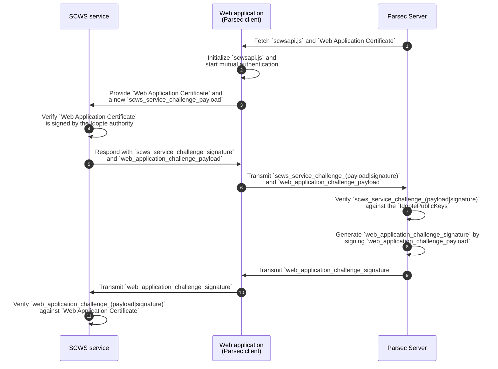

<!-- Parsec Cloud (https://parsec.cloud) Copyright (c) BUSL-1.1 2016-present Scille SAS -->

# PKI Web SCWS Mutual Authentication

## 1 - Overview

To provide PKI support in a web context, we choose the use SCWS: a [proprietary solution
developed by Idopte](https://www.idopte.com/doc_ug.php).

We want the configuration of SCWS to be optional (to not require every on-prem clients to be forced to have a contract with Idopte).

SCWS allows a web application running in the browser to access the machine's PKIs (e.g. Smartcard).
This works by having a native application (the "SCWS service") exposing a web server on localhost
that is then talked to by the web application.

Long story short, [a mutual authentication](https://idopte.fr/scwsapi/javascript/1_intro/security.html#security-auth)
must first be done between the web application and the SCWS service, this is done in three steps:

1. The Web Application Certificate is provided by the web application to the SCWS service.
2. The SCWS service solves a challenge provided by the web application.
3. The web application solves a challenge provided by the SCWS service.

## 2 - Terms

- **SCWS service**: The native application installed on the user's machine that exposes an HTTP API to provide PKI support.
  This application is developed by Idopte and we have no control over it.
- **scwsapi.js**: A javascript library provided by Idopte that should be used to talk to the SCWS service.
- **Web application**: The Parsec client compiled for the web and running on the user's browser.
- **Web Application Certificate**: A [certificate signed by Idopte's authority](https://idopte.fr/scwsapi/javascript/2_API/using.html#web-application-certificate)
  for a given web application.
  This document notably contains the web application server base URL and the web application public key.
  From our point of view this is a opaque document that we just have to provide as-is to the SCWS service.
- **Web application private key**: Private key corresponding to the web application certificate. It must be kept
  on the Parsec server to avoid leaking it.
- **challenge**: A cryptographic challenge (given as an hexadecimal string) between two peers:
  peer 1 chooses a random payload, peer 2 signs it with its private key, peer 3 verifies it against
  peer 2's X509 certificate.
- **IdoptePublicKeys**: A file provided by Idopte an containing a list of public keys that should be used to
  validate the challenge signed by the SCWS service.

## 3 - In-depth cinematic



> [!NOTE]
>
> - Step 1 is required because those resources cannot be shipped in the Parsec web release:
>   - `scwsapi.js` contains proprietary code.
>   - `Web Application Certificate` is unique for each deployment.
>
> - Step 7 (verify `scws_service_challenge_signature`) could in theory be done by the web application since
>   it only involves a public key (i.e. Idopte's X509 authority certificate).
>   However verifying on the Parsec server side works as an authentication procedure before signing the
>   challenge with the web application private key.

## 4 - Server CLI changes

The server needs to have 2 things:

- The `IdoptePublicKeys` file used at step 7 (verify `scws_service_challenge_signature`)
- The `Web application private key` used at step 8 (signing `web_application_challenge_payload`)

Naturally, we would add 2 options on the server CLI:

```bash
--scws-idopte-public-keys-file <PEM_FILE>
--scws-web-application-private-key-file <PEM_FILE>
```

## 5 - How Does the Client Retrieve `scwsapi.js` and `Web Application Certificate`

As stated before, those resources:

- must added during deployment of the web application code.
- can also not be added at all if SCWS support is disabled.

For this we rely on two meta attributes defined in the Parsec client's `index.html`:

```html
      <!--
        SCWS allows a web application running in the browser to access the machine's
        PKIs (e.g. Smartcard).
        This works by having a native application (the "SCWS service") exposing a
        web server on localhost that is then talked to by the web application.

        For it to work, two files must be manually provided:
        1. The `scwsapi.js` middleware (as, for copyright reasons, it is not shipped with Parsec).
        2. The web application certificate (as it differs for each application)

        This is done by:
        1. Adding `scwsapi.js` somewhere in the web application resources (typically in `assets/scws/scwsapi-2c8127e9.js`,
           note the hash-based suffix to avoid cache issue whenever this file needs to be updated).
        2. Configuring `scws-scwsapi_js-location` meta attribute (e.g. `<meta name="scws-scwsapi_js-location" content="/assets/scws/scwsapi-2c8127e9.js" />` )
        2. Configuring `scws-web_application_certificate` meta attribute (e.g. `<meta name="scws-web_application_certificate" content="dmFyIElzPU9iamVjdC5kZ..." />` )

        See:
        - https://idopte.fr/doc_scws.php
        - https://idopte.fr/scwsapi/javascript/1_intro/security.html#proprietary-authentication-scheme
      -->
      <meta
        name="scws-scwsapi_js-location"
        content=""
      />
      <meta
        name="scws-web_application_certificate"
        content=""
      />
```

The logic is:

- On native platform those attributes are ignored (hence SCWS is always disabled).
- On web, SCWS is enabled only if those attributes are set.

## 6 - Server-side Challenge verification & Response

The client would have previously initiated the authentication process by providing the web application certificate
and a randomly generated challenge (via [`SCWS.findService`]).

If the SCWS service accepts the certificate it would then respond with the signed challenge and a challenge to be signed by the server.

The client would then need to pass those data to the server with the following command (from the anonymous server API family):

```jsonc
{
  // This command does the challenges resolution & validation part of the
  // mutual authentication with the SCWS service.
  //
  // SCWS allows a web application running in the browser to access the machine's
  // PKIs (e.g. Smartcard).
  // This works by having a native application (the "SCWS service") exposing a
  // web server on localhost that is then talked to by the web application.
  //
  // Long story short, a mutual authentication must first be done between
  // the web application and the SCWS service, this is done in three steps:
  // 1. The Web Application Certificate is provided by the web application to the SCWS service.
  // 2. The SCWS service solves a challenge provided by the web application.
  // 3. The web application solves a challenge provided by the SCWS service.
  //
  // The challenges during step 2 and 3 are done between the SCWS service and the
  // Parsec server (as it involves application secret key that should be kept on the server).
  //
  // see: https://idopte.fr/scwsapi/javascript/1_intro/security.html#proprietary-authentication-scheme
  "cmd": "scws_service_mutual_challenges",
  "req": {
    "fields": [
      {
        // Challenge (i.e. random hexadecimal string) generated by the web
        // application that should have been signed by the SCWS service.
        "name": "scws_service_challenge_payload",
        "type": "Bytes"
      },
      {
        // Signature made by the SCWS service of `scws_service_challenge_payload`.
        // This should get validated by the server to achieve step 2 in the mutual
        // authentication.
        "name": "scws_service_challenge_signature",
        "type": "Bytes"
      },
      {
        // An integer corresponding to the index of the public key to use among the
        // keys in the `IdoptePublicKeys` file (provided by Idopte).
        // see: https://idopte.fr/scwsapi/javascript/2_API/envsetup.html#SCWS.findService
        "name": "scws_service_challenge_key_id",
        "type": "Index"
      },
      {
        // Challenge (i.e. random hexadecimal string) generated by the SCWS service
        // that should be signed to authenticate the web application.
        // Signature is done on the server in order not to leak the web application
        // private key.
        "name": "web_application_challenge_payload",
        "type": "Bytes"
      }
    ]
  },
  "reps": [
    {
      "status": "ok",
      "fields": [
        {
          // Signature made by the server of `web_application_challenge_payload`.
          // This should get validated by the SCWS service to achieve step 3 in the
          // mutual authentication.
          "name": "web_application_challenge_signature",
          "type": "Bytes"
        }
      ]
    },
    {
      // SCWS support is not configured on the server
      "status": "not_available"
    },
    {
      "status": "unknown_scws_service_challenge_key_id"
    },
    {
      "status": "invalid_scws_service_challenge_signature"
    },
    {
        "status": "invalid_web_application_challenge_payload"
    }
  ]
}
```

With the OK response, the client would just have to finish the authentication process by calling [`SCWS.createEnvironment`].

[`SCWS.findService`]: https://idopte.fr/scwsapi/javascript/2_API/envsetup.html#SCWS.findService
[`SCWS.createEnvironment`]: https://idopte.fr/scwsapi/javascript/2_API/envsetup.html#SCWS.createEnvironment
