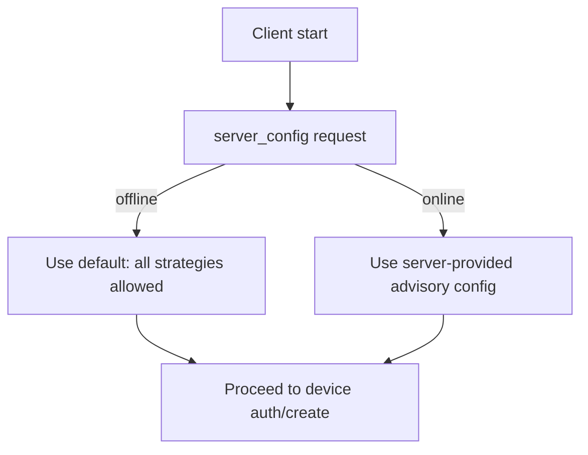

<!-- Parsec Cloud (https://parsec.cloud) Copyright (c) BUSL-1.1 2016-present Scille SAS -->

# Advisory device protection

## 1 - Goals

This RFC introduces a mechanism for the Parsec server to provide a recommended
device protection configuration to clients.

This allows a server administrator to specify that local devices should be protected
using specific strategies (e.g. PKI, or password + TOTP), guiding the client towards
security policies.

> [!IMPORTANT]
>
> This configuration is **purely advisory**: the server cannot enforce it because
> the local device keys file is encrypted entirely client-side. The server never sees
> the cleartext device keys and has no way to verify which protection strategy was
> actually used.

## 2 - Overview

### 2.1 - Client workflow

1. The client requests the server for config via the anonymous server API `server_config`.
2. **If no answer** (e.g. the server is unreachable / offline): a default config is
   used that allows all protection strategies (i.e. no restriction). This ensures
   the client can still operate offline.
3. **If an answer is received**: the advisory protection config is used to:
   - Prioritize the recommended protection strategies during device creation.
   - At login time, compare the current device's protection strategy against the
     advisory config. If the current strategy is not in the recommended set, a
     dialogue is displayed to the user suggesting they change their device protection.



### 2.2 - Device protection formats

The following local device protection strategies exist in Parsec:

| Strategy       | Description                                          | Offline login | Offline attack resistance |
|----------------|------------------------------------------------------|:-------------:|:-------------------------:|
| Password       | Derived key from user-provided password              | ✅             | Moderate (key stretching) |
| Keyring        | OS-level credential store (Keychain, Secret Service) | ✅             | Low (tied to OS session)  |
| PKI            | Smartcard / X.509 certificate                        | ✅             | High                      |
| OpenBao        | SSO-based key retrieval via OpenBao                  | ❌             | High                      |
| Account Vault  | Key stored in Parsec account vault on server         | ❌             | High                      |

On top of any of these, TOTP can be layered as a secondary protection
(see [RFC 1025]) which adds server involvement at login time (and thus removes
offline login capability but increases offline attack resistance).

The advisory configuration specifies which **combinations** of primary strategy
(+ optional TOTP) are acceptable.

To keep the protocol simple and forward-compatible, each acceptable combination is
serialized as a canonical string identifier such as `PASSWORD`, `PASSWORD+TOTP`,
`PKI` or `PKI+TOTP`.

## 3 - Protocol

### 3.1 - New `AdvisoryDeviceFileProtection`

To keep the protocol forward-compatible, each device protection is serialized as a
canonical string in `server_config`.
This way the client can simply ignore an unknown one instead of rejecting the entire
`server_config` response.

Canonical values initially defined by this RFC are:

- `PASSWORD`
- `PASSWORD+TOTP`
- `KEYRING`
- `KEYRING+TOTP`
- `PKI`
- `PKI+TOTP`
- `OPENBAO`
- `OPENBAO+TOTP`
- `ACCOUNT_VAULT`
- `ACCOUNT_VAULT+TOTP`

Deserialization is done by the new type `AdvisoryDeviceFileProtection`

```rust

enum AdvisoryDeviceFilePrimaryProtection {
  Password,
  Keyring,
  PKI,
  OpenBao,
  AccountVault,
}

struct AdvisoryDeviceFileProtection {
  primary: AdvisoryDeviceFilePrimaryProtection,
  with_totp: bool,
}
```

### 3.2 - Updated `server_config` schema

```json5
[
    {
        "major_versions": [
            5
        ],
        "cmd": "server_config",
        "req": {},
        "reps": [
            {
                "status": "ok",
                "fields": [
                    // ...
                    {
                        // Advisory configuration for local device protection (e.g.
                        // `["PASSWORD+TOTP", "PKI"]`).
                        //
                        // Each entry is a serialized `AdvisoryDeviceFileProtection`
                        // (this way unknown values can simply be ignored by the client).
                        //
                        // Missing field or empty list means no recommendation.
                        "introduced_in": "5.5",
                        "name": "advisory_device_file_protection",
                        "type": "List<String>"
                    }
                ]
            }
        ],
        "nested_types": [
            // ... (existing nested types unchanged) ...
        ]
    }
]
```

### 3.3 - Server CLI changes

New CLI flags for `parsec run` to configure the advisory device protection:

```bash
--device-protection-strategy <STRATEGY>...
```

Where `<STRATEGY>` is one of the canonical identifiers defined above.

When no `--device-protection-strategy` is specified, the default is an empty
recommendation list (all strategies are accepted).

[RFC 1025]: ./1025-totp-protected-local-device.md
