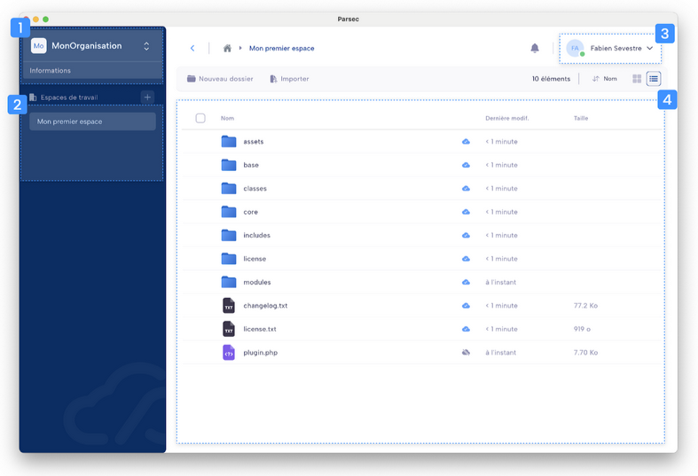

.. Parsec Cloud (https://parsec.cloud) Copyright (c) BUSL-1.1 2016-present Scille SAS

.. _doc_userguide_first_steps:

First steps with Parsec
=======================

Welcome to Parsec! Here's a brief overview of the user interface.

\1. **Organization section**: select your organization and access your organization details (if allowed by your profile).

\2. **Recent workspaces and documents**: list of workspaces and documents you have accessed recently.

\3. **Main menu**: access application settings and your user profile.

\4. **Workspace section**: access a workspace and its documents.

Security best practices
-----------------------

To avoid losing access to your data you should always:

- :ref:`Add multiple devices <doc_userguide_manage_devices>` to access Parsec
- :ref:`Share your workspaces <doc_userguide_parsec_workspaces_share>` with
  other users

.. caution::

  Strong cryptographic security prevents data recovery. This means that if you
  lose access to your computer, or cannot log in for any reason, there is no way
  to recover your data.
