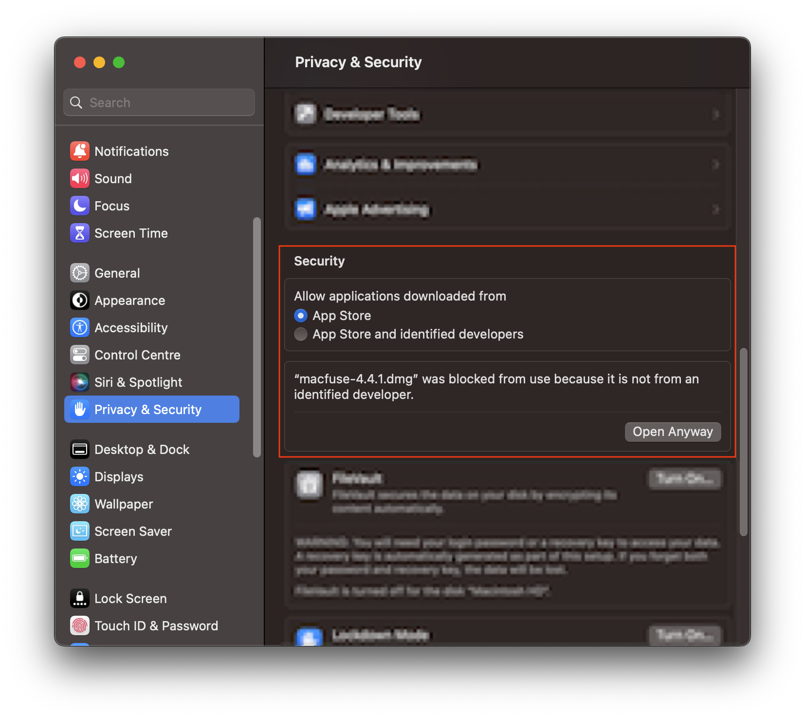
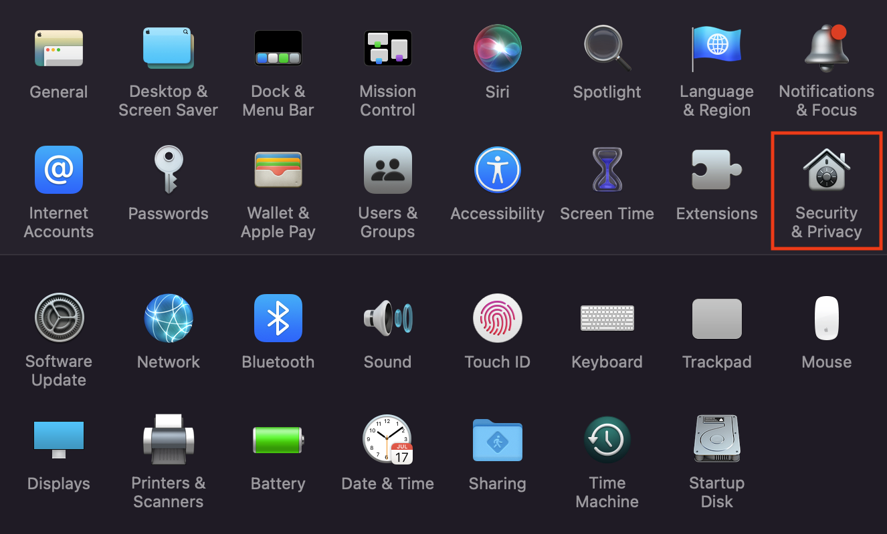
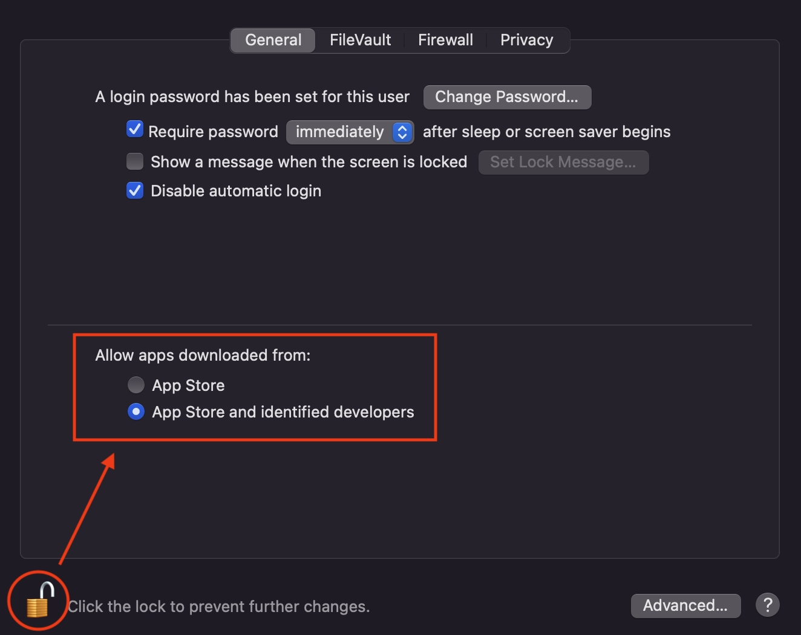
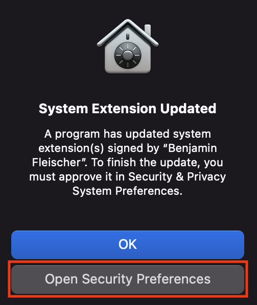
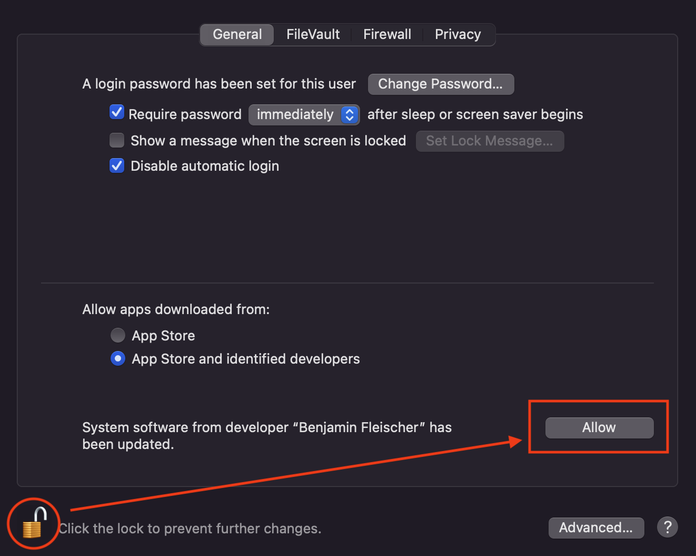

.. Parsec Cloud (https://parsec.cloud) Copyright (c) BUSL-1.1 2016-present Scille SAS

.. _doc_userguide_install_parsec:

Install Parsec
==============

Windows
-------

Windows installer is available at the latest stable version on `Get Parsec`_.

Linux
-----

AppImage
^^^^^^^^

AppImage is available at the latest stable version on `Get Parsec`_.

To use Parsec via the AppImage:

1. Download AppImage file
2. Make it executable

  - Right-click/Properties/Allow executing file as program
  - Or use the `chmod` command:

    .. code-block:: shell

        chmod u+x Parsec.AppImage

3. Run it (double-click on AppImage file)

Snap
^^^^

Parsec is available on Snap Store:

.. raw:: html

    <iframe src="https://snapcraft.io/parsec/embedded?button=black" frameborder="0" width="100%" height="350px" style="border: 1px solid #CCC; border-radius: 2px; padding: 1px 2px 3px 4px;"></iframe>

You can install the snap from the command line by doing:

.. code-block:: shell

    sudo snap install parsec --classic --channel=v3

If you are familiar with Snap, you may notice that Parsec snap is provided in classic mode (i.e. without sandbox). This is needed because Parsec needs `Fuse <https://en.wikipedia.org/wiki/Filesystem_in_Userspace>`_ to mount your data as a virtual directory, which is not allowed by the Snap sandbox.

.. note::

    In order to install multiple versions of Parsec, you need to enable snapd `parallel instances <https://snapcraft.io/blog/parallel-installs-test-and-run-multiple-instances-of-snaps>`_:

    .. code-block:: shell

        snap set system experimental.parallel-instances=true

    Then, to install v3.0 (provided you already have v2.17 installed), give it a specific name:

    .. code-block:: shell

        snap install --channel=v3/stable --name parsec-v3 --classic

macOS
-----

.. warning::

    Support for macOS is currently under development for the latest version of Parsec (v3.x).

macOS installer is available at the latest stable version on `Get Parsec`_.

Parsec requires `macFUSE <https://osxfuse.github.io/>`_ in order to provide a smooth integration with macOS and let you access your documents via Finder (macOS file manager).
The following sections describe how to install macFUSE (which can be a little bit troublesome, see `this discussion <https://github.com/osxfuse/osxfuse/issues/814>`_).

Install macFUSE
^^^^^^^^^^^^^^^

Get the latest version from the `macFUSE <https://osxfuse.github.io/>`_ website.

.. image:: screens/macfuse_download.png
    :align: center
    :alt: macFUSE download screen

Open the ``.dmg`` file and follow instructions to install.

If the opening fails, two options are available in `System Settings > Privacy and Security`: either check the `App Store and identified developers` box, or click `Open Anyway` if you don't want to change this setting, which will need to be done once to open the ``.dmg``, and possibly once more to start the installer.

Finally, reboot your Mac to complete the installation.

Install macFUSE on macOS 12 and older
"""""""""""""""""""""""""""""""""""""

Open the ``.dmg`` file and follow its instructions to install. If the opening fails, check the `App Store and identified developers` box in `System Preferences > Security & Privacy`:

To change this setting, click the lock first which will require admin rights.

Once the installation is done, a `System Extension Updated` window will pop up. Click `Open Security Preferences`, and click the lock, then click `Allow`:

Finally, reboot your Mac to complete the installation.

Install an older version of Parsec
----------------------------------

.. warning::

    For security reasons, you should **always install the latest stable version of Parsec** as it contains the latest security fixes.

If you need to access older versions, they are available on `GitHub`_.

.. _Get Parsec: https://parsec.cloud/en/get-parsec
.. _GitHub: https://github.com/Scille/parsec/releases/latest
