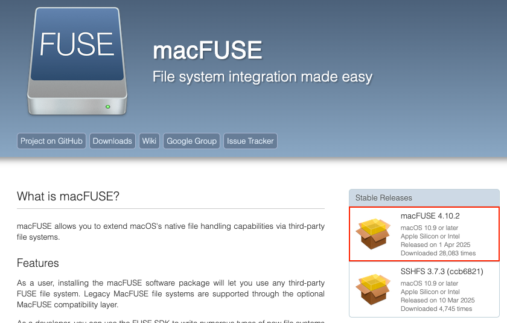

.. Parsec Cloud (https://parsec.cloud) Copyright (c) BUSL-1.1 (eventually AGPL-3.0) 2016-present Scille SAS

.. _doc_userguide_install_client:

Install Parsec client
=====================

Windows
-------

Windows installer is available at the latest stable version on `parsec.cloud <https://parsec.cloud/get-parsec>`_. Otherwise, it is possible to download a specific Parsec version on `GitHub <https://github.com/Scille/parsec/releases/latest>`_, for exemple to make Parsec work on a 32 bits computer (installers named ``parsec-vX.Y.Z-win32-setup.exe``).

Linux
-----

Parsec is available on Snap:

.. raw:: html

    <iframe src="https://snapcraft.io/parsec/embedded?button=black" frameborder="0" width="100%" height="350px" style="border: 1px solid #CCC; border-radius: 2px;"></iframe>

If you are familiar with Snap, you may notice that Parsec snap is provided in classic mode (i.e. without sandbox). This is needed because Parsec needs `Fuse <https://en.wikipedia.org/wiki/Filesystem_in_Userspace>`_ to mount your data as a virtual directory, which is not allowed by the Snap sandbox.

.. note::

    You can install the snap from the command line by doing:

    .. code-block:: shell

        sudo snap install parsec --classic

Via pip
-------

Given that Parsec is written in Python, an alternative is to install it through `pip (the Python package repository) <https://pypi.org/project/parsec-cloud/>`_.

.. code-block:: shell

    pip install parsec-cloud

Or intall it with all its dependencies, for the GUI.

.. code-block:: shell

    pip install parsec-cloud[all]

.. note::

    Parsec requires Python >= 3.9 to work.

MacOS
-----

MacOS (10.15, >= 11.0) installer is available as a DMG installer on `GitHub <https://github.com/Scille/parsec/releases/latest>`_ (installer named ``parsec-vX.Y.Z-macos-amd64.dmg``).

The MacOS version requires `macFUSE <https://osxfuse.github.io/>`_ to be installed, which can be troublesome on Big Sur and Monterey. See `this discussion <https://github.com/osxfuse/osxfuse/issues/814>`_ about it and the OS' limitations.

macFUSE installation
***************************

.. note::

    Parsec uses userspace filesystems for a smooth integration of created repositories and ease of access to stored files.
    This core feature is enabled by macFUSE, and is required to have the native experience we aim for.

From the `macFUSE <https://osxfuse.github.io/>`_ website, you can find the lastest version to download at the indicated location.

Open the ``.dmg`` file and follow its instructions to install. If the opening fails, check the `App Store and identified developers` box in System Preferences > Security & Privacy:

.. image:: screens/macfuse_system_preferences.png
    :align: center
    :alt: MacOS path to Security and Privacy

.. image:: screens/macfuse_allow_developer.png
    :align: center
    :alt: MacOS allow identified developer

To change this setting, click the lock first which will require admin rights.

Once the installation is done, a `System Extension Updated` window will pop up. Click `Open Security Preferences`, and click the lock, then click `Allow`:

.. image:: screens/macfuse_system_extension.png
    :align: center
    :alt: System Extension Updated window

.. image:: screens/macfuse_allow_extension.png
    :align: center
    :alt: MacOS allow extension

Finally, reboot your Mac to complete the installation.
