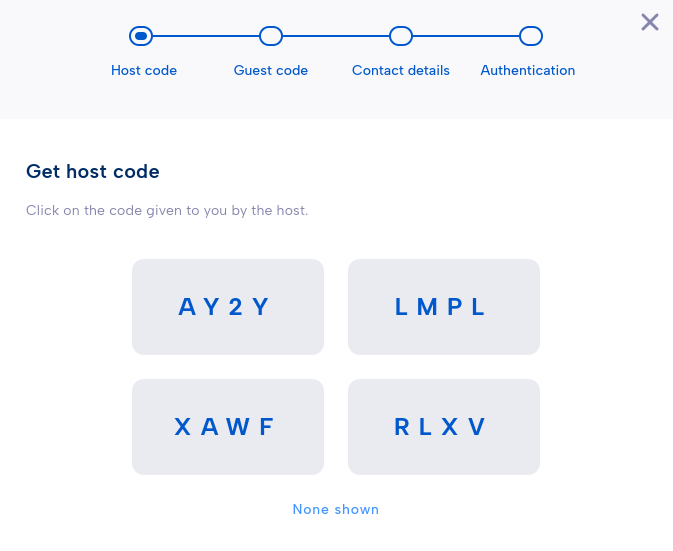
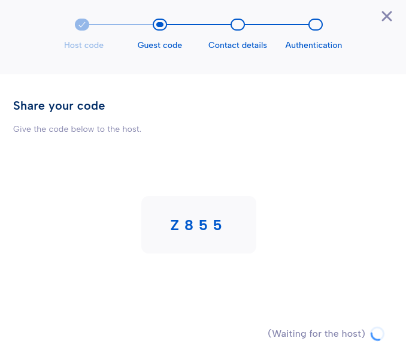

.. Parsec Cloud (https://parsec.cloud) Copyright (c) BUSL-1.1 2016-present Scille SAS

.. _doc_userguide_join_organization:

Join an organization
====================

You have been invited to join an organization on Parsec! Before you get started,
please make sure you have :ref:`installed the Parsec app <doc_userguide_install_parsec>`.

Start the invitation process
-------------------------------

If you have received an **invitation email**, simply click the link in the email.
The Parsec app will start and guide you through the invitation process.

If Parsec does not start automatically, you can still join the organization
with an **invitation link**. Paste the link on the login screen and click ``Join``.

.. _doc_userguide_join_organization_token_exchange:

Token exchange
-----------------

In order to create a secure channel between the **guest** (you) and
the **host**, you will need to carry out a **code exchange** via an
**authentic channel** (such as a regular phone call).

.. important::

  Authentic channels are not confidential, but they guarantee that the
  information is not tampered: what your contact says is what you hear.
  You should avoid using SMS.

When you are ready, click ``I understand!`` and wait for the host to
start the process on its side.

Select the code provided by your host from the list.

Then, share your code to the host and wait until it is selected.

.. caution::

  If one of the codes to share is not present in the other's list, it means
  there is a very high probability you are victim of a
  `Man-in-the-middle attack <https://en.wikipedia.org/wiki/Man-in-the-middle_attack>`_.

Set up your account
----------------------

Finally, enter your **contact details** and choose the preferred **authentication method**
(this can be changed later from your profile).

You are ready for your :ref:`first steps with Parsec! <doc_userguide_first_steps>`
