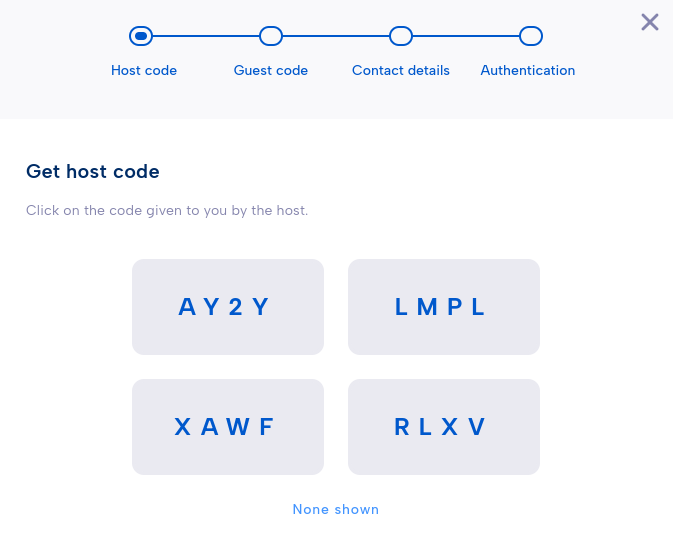
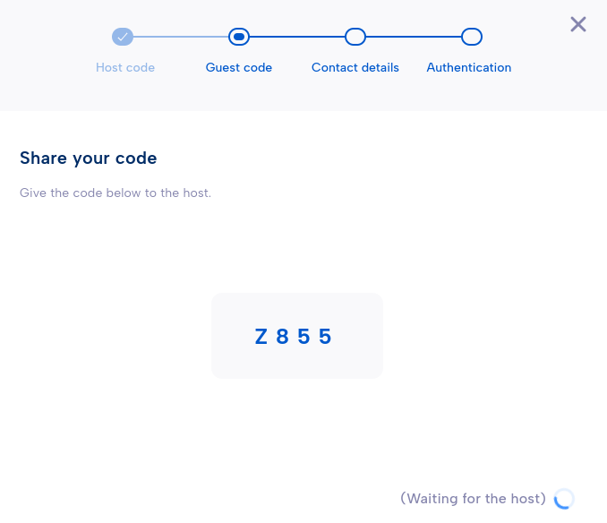

.. Parsec Cloud (https://parsec.cloud) Copyright (c) BUSL-1.1 2016-present Scille SAS

.. _doc_userguide_join_organization:

Join an organization
====================

To join an organization, you need to prove your identity. Parsec provides two ways to do so.

Join an organization with an invitation link
--------------------------------------------

You have been invited to join an organization on Parsec! Before you get started,
please make sure you have :ref:`installed the Parsec app <doc_userguide_install_parsec>`.

Both you and the host have to be available at the same time and go through the process together.

.. _doc_userguide_join_organization_start_invitation:

Start the invitation process
^^^^^^^^^^^^^^^^^^^^^^^^^^^^

1. If you received an **invitation link** either by email or by any other means,
   make sure to :ref:`verify it <userguide-verify-parsec-link>` before clicking the link.

   .. important::

     If you do not trust the link, do not proceed with the invitation.

2. After making sure that the link is safe, simply click on the link.
   Parsec will start and guide you through the invitation process.

   - You can also start Parsec and paste the link on the welcome screen
     (Click ``Create or join`` then ``Join``).

.. _doc_userguide_join_organization_token_exchange:

Verify your identity with a code exchange
^^^^^^^^^^^^^^^^^^^^^^^^^^^^^^^^^^^^^^^^^

In order to create a secure channel between you and the host, you will
need to carry out a **code exchange** via an **authentic channel**
(such as a regular phone call).

.. important::

  Authentic channels are not confidential, but they guarantee that the
  information is not tampered: what your contact says is what you hear.
  You should avoid using SMS.

When you are ready, click ``I understand!`` and wait for the host to
start the process on its side.

Select the code provided by your host from the list.

Then, share your code to the host and wait until it is selected.

.. caution::

  If one of the codes to share is not present in the other's list, it means
  there is a very high probability you are victim of a
  `Man-in-the-middle attack <https://en.wikipedia.org/wiki/Man-in-the-middle_attack>`_.

Set up your account
^^^^^^^^^^^^^^^^^^^

Finally, enter your **contact details** and choose the preferred **authentication method**
(this can be changed later from your profile).

You are ready for your :ref:`first steps with Parsec! <doc_userguide_first_steps>`

Join an organization with a join request
----------------------------------------

You have been invited to join an organization on Parsec! Before you get started,
please make sure you have :ref:`installed the Parsec app <doc_userguide_install_parsec>`.

Your identity will be verified with an identity provider. You and the administrator do not have
to go through this process together. You first make a request to join an organization, and the
administrator accepts it later.

  .. important::

    An identity provider is required to use this option. Those currently supported are:

      - a **Public Key Infrastructure** (PKI). Supported only on Windows.
      - a **Single-Sign On** (SSO) provider. Only **ProConnect** is supported at the moment.

.. _doc_userguide_join_organization_request:

Request to join the organization
^^^^^^^^^^^^^^^^^^^^^^^^^^^^^^^^

1. If you received an link to join the organization either by email or by any other means,
   make sure to :ref:`verify it <userguide-verify-parsec-link>` before clicking the link.

   .. important::

     If you do not trust the link, do not proceed with the invitation.

2. After making sure that the link is safe, simply click on the link.
   Parsec will start and guide you through the invitation process.

   - You can also start Parsec and paste the link on the welcome screen
     (Click ``Create or join`` then ``Join``).

3. Depending on your system, you may have to select the identity provider you would like to use (PKI or SSO).

  .. admonition:: Using an SSO (ProConnect)

    1. Select your SSO provider
    2. Authenticate with your SSO provider as usual
    3. Enter your **name**, select your **email address** and click ``Continue``
    4. Click ``Continue``

  .. admonition:: Using a PKI

    1. Click on ``Add a certificate`` to open the certificate selection dialog
    2. Select the certificate matching your infrastructure
    3. Click ``Continue``

4. Your join request has been sent and you should now see it with the **Pending** status.
5. Once accepted, a button ``Add to my organizations`` will appear on your request. Click on it to log into the organization.
   You may need to re-authenticate with your SSO provider.

You are ready for your :ref:`first steps with Parsec! <doc_userguide_first_steps>`
