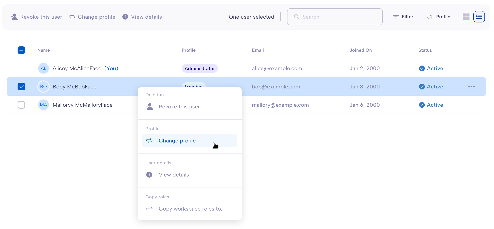
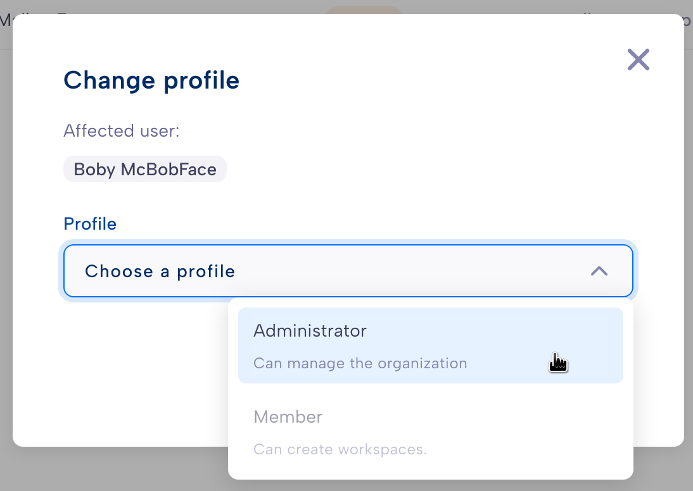
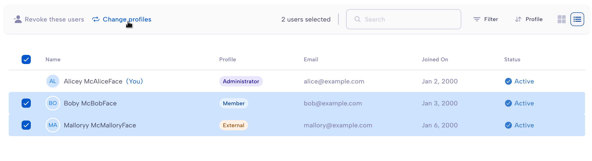
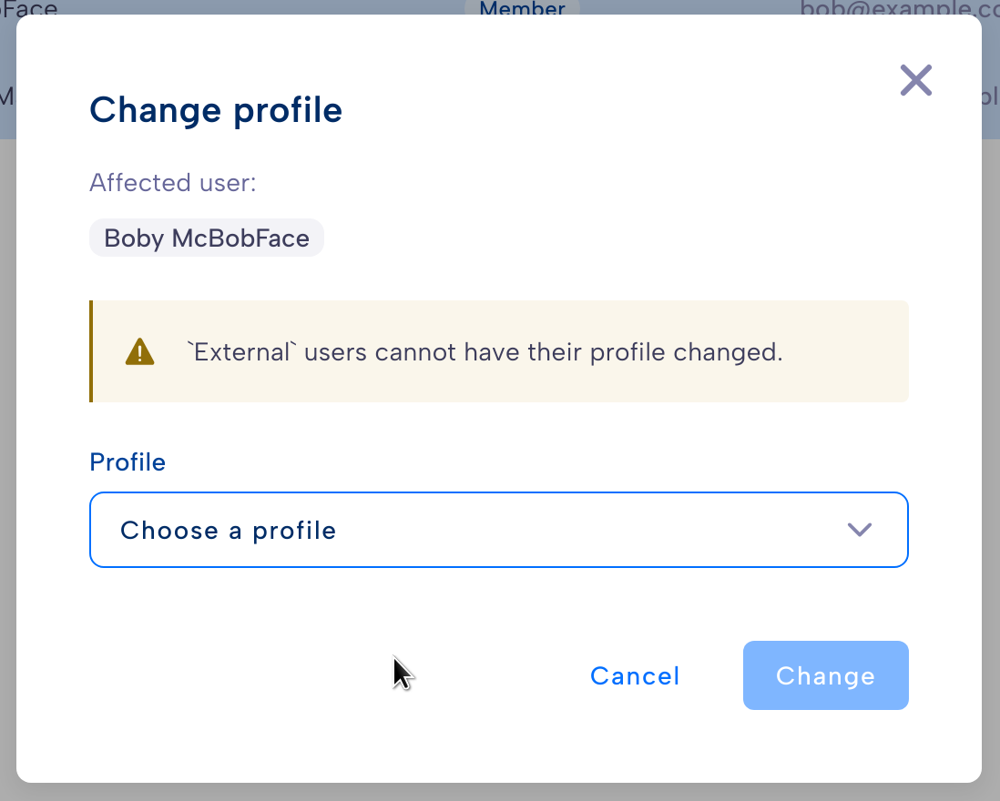

.. Parsec Cloud (https://parsec.cloud) Copyright (c) BUSL-1.1 2016-present Scille SAS

.. _doc_userguide_manage_organization:

Manage your organization
========================

Now that our organization is ready, we can start inviting new users.

In Parsec, inviting a new user to join your organization is a critical operation
that aims at building trust towards the user and the device that will be used to
connect to Parsec.

The process requires both the guest (the invited user) and the host (you) to be
connected to the Parsec server at the same time.

Invite a user
-------------

Parsec provides two ways to invite users:

- **Invite by email address**: the user will receive an email with a link to join your organization.
  Both you and the user have to be available at the same time and go through the process together
  in order to verify the user's identity.

- **Invite by join request**: the user will request to join the organization using a generic link.
  The user identity is verified with an external identity provider. You can then *accept* or
  *reject* the request at any time.

  .. important::

    An identity provider is required to use this option. Those currently supported are:

      - a **Public Key Infrastructure** (PKI). Supported only on Windows.
      - a **Single-Sign On** (SSO) provider. Only **ProConnect** is supported at the moment.

Invite a user by email address
^^^^^^^^^^^^^^^^^^^^^^^^^^^^^^

1. In the sidebar, go to ``Users``
2. Click ``Invite a user`` and enter an email address to send the **invitation link**

  - A blue button will appear at the top, informing you that you have an
    invitation waiting to be validated.

  .. image:: screens/new_user_invitation_sent.png
      :align: center
      :alt: Pending invitations

3. Ask the user to open the invitation link and follow the steps to
   :ref:`start the invitation process <doc_userguide_join_organization_start_invitation>`.

4. Click on ``Greet`` and wait for the guest to proceed to
   :ref:`verify your identity with a code exchange <doc_userguide_join_organization_token_exchange>`.

5. Confirm the user details and set the :ref:`user profile <doc_userguide_manage_organization_profiles>`.

6. The user can now login to your organization.

Invite a user by join request
^^^^^^^^^^^^^^^^^^^^^^^^^^^^^

1. In the sidebar, go to ``Invitations & Join Requests`` and then ``Join requests (PKI/SSO)``
2. Click ``Copy join request link (PKI/SSO)`` and share the link with the users.
   Note that this link is not specific to a single user, you can share it with anyone wanting to
   join your organization.

3. Ask the user to open the link and follow the steps to
   :ref:`request to join the organization <doc_userguide_join_organization_request>`.

4. A pending join request will appear in the list. Click ``Accept`` to accept the request to join your
   organization or ``Reject`` to discard it.

5. If you accepted the request, confirm the user details and set the :ref:`user profile <doc_userguide_manage_organization_profiles>`.

6. The user can now login to your organization.

Revoke a user
-------------

Revoking a user will remove its access rights to the organization. This is
specially required when:

- the user device has been compromised or lost
- the user is no longer part of the organization

1. In the sidebar, go to ``Users``
2. Select ``Revoke this user``.
3. Click ``Revoke`` to confirm (**this action cannot be undone**)

.. caution::

  Revocation is irreversible. If the revoked user needs to re-join the organization,
  it will need to go through the standard procedure to :ref:`join an organization <doc_userguide_join_organization>`

.. note::

  It is not possible to revoke a single user device. If one of the user's
  devices has been compromised, the user and all its devices need to be revoked.
  This is intended because the compromised device has the knowledge of some
  cryptographic secrets shared among all the user's devices.

.. _doc_userguide_manage_organization_profiles:

User profiles
-------------

The **user profiles** defines what the user is allowed to do within the
organization.

External profile
^^^^^^^^^^^^^^^^

This profile allows a user to:

- **Collaborate in workspaces**

.. note::

  Users with the External profile are not allowed to see the name and
  email of other users within the organization.

Member profile
^^^^^^^^^^^^^^

This profile allows a user to:

- Collaborate in workspaces.
- **Create and share workspaces.**
- **See the name and email of other users within the organization.**

Administrator profile
^^^^^^^^^^^^^^^^^^^^^

This profile allows a user to:

- Collaborate in workspaces.
- Create and share workspaces.
- See the name and email of other users within the organization.
- **Invite new users to join the organization, and set their profile.**
- **Remove users from the organization, regardless of their profile.**

Change the profile
------------------

If you need to change the profile of a user, go to ``Users`` (in the sidebar) in the upper-left corner. Either select the user or right-click on them and select ``Change profile``.

Select the user's new profile and click on ``Change``.

You can change the profiles of multiple users at once by selecting them and clicking on ``Change profiles``.

You cannot change the profile from and to `External`. If there are users with `External` profile among the selected users, the dialog will warn you that their profile will not be affected.

