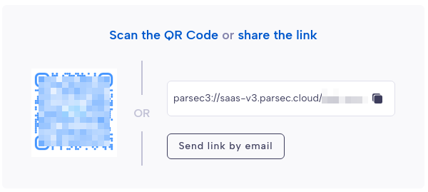
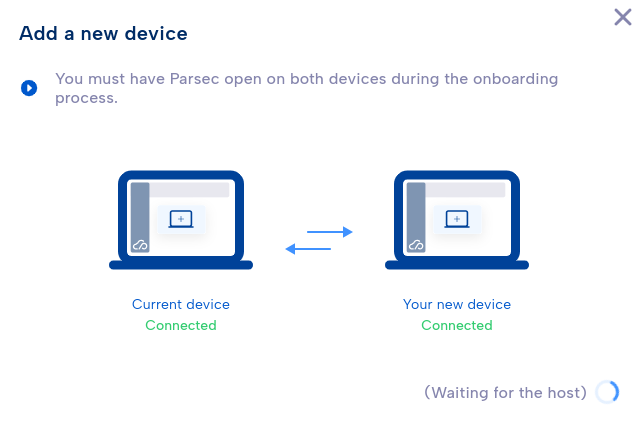
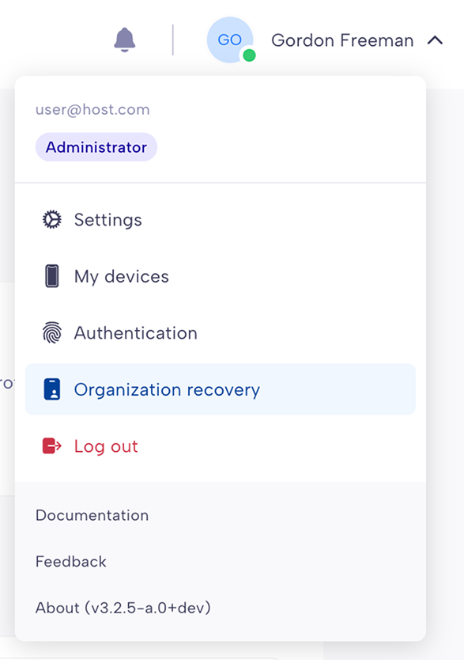
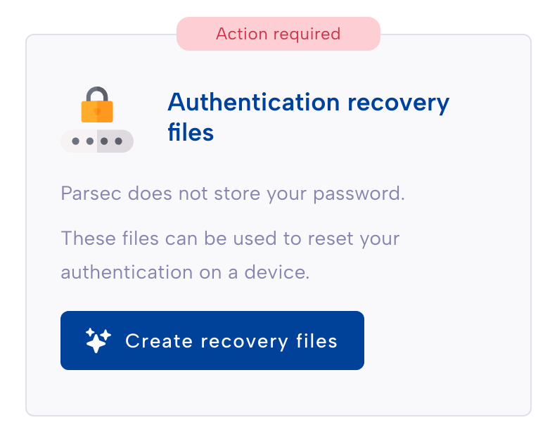
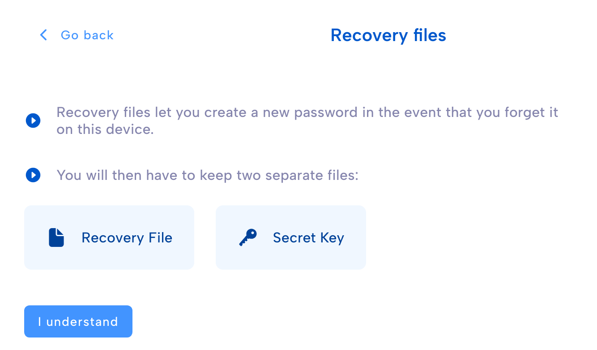
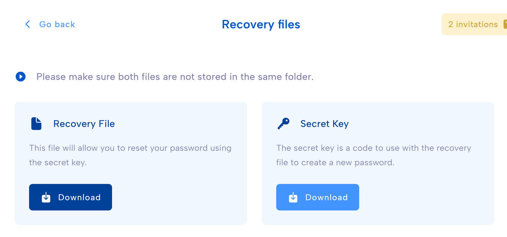
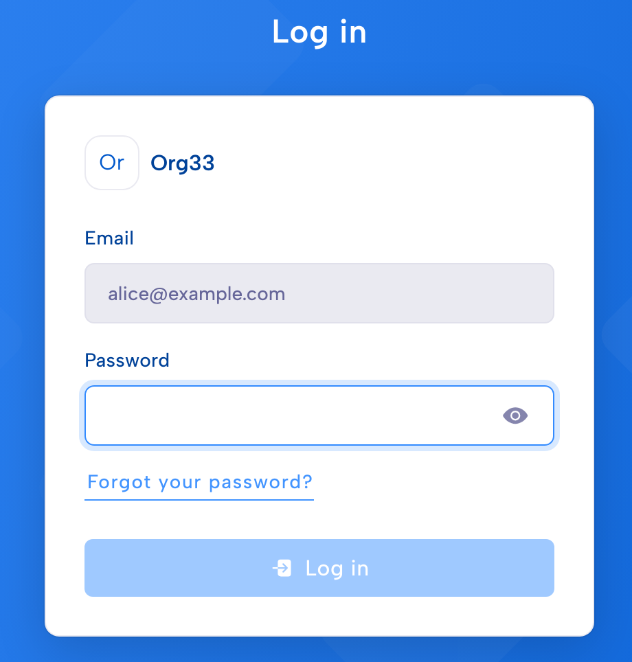
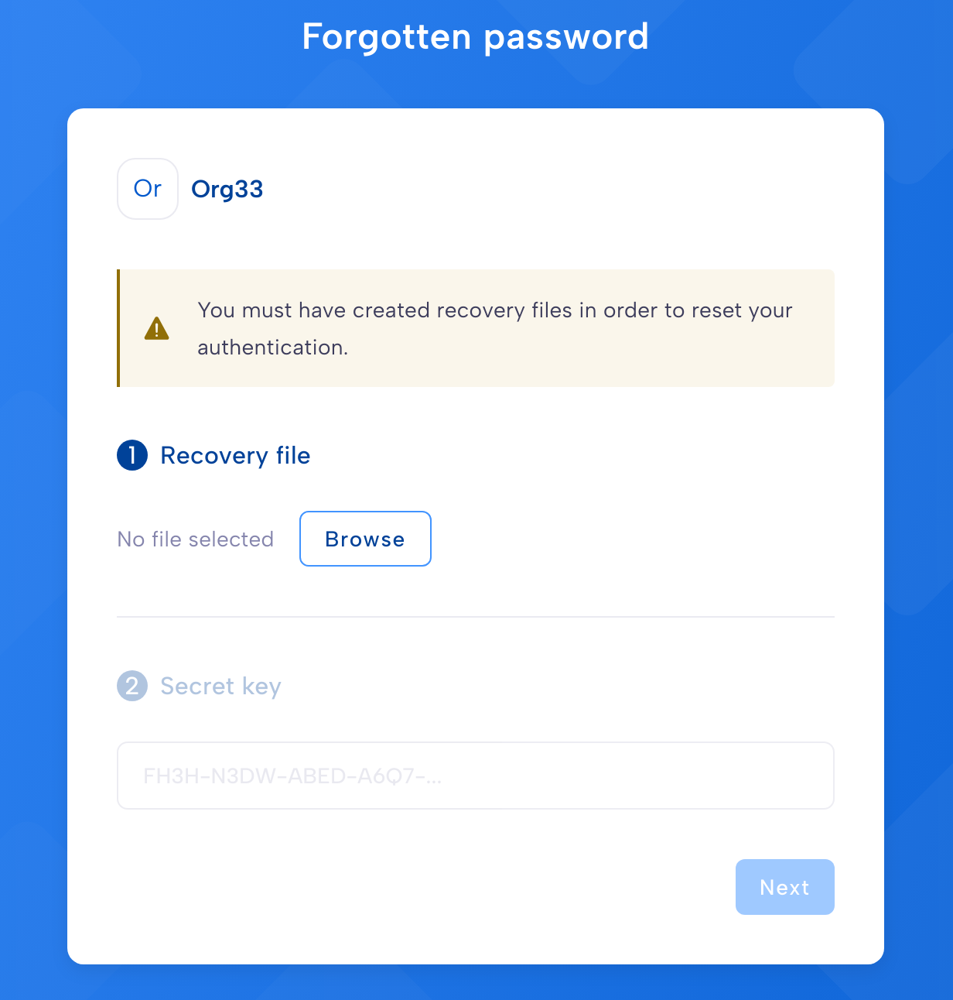
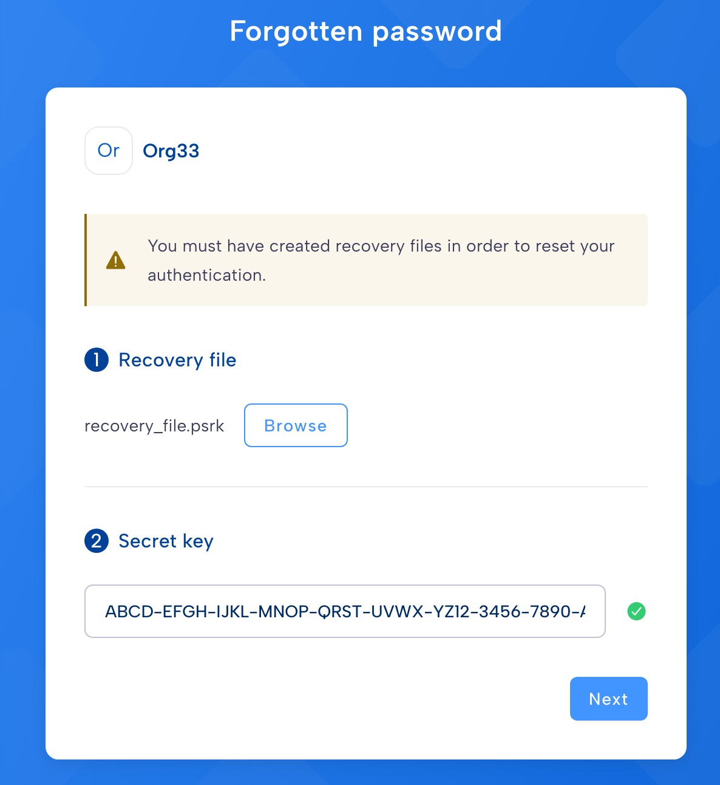

.. Parsec Cloud (https://parsec.cloud) Copyright (c) BUSL-1.1 2016-present Scille SAS

.. _doc_userguide_manage_devices:

Manage your devices
===================

When you :ref:`join an organization <doc_userguide_join_organization>`, your
computer is automatically added as a new **device** so you can securely access
Parsec.

For enhanced security, the devices you use to access Parsec are uniquely
authenticated. It is  highly recommended to add another device in case you lose
access to your computer or cannot log in for any reason.

.. warning::

   Device keys are safely stored on your computer and are not sent to the Parsec
   server.

   Without having added another device, your account cannot be recovered in the
   event you lose access to your computer. You will need to be re-invited to
   :ref:`join the organization <doc_userguide_join_organization>`.

   We strongly encourage you to create a :ref:`recovery device <doc_userguide_recovery_devices>`.

Add a new device
----------------

You can add a new device from your profile page.

1. Click on your name on the main menu (top-right) and select ``My Profile``.
2. In ``My devices``, click ``+ Add``.

3. If you send the device invitation link by mail, simply click on the link in
   the new device to start Parsec. Otherwise start Parsec on the new device and
   select ``Join`` in the welcome page.
4. Paste the device invitation link and follow the instructions to perform the
   code exchange between your devices.

5. Your new device is ready to access Parsec!

.. caution::

  If one of the codes to share is not present in the other's list, it means
  there is a very high probability you are victim of a
  `Man-in-the-middle attack <https://en.wikipedia.org/wiki/Man-in-the-middle_attack>`_.
  You can read more about that process at the :ref:`Cryptography <doc_cryptography>` section.

.. _doc_userguide_recovery_devices:

Recovery devices
----------------

A recovery device is a special type of device that allows you to get access to your data back
in case your forgot your password or lose your computer.

It is composed of two parts:

  - a file, ending with `.psrk`
  - a passphrase, composed of letters and numbers separated by dashes.

The passphrase is used to unlock the file and get access to your data.

.. note::

  A recovery device is linked to a specific organization. If you have multiple organization,
  you will have to create multiple recovery devices.

.. caution::

  If someone gets access to both the file and the passphrase, they can get
  full access to your data as if they were you.
  We **strongly** recommend storing them separately in a safe place. They are as precious and
  secret as your password.

Create a recovery device
------------------------

When you access your profile, in the ``My Devices`` page, click on ``Create recovery files``.

Once you're ready, click on ``I understand``.

You'll be able to download both the file and the passphrase. Make sure to get them both.

.. caution::

  As mentioned before, these two files combined will allow someone to access your data.
  Store them separately and don't let someone access them.

Import a recovery device
------------------------

If you forget your password and you have both the recovery file and the passphrase,
you can import them and gain access to your data back.

When trying to log in, click on ``Forgot your password?``.

You will be able to import the recovery file and type in the passphrase.

Once imported, this will create a new device and you will be able to log into your organization by clicking ``Next``.
