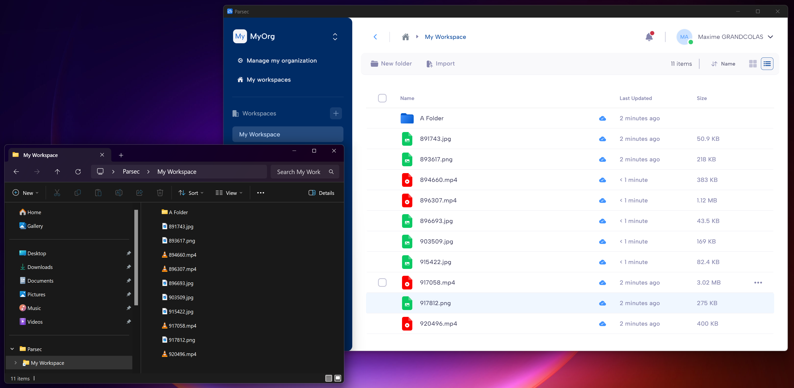

.. Parsec Cloud (https://parsec.cloud) Copyright (c) BUSL-1.1 2016-present Scille SAS

.. _doc_userguide_manage_files:

Files and folders
==============================

You can import files into a workspace. Files in a workspace are automatically shared with the users who have access to the workspace (see :ref:`Share a workspace <doc_userguide_parsec_workspaces_share>`). Depending on your :ref:`workspace role <doc_userguide_parsec_workspaces_roles>`, some features may not be available.

Importing files
---------------

Using the import button
^^^^^^^^^^^^^^^^^^^^^^^

Click on the button ``Import`` in the action bar and select ``Import files`` or ``Import a folder``.  Select the files or folder to import from your file system. The files will be imported in the current directory.

Using drag and drop
^^^^^^^^^^^^^^^^^^^

You can drag and drop files and folders directly from your file explorer to Parsec. This is the preferred method as you are able to import both files and folders at the same time. You can either drop the files on an empty space to import them in the current folder, or on a specific folder to place them inside it.

The import window
^^^^^^^^^^^^^^^^^

When you import files, the import windows appears automatically to show the progress. You can use Parsec during the import process. We strongly recommend that you do not close Parsec or log out before it has finished to guarantee that all your files are being imported.

When a file is imported, Parsec will start synchronizing it right away with the server. The cloud icon next to the file name indicates its synchronization status:

* File/Folder has not yet been synchronized yet.

  .. image:: screens/files/not_synced.png
    :width: 64

* File/Folder has been fully synchronized with the server and is available to other users in the workspace.

  .. image:: screens/files/synced.png
    :width: 64

Working with files and folders
------------------------------

Creating a folder
^^^^^^^^^^^^^^^^^

To create a new folder, simply click the ``New folder`` button, or right-click in an empty space in the file list to bring out the context menu and click ``New folder``.

Deleting files
^^^^^^^^^^^^^^

Either right-click on a file and select ``Delete``, or select a file and click ``Delete`` in the action bar, and then answer ``Yes`` when asked for confirmation. You can delete multiple files at the same time.

Renaming files
^^^^^^^^^^^^^^

Either right-click on a file and select ``Rename``, or select a file and click ``Rename`` in the action bar. Enter the file's new name in the pop-up. You can only rename one file at a time.

Copying files
^^^^^^^^^^^^^

Either right-click on a file and select ``Copy``, or select a file and click ``Copy`` in the action bar. In the pop-up, select the folder you want to copy your files into. You can copy multiple files at the same time. You can only copy files inside the same workspace.

Moving files
^^^^^^^^^^^^

Either right-click on a file and select ``Move``, or select a file and click ``Move`` in the action bar. In the pop-up, select the folder you want to move your files into. You can move multiple files at the same time. You can only move files inside the same workspace.

.. _userguide-share-file:

Share a link to a file
^^^^^^^^^^^^^^^^^^^^^^

You can securely share a link to a file with other users. Parsec ensures only users from the organization having access to the workspace will be able to open the link.

When a user clicks on the link, if they have the proper access and permissions, Parsec will open and point to the specific file.

In order to get a link to a file, either right-click on a file and select ``Copy link``, or select a file and click ``Copy link`` in the action bar. This will copy the file link that you can share with other users of the workspace (in an email for example).

File explorer integration
-------------------------

When you're logged-in to Parsec, your workspaces are available from the file explorer so you can access your data directly from your computer.

Each workspace is exposed in a specific folder matching the workspace name. You can add, delete, rename or open files, or any other other operations that you would normally do, as if your workspace was any regular folder on your computer.

Any operation performed in the file explorer will be automatically synchronized in Parsec.

If you logout or quit Parsec, your workspaces will no longer be accessible from the file explorer, until you log back in.

Opening a file
--------------

When you open a file in Parsec, it will be downloaded and stored locally so files that you open often will not have to be downloaded again. Large files may take some time to open the first time for this reason. If you are offline, only the files that have been downloaded while you were online can be opened.

Using an external application
^^^^^^^^^^^^^^^^^^^^^^^^^^^^^

When you double-click on a file, it will be opened with the default application that is associated with the file type on your system. This is therefore defined by your system and not by Parsec.

Using Parsec preview
^^^^^^^^^^^^^^^^^^^^

Some file types can be displayed directly in Parsec without using an external application.

If the file type is supported (see below), Parsec will display a preview of it. While this preview does not allow you to make any change, and may lack some of the functionality provided by external applications, it is the more secure way of viewing your files as they will not leave Parsec.

Parsec preview is limited to files with size inferior to 15MB. The following file formats are supported:

* PDF
* DOCX (Microsoft Word). XLSX (Microsoft Excel) support is coming soon.
* Audio
* Images
* Plain Text

Parsec preview can be disabled in the desktop application settings.

Recent documents
^^^^^^^^^^^^^^^^

Files you have recently opened are shown in the quick access menu in the sidebar for convenience.

