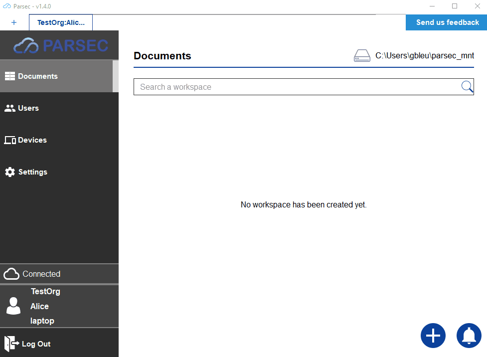
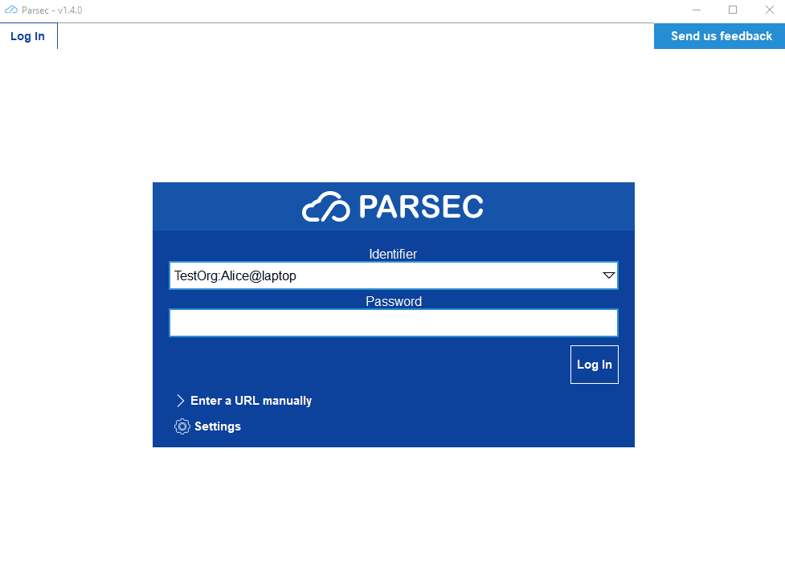

.. _doc_userguide_new_device:

Create new devices
==================

So far, we've only registered users on a single computer. However what would
happened if this computer get lost or stolen ?

For this reason it's a good idea for a user to register himself on multiple
computers.

To put it another way, a physical person is represented in Parsec by a user
and each computer this person has is represented in Parsec by a device.

Just like for the user, the device creation requires to have the inviting
and the invitee devices both connected to the server at the same time.

Invite step
-----------

Inviting a new device is done from the Parsec client:

Once started, the invitation is pending (note you can cancel it though) and an
invitation URL and token are displayed. The URL shoul now be transfered on
the invited computer.

.. warning::

    Device invitation URL and token should be provided to the invitee by two
    different means of communication.

    This is important to ensure protection against
    `man-in-the-middle <https://en.wikipedia.org/wiki/Man-in-the-middle_attack>`_
    attack.

.. note::

    For cryptographic reasons, a user can only create new devices for himself

Claim step
----------

From the new computer, clicking on the invitation URL should open up Parsec:

That's it! The user now has two devices, each on a different computer.

.. note::

    - If clicking on the URL doesn't work, you can also use the
      ``Enter a URL manually`` dialog inside Parsec.
    - The inviting device will also be notified of the successful claim.
    - Given the password is only used locally, it doesn't have to be the same
      across devices.
