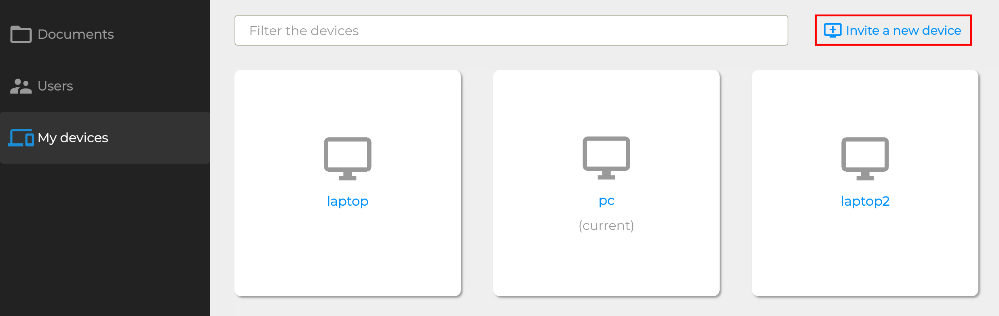
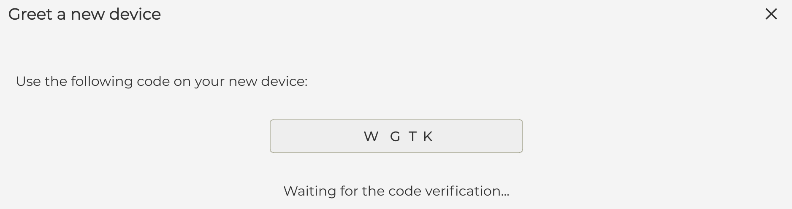
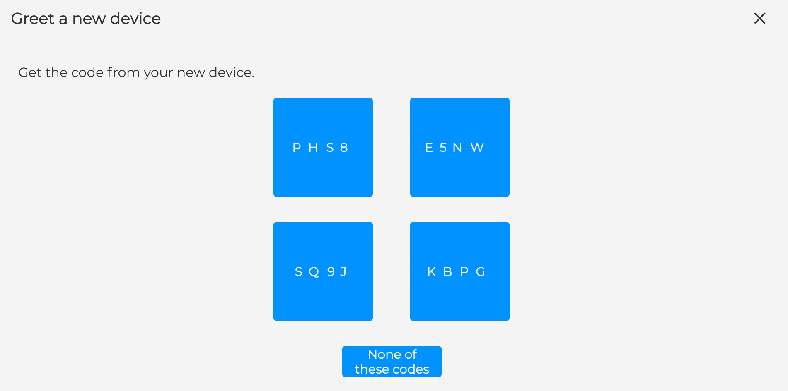

.. Parsec Cloud (https://parsec.cloud) Copyright (c) BUSL-1.1 (eventually AGPL-3.0) 2016-present Scille SAS

.. _doc_userguide_new_device:

Create new devices
==================

So far, we've only registered users on a single computer. However what would happened if this computer get lost or stolen ?

For this reason it's a good idea for a user to register himself on multiple computers.

To put it another way, a physical person is represented in Parsec by a user and each computer this person has is represented in Parsec by a device.

Just like for the user, the device creation requires to have the inviting and the invitee devices both connected to the server at the same time.

Send invite
-----------

Inviting a new device is done from the Parsec client:

Once started the invitation is pending (note you can cancel it though) and the user must check his emails for an invitation link that has been sent to him.

.. note::

    For cryptographic reasons, a user can only create new devices for himself.

Receive invite
--------------

The user should receive a link by email enabling him to register his device. Clicking on the invitation URL on the new computer should open up the Parsec client (it must have been installed previously). The token exchange will now start.

.. note::

    - If clicking on the URL doesn't work, you can also use the
      ``Enter a URL manually`` dialog inside Parsec.
    - Given the password is only used locally, it doesn't have to be the same
      across devices.

Token exchange
--------------

The token exchange is a verification process that aims at ensuring that the two devices are not victim of a `Man-in-the-middle attack <https://en.wikipedia.org/wiki/Man-in-the-middle_attack>`_. You can read more about that process at the :ref:`Cryptography <doc_cryptography>` section.

The user will have to proceed to a token exchange between the two devices. For that, the devices will both display a token, or a list of tokens : on the device with the list, the user must click on the token displayed by the Parsec client of the other device. If the token one of them is given is not present in the list, it means there is a very high probability that the user is victim of a `Man-in-the-middle attack <https://en.wikipedia.org/wiki/Man-in-the-middle_attack>`_.

The user’s new Parsec client has been configured and is ready to log in.
