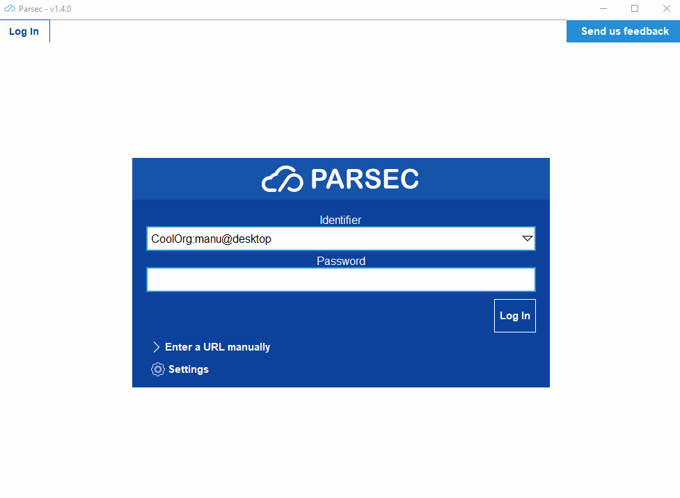

.. _doc_userguide_installation:

Create&Bootstrap your own organization
======================================

Once installed, the Parsec client must be connected to an organization that have
been created on a Parsec server.

The simplest way to do that is to join the `Parsec SAAS service <https://my.parsec.cloud/>`_
and create an organization from there. This should provides you with an organization bootstrap
URL in the style ``parsec://saas.parsec.cloud/TestOrg?action=bootstrap_organization&token=e5d61d7eb1d94fd32``.

.. note::

    Another possibility (though more technical) is to host you own Parsec server
    and create the organization on it using the Parsec CLI.
    You can read about this in the :ref:`the Hosting server <doc_hosting_server>`
    part.

This URL is needed to bootstrap the organization by registering yourself as its
first user and device. Clicking on the URL should bring up Parsec client
(starting it if needed) with the following view:

.. note::

    If clicking on the URL doesn't work, you can also use the
    ``Enter a URL manually`` dialog.

Few key points here:

- User name is the name you'll be referenced by from within the organization
- Device name is the name your current hardware will be referenced by (e.g.
  people will see the work you've done on this computer as from ``Alice@laptop``)
- The password is used to encrypt your user&device private keys on your computer.

.. note::

    The keys stored encrypted on your computer are what makes Parsec secure.
    Hence there is no way to recover if you lost them (e.g. if you computer is
    stolen) or if you forget the password protecting them.

    To avoid losing access to your data you should always have
    :ref:`multiple devices <doc_userguide_new_device>` or
    :ref:`share your workspaces <doc_userguide_share_data>` with other users.
