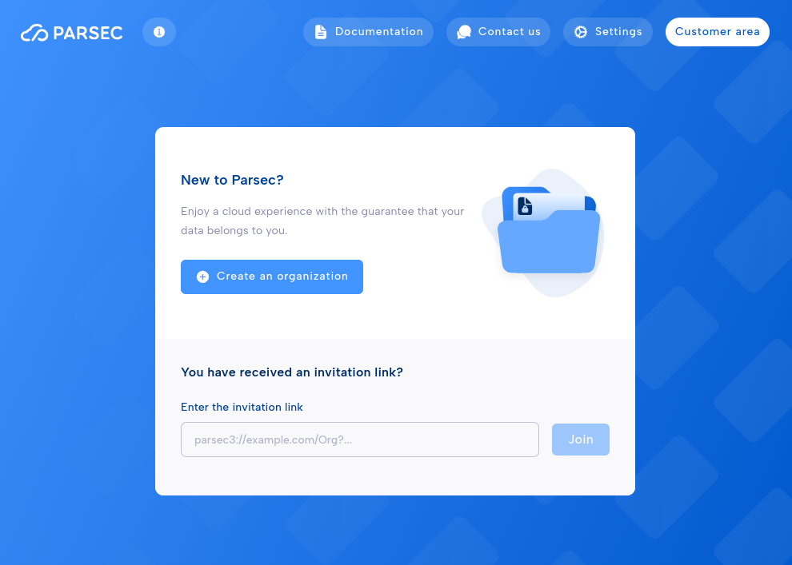
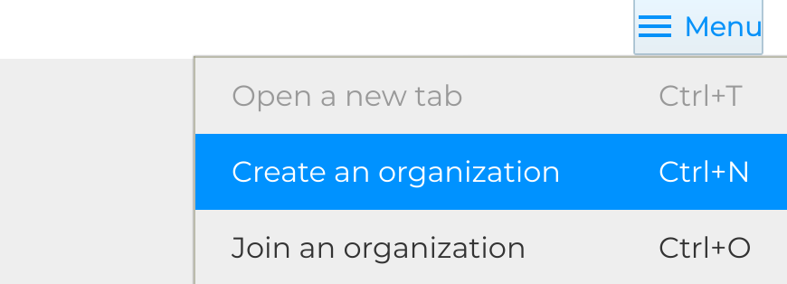
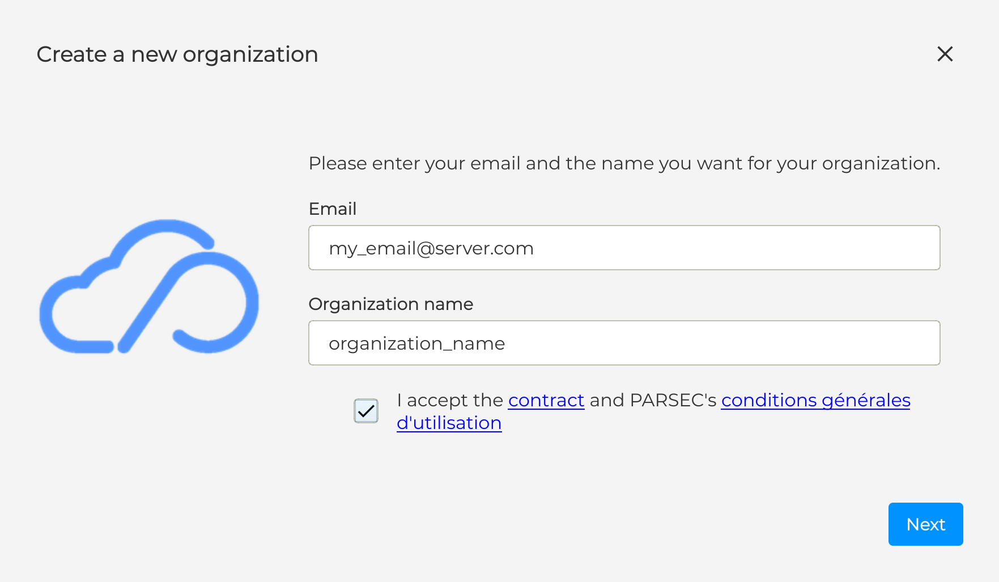
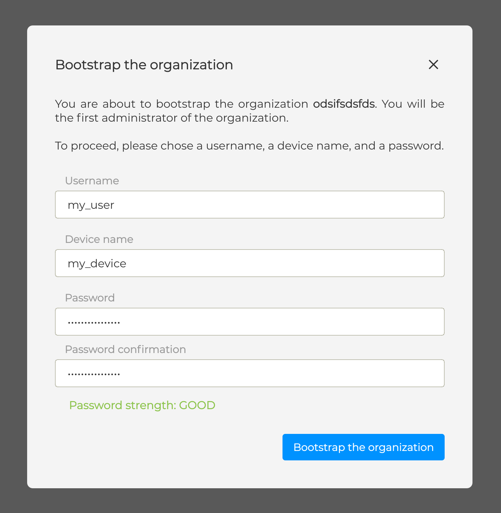

.. Parsec Cloud (https://parsec.cloud) Copyright (c) BUSL-1.1 (eventually AGPL-3.0) 2016-present Scille SAS

.. _doc_userguide_installation:

Create your own organization
============================

Once installed, the Parsec client must be connected to an organization that have been created on a Parsec server.

The simplest way to do that is to create one directly from the Parsec client. It automatically handles all the process securely, and create a temporary account on the `Parsec SAAS service <https://my.parsec.cloud/>`_, sending an invitation link to end registration through email.

Creating an organization is proposed automatically if you have no account linked to your Parsec client.

Otherwise, you can click on `Create an organization` in the Menu of the login screen.

.. note::

    Another possibility (though more technical) is to host you own Parsec server and create the organization on it using the Parsec CLI. You can then join that organization using an organization bootstrap URL.
    You can read about this in the :ref:`the Hosting server <doc_hosting_server>` part.

Once you start the process, you are asked for an Email and an Organization Name. This email address will be used to contact you later.

Creating an organization through the Parsec client register yourself as its first user and device (this step is called the bootstrap). This is why you must enter your Username, Device name, and your Password.

Few key points here:

- User name is the name you'll be referenced by from within the organization
- Device name is the name your current hardware will be referenced by (e.g.
  people will see the work you've done on this computer as from ``my_user@my_device``)
- The password is used to encrypt your user&device private keys on your computer.

Once this process is completed, you can log-in to the organization you just created.

.. warning::

    The keys stored encrypted on your computer are what makes Parsec secure.
    Hence there is no way to recover if you lost them (e.g. if you computer is
    stolen) or if you forget the password protecting them.

    To avoid losing access to your data you should always have
    :ref:`multiple devices <doc_userguide_new_device>` or
    :ref:`share your workspaces <doc_userguide_share_data>` with other users.
