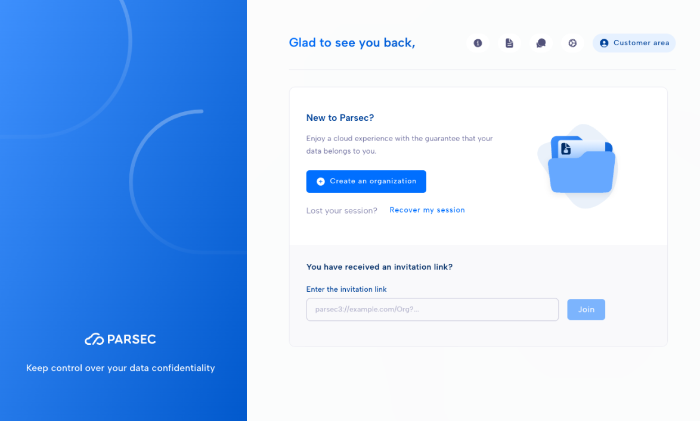

.. Parsec Cloud (https://parsec.cloud) Copyright (c) BUSL-1.1 2016-present Scille SAS

.. _doc_userguide_new_organization:

Create an organization
======================

When you start Parsec for the first time, the welcome screen will propose to
**create** or **join** an organization.

Create an organization on Parsec
--------------------------------

This is the preferred option. Your organization will be securely created on our
servers and associated to your customer account.

.. note::

  Please `visit our website to choose the offer <https://parsec.cloud/tarification/>`_
  that best suits your needs and follow the steps to create your account.

.. image:: screens/create_organization.png
    :align: center
    :alt: Create an organization

If you already have a customer account on Parsec, follow the steps below to
create your organization:

1. Start by clicking ``Create an organization`` on the welcome screen.
2. Select ``Create my organization on Parsec``.
3. Log in with your customer account.
4. Enter the organization name (this name cannot be changed later).
5. Choose the preferred authentication method (this can be changed later from
   your profile).
6. Check the information entered and confirm.

🚀 Congratulations, you've just created your organization on Parsec!

You are ready for your :ref:`first steps with Parsec! <doc_userguide_first_steps>`

Create an organization on Trial
-------------------------------

Our **Trial service** allows you to **test Parsec for a limited time**. Your
organization will be securely created on our servers. No customer account is
required.

.. warning::

  Your organization and associated data will be deleted at the end of the trial
  period.

1. Start by clicking ``Create an organization`` on the welcome screen.
2. Select ``Try Parsec for 15 days``.
3. Enter your name and email address.

You are ready for your :ref:`first steps with Parsec! <doc_userguide_first_steps>`

Create an organization on my own Parsec server
----------------------------------------------

Follow the steps below to create an organization on your own Parsec server:

1. Start by clicking ``Create an organization`` on the welcome screen.
2. Select ``Use a different Parsec server``.
3. Specify the organization name and the address of your own Parsec server.

You are ready for your :ref:`first steps with Parsec! <doc_userguide_first_steps>`

.. note::

  You can read more about hosting Parsec server in the :ref:`Hosting Guide <doc_adminguide_hosting>`.
