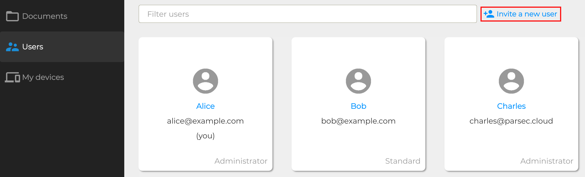
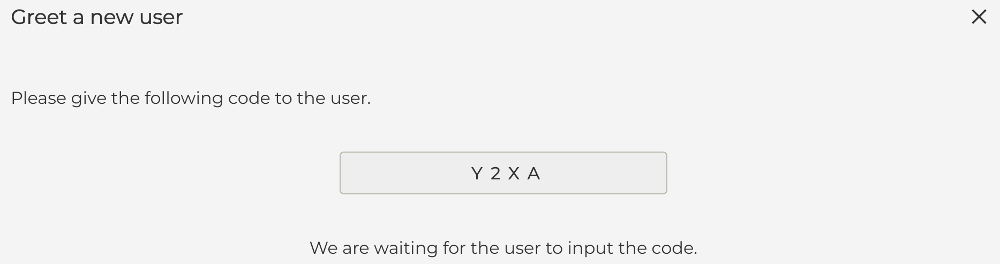
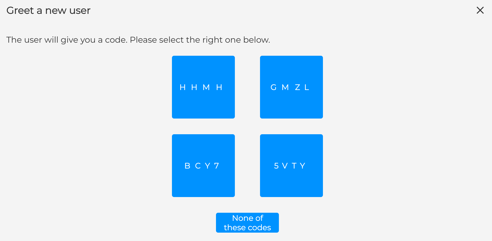

.. Parsec Cloud (https://parsec.cloud) Copyright (c) BUSL-1.1 (eventually AGPL-3.0) 2016-present Scille SAS

.. _doc_userguide_new_user:

Create new users
================

Now that our organization is ready, we can start inviting new users.

In Parsec, inviting a user is a critical operation that aims at building trust toward an unknown user the inviting using has vouched for. For this reason the operation requires both the invitee and inviting users to be connected to the Parsec server at the same time.

Send invite
-----------

Inviting a user is done from the Parsec client:

Once started the invitation is pending (note you can cancel it though) and the invitee must check his emails for an invitation link that has been sent to him.

It's also during this step that is chosen if the invitee will have administrator rights over the organization. Make sure to double check this as you won't be able to change that later.

.. note::

    Only an administrator of the organization can invite a new user

Receive invite
--------------

The invitee should receive a link by email enabling him to register. Clicking on the invitation URL should open up the Parsec client. The token exchange will now start.

.. note::

    If clicking on the URL doesn't work, you can also use the ``Enter a URL manually`` dialog.

Token exchange
--------------

The token exchange is a verification process that aims at ensuring that the two users are not victim of a `Man-in-the-middle attack <https://en.wikipedia.org/wiki/Man-in-the-middle_attack>`_. You can read more about that process at the :ref:`Cryptography <doc_cryptography>` section.

The inviting and the invitee will have to exchange tokens in person or on an already verified canal. For that, they will both be given a token, or a list of tokens : the user with the list must click on the token displayed by the Parsec client of the other user. If the token one of them is given is not present in the list, it means there is a very high probability that one of the user is victim of a `Man-in-the-middle attack <https://en.wikipedia.org/wiki/Man-in-the-middle_attack>`_.

The invitee user’s Parsec client has been configured and is ready to log in.
