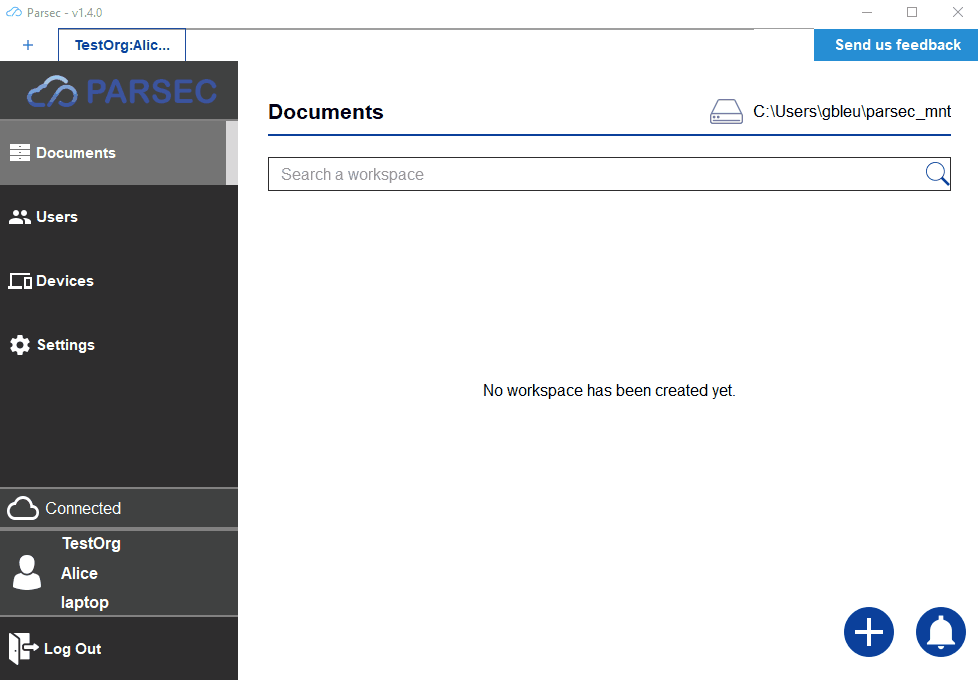
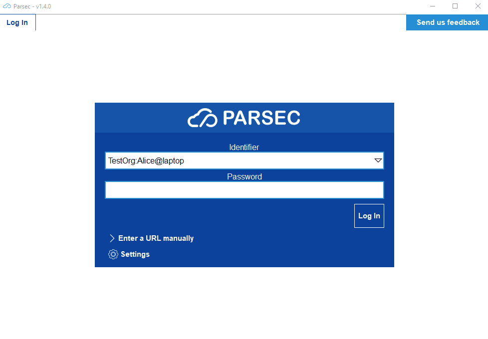

.. _doc_userguide_new_user:

Create new users
================

Now that our organization is ready, it's time to start inviting new users!

In Parsec, inviting a user is a critical operation that aims at building
trust toward an unknown user the inviting using has vouched for.
For this reason the operation requires both the invitee and inviting users to
be connected to the Parsec server at the same time.

Invite step
-----------

Inviting a user is done from the Parsec client:

Once started the invitation is pending (note you can cancel it though) and an
invitation URL and token are displayed. Those URL and token should be provided
to the invitee.

It's also during this step that is chosen if the invitee will have administrator
rights over the organization. Make sure to double check this as you won't be
able to change that later!

.. warning::

    User invitation URL and token should be provided to the invitee by two
    different means of communication (i.g. URL sent by email and token by phone).

    This is important to ensure protection against
    `man-in-the-middle <https://en.wikipedia.org/wiki/Man-in-the-middle_attack>`_
    attack.

.. note::

    Only an administrator of the organization can invite a new user

Claim step
----------

From the invitee user's computer, clicking on the invitation URL should open up
Parsec client:

That's it! The invitee user's Parsec client has been configured and is ready
to log in.

.. note::

    - If clicking on the URL doesn't work, you can also use the
      ``Enter a URL manually`` dialog.
    - The inviting user will also be notified of the successful claim.
