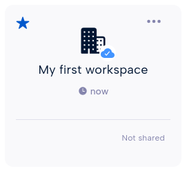
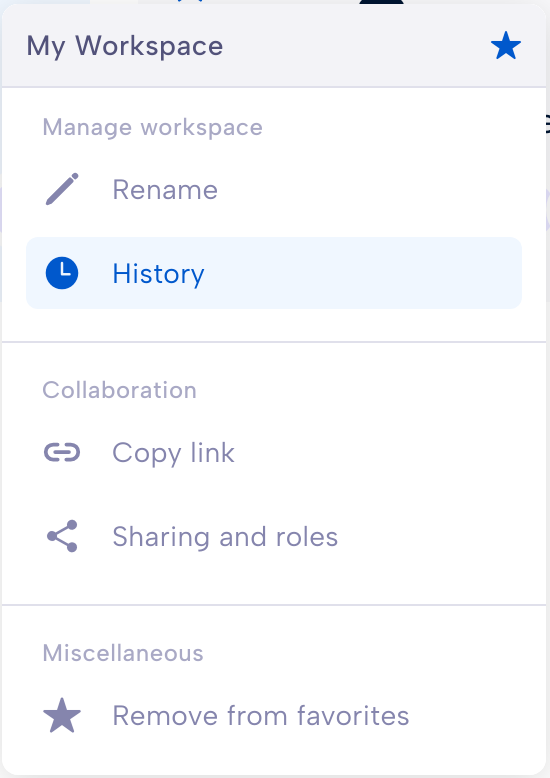
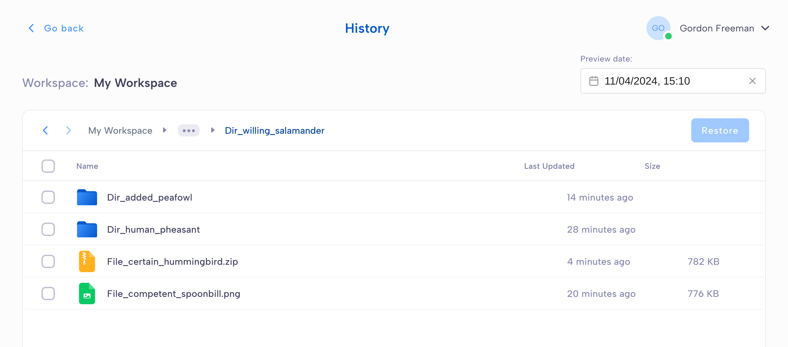
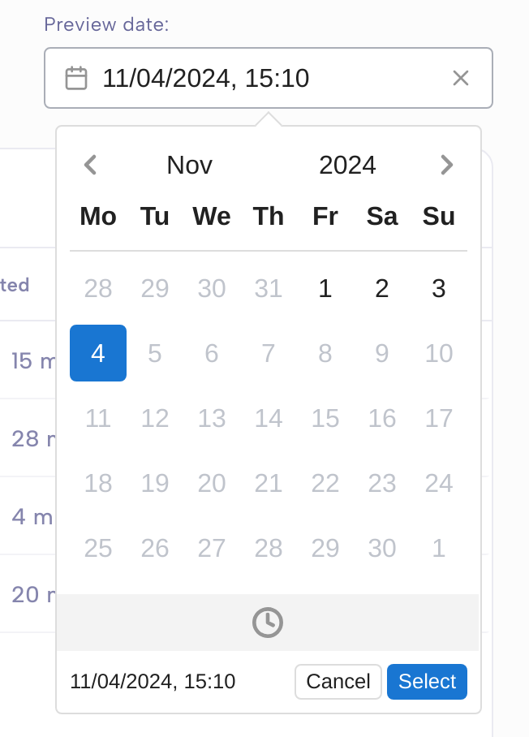
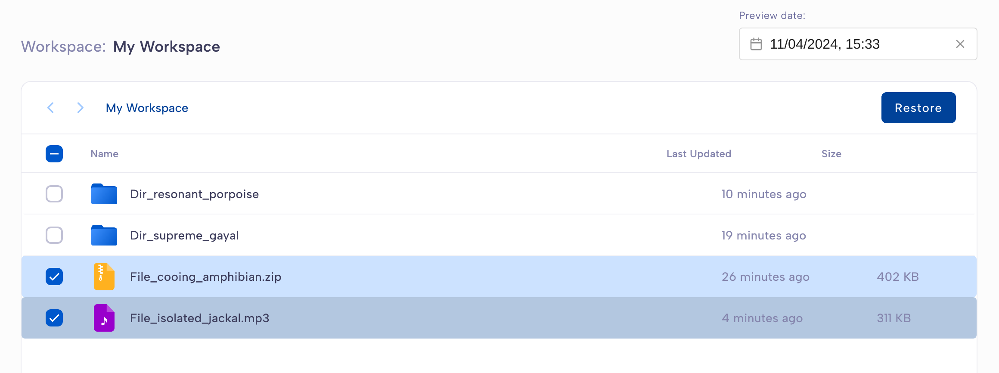
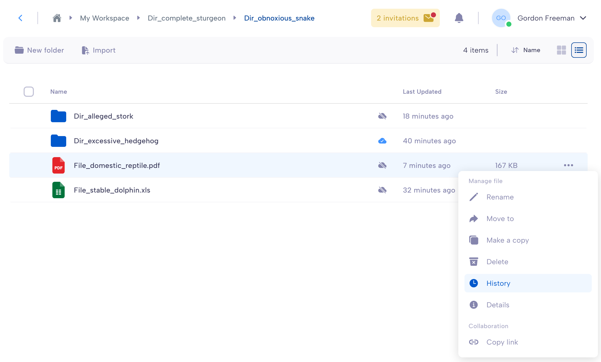

.. Parsec Cloud (https://parsec.cloud) Copyright (c) BUSL-1.1 2016-present Scille SAS

.. _doc_userguide_parsec_workspaces:

Parsec workspaces
=================

In Parsec, your data is securely stored within **workspaces**.

You can import your data into a Parsec workspace and manage your files and
directories as you will do with a regular file explorer.

.. image:: screens/parsec_file_explorer.png
    :align: center
    :alt: Parsec file explorer

Workspaces are mounted by default in your system and will also appear in the
file explorer as regular folders. This is convenient to copy files from and to
Parsec.

Each workspace has its own :ref:`role-based policy <doc_userguide_parsec_workspaces_roles>`
for read and write access. This allows a fine-grained access control as each
member can have different roles in different workspaces.

.. note::

    When you are offline, you can still access documents provided they were
    synchronized by Parsec while connected. Synchronization will occur
    automatically as soon as the connection with the server is established.

.. mount/unmount function not yet available on V3
.. .. note::
..     Although workspaces are mounted by default, they can be unmounted or mounted back using the toggle at the bottom left of the workspace card. When a workspace is unmounted, his data are not accessible in Parsec, and it is not reachable through the regular file explorer of the computer.
..     .. image:: screens/workspace_unmounted_mounted.png
..         :align: center
..         :alt: workspaces unmounted and mounted
..
..
.. .. image:: screens/parsec_file_explorer.png
..    :align: center
..    :alt: Parsec in file explorer

.. _doc_userguide_parsec_workspaces_create:

Create a workspace
------------------

You can create a workspace by clicking ``New workspace`` and entering a name for
the workspace.

.. image:: screens/create_workspace.png
    :align: center
    :alt: Creating a workspace

When you create a workspace, you automatically get the :ref:`Owner role <doc_userguide_parsec_workspaces_roles>`
within the workspace.

.. _doc_userguide_parsec_workspaces_share:

Share a workspace
-----------------

If you have the **Owner** or **Manager** role, the ``Sharing and roles`` option
will be available from the workspace menu.

Find the member you want to share the workspace with and select its
:ref:`workspace roles <doc_userguide_parsec_workspaces_roles>`.

.. image:: screens/share_workspace.png
    :align: center
    :alt: Sharing a workspace

Depending on the member profile within the organization, some roles may not be
available for the selected member.

You can remove access to this workspace by selecting ``Not shared`` for a given
member.

.. _doc_userguide_parsec_workspaces_roles:

Workspace roles
---------------

The **workspace role** defines what the member is allowed to do within the
workspace. Since the role is specific to the workspace, a member can have
different roles in different workspaces.

The available roles and what they allow to do are shown in the following table.

.. list-table::
   :align: center
   :header-rows: 1

   * - Member rights
     - Reader
     - Contributor
     - Manager
     - Owner
   * - Can view and open files
     - ✅
     - ✅
     - ✅
     - ✅
   * - Can edit, import and delete files
     - ❌
     - ✅
     - ✅
     - ✅
   * - Can manage member access to the workspace
     - ❌
     - ❌
     - ✅
     - ✅
   * - Can re-encrypt the workspace
     - ❌
     - ❌
     - ❌
     - ✅
   * - Can promote other members to Owner
     - ❌
     - ❌
     - ❌
     - ✅

Members without a role in the workspace, are not allowed to access nor see the
workspace.

.. warning::
  It is recommended to always share the workspace with other members.

  Strong cryptographic security prevents data recovery. If the workspace is
  not shared with others, and the member loses access to its device or cannot
  log in for any reason, data stored in the workspace will be lost forever.

Browse workspace history and restore files
------------------------------------------

Parsec allows you to browse a workspace at a given time, showing you all the files as they were.
You will need to have the **Owner** or **Manager** roles on the workspace.
The ``History`` option is available in the workspace context menu.

Once you enter the History mode, you can navigate inside the workspace as you normally would.

If you change the date or time, files and folders will be automatically updated to reflect the state of the workspace at this moment.
You can only select a time between the workspace's creation date and the current date.

If you want to restore a file or a folder, select it and click ``Restore``. This will replace the current version of the file with the version from the selected date and time.

.. note::

  If you make a mistake, don't worry, the file history is incremental and therefore it is never deleted! Let's take an example with a file named **File.txt** whose content has been updated as follows:

    #. On April 1st, **Creation** of the file with the content **AAA**. This is **version 1**.
    #. On April 5th, **Update** of the file with the content **BBB** (replacing the previous content). This is **version 2**.
    #. On April 7th, **Update** of the file with the content **CCC** (replacing the previous content). This is **version 3**.

  If you look at this workspace history on April 6th, the content of the file will be **BBB**. Should you chose to restore this version, the content of **File.txt** (**CCC** currently) will be replaced by **BBB**. This will be **version 4**, which means that **version 3** has not been deleted, and if you later change your mind, you will still be able to restore it.

You can also explore the workspace history from a specific file. This will open the history page directly where the file is stored.

