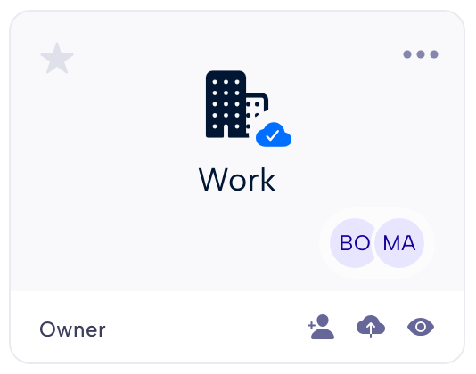

.. Parsec Cloud (https://parsec.cloud) Copyright (c) BUSL-1.1 2016-present Scille SAS

.. _doc_userguide_parsec_workspaces:

Parsec workspaces
=================

In Parsec, your data is securely stored within **workspaces**.

You can import your data into a Parsec workspace and manage your files and
directories as you will do with a regular file explorer.

.. image:: screens/parsec_file_explorer.png
    :align: center
    :alt: Parsec file explorer

Workspaces are mounted by default in your system and will also appear in the
file explorer as regular folders. This is convenient to copy files from and to
Parsec.

Each workspace has its own :ref:`role-based policy <doc_userguide_share_data_workspace_roles>`
for read and write access. This allows a fine-grained access control as each
user can have different roles in different workspaces.

.. note::

    When you are offline, you can still access documents provided they were
    synchronized by Parsec while connected. Synchronization will occur
    automatically as soon as the connection with the server is established.

.. mount/unmount function not yet available on V3
.. .. note::
..     Although workspaces are mounted by default, they can be unmounted or mounted back using the toggle at the bottom left of the workspace card. When a workspace is unmounted, his data are not accessible in Parsec, and it is not reachable through the regular file explorer of the computer.
..     .. image:: screens/workspace_unmounted_mounted.png
..         :align: center
..         :alt: workspaces unmounted and mounted
..
..
.. .. image:: screens/parsec_file_explorer.png
..    :align: center
..    :alt: Parsec in file explorer

Create a workspace
------------------

You can create a workspace by clicking ``New workspace`` and entering a name for
the workspace.

.. image:: screens/create_workspace.png
    :align: center
    :alt: Creating a workspace

When you create a workspace, you automatically get the :ref:`Owner role <doc_userguide_share_data_workspace_roles>`
within the workspace.

Share a workspace
-----------------

If you have the **Owner** or **Manager** role, the ``Sharing and roles`` option
will be available from the workspace menu.

Find the user you want to share the workspace with and select its
:ref:`workspace roles <doc_userguide_share_data_workspace_roles>`.

.. image:: screens/share_workspace.png
    :align: center
    :alt: Sharing a workspace

Depending on the user profile within the organization, some roles may not be
available for the selected user.

You can remove access to this workspace by selecting ``Not shared`` for a given
user.

.. _doc_userguide_share_data_workspace_roles:

Workspace roles
---------------

The **workspace role** defines what the user is allowed to do within the
workspace. Since the role is specific to the workspace, a user can have
different roles in different workspaces.

Here are the available roles:

- **Reader**: Can view and open files.
- **Contributor**: Can edit, import and delete files.
- **Manager**: Can manage user access to the workspace.
- **Owner**: Can manage user access and re-encrypt the workspace. Can promote other users to Owner

Users without a role in the workspace, are not allowed to access nor see the
workspace.

.. warning::
  It is recommended to always share the workspace with other users.

  Strong cryptographic security prevents data recovery. If the workspace is
  not shared with others, and the user loses access to its device or cannot
  log in for any reason, data stored in the workspace will be lost forever.
