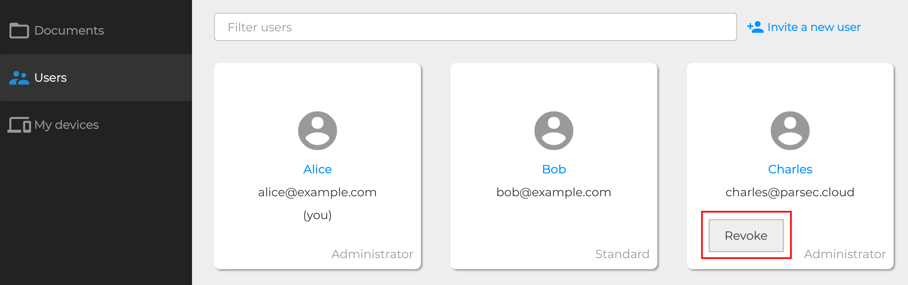
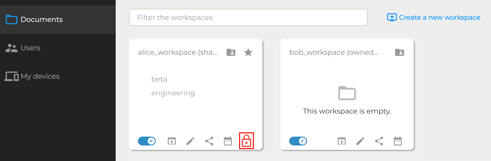

.. Parsec Cloud (https://parsec.cloud) Copyright (c) BUSL-1.1 (eventually AGPL-3.0) 2016-present Scille SAS

.. _doc_userguide_revoke_user:

Revoking users
==============

Revoking a user is the operation that aims at removing his access rights to the organization. This is needed when:

- the user is no longer needed (e.g. a person leaving his company)
- the user has been compromised

.. note::

    There is no way to revoke a single device instead of the entire user.
    This is intended given the compromised device has the knowledge of some
    cryptographic secrets shared among all the user's devices.

Revocation
----------

Revocation is done from the client, this option is accessible by right-clicking on a user:

.. note::

    - Only an administrator of the organization can revoke a user
    - Revocation is irreversible!

Workspace re-encryption
-----------------------
.. _doc_userguide_revoke_user_workspace_re_encryption:

Once a user is revoked, it corresponding devices are no longer allowed to connect to the Parsec server hosting the organization. In practice this means the user won't be able to do any changes or to consult the data he used to have access to.

However from a cryptographic point of view this user still knows the encryption key of the workspaces that have been shared with them. For this reason, those workspaces must be re-encrypted to ensure security of the data.

Concretely, once a user is revoked, each owner of a previously shared workspace will be notified a re-encryption operation is needed. Each owner can then choose to do the operation on the spot, or to wait until a better time to do it (for instance if multiple user are getting revoked in one batch).

.. note::

    - During it re-encryption, a workspace cannot be synchronized
    - Re-encryption is fairly quick given only metadata are re-encrypted
