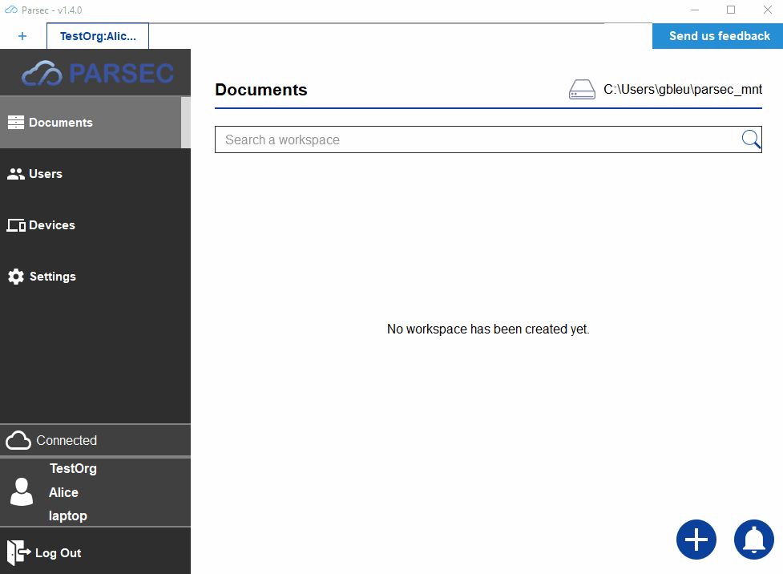
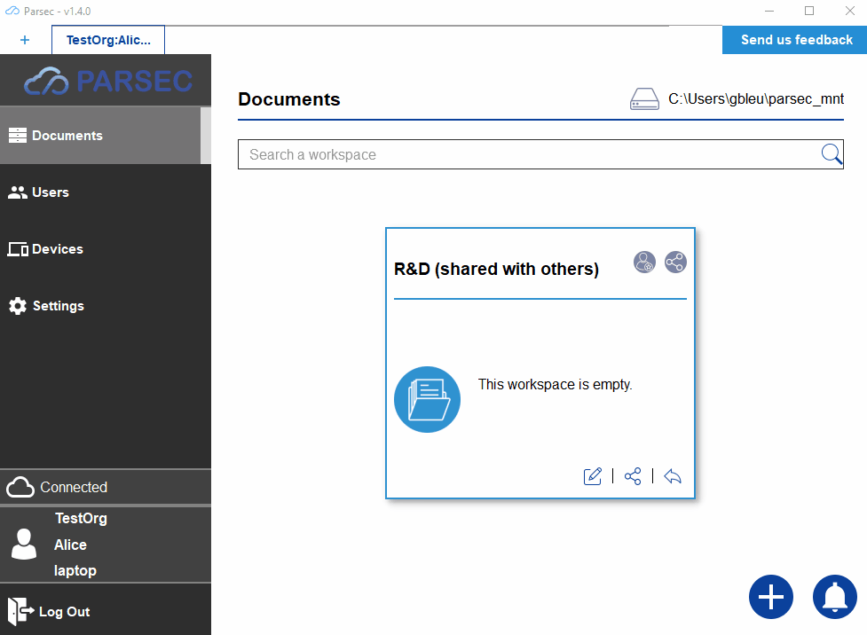

.. _doc_userguide_share_data:

Share data
==========

Create & share workspace
------------------------

In Parsec, data are stored into workspaces, each workspace having it own policy
for read and write access.

So before adding data to Parsec we must create a workspace:

The creator of the workspace automatically gets the ``Owner`` role, as shown
above, and can then share the workspace with other users.

Regarding the different sharing roles:

- Reader: Has read-only access to the workspace
- Contributor: Has read&write access
- Manager: same access as Contributor, but can give Reader and Contributor
  roles to other users.
- Owner: same as Manager, but can also give Manager and Owner roles to other users.
  On top of that, owners are responsible for maintenance tasks such as
  :ref:`workspace re-encryption <doc_userguide_revoke_user_workspace_re_encryption>`.

.. warning::

    Just like a user with a single device is bad because there is no fall-back if
    something happens to it, having a workspace with a single user is dangerous!

    Strong cryptographic security prevent from data recovery if the user is
    lost or cannot log in. For this reason it's better to share the workspace
    with other users.

Upload data
-----------

Once the workspace is created, it appears in the file explorer as a regular
folder.

As you can see data copied from file explorer also appear into the Parsec
client. On top of that the Parsec client also displays the current synchronization
state of each file (showing whether the modification are only present locally or
if they have been synced with the server and hence are visible by everybody with
access to the workspace).

.. note::

    Parsec client can work while offline (however only the data present locally
    are available), synchronization will occur automatically as soon as the
    connection with the server is achieved.
