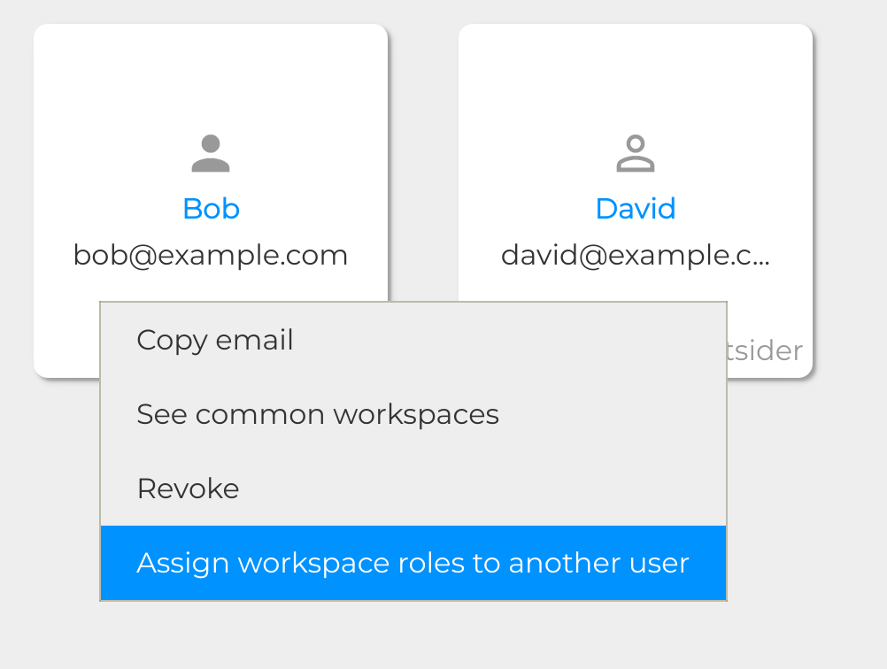

.. Parsec Cloud (https://parsec.cloud) Copyright (c) BUSL-1.1 (eventually AGPL-3.0) 2016-present Scille SAS

.. _doc_userguide_share_data:

Share data
==========

Create & share workspace
------------------------

In Parsec, data are stored into workspaces, each workspace having its own policy
for read and write access.

So before adding data to Parsec we must create a workspace:

.. image:: screens/create_workspace.png
    :align: center
    :alt: Creating workspace process

The creator of the workspace automatically gets the ``Owner`` role, as shown
above, and can then share the workspace with other users.

.. image:: screens/share_workspace.png
    :align: center
    :alt: Sharing workspace process

Regarding the different sharing roles:

- Reader: has read-only access to the workspace
- Contributor: has read and write access
- Manager: same as Contributor and can also Reader and Contributor roles to other users.
- Owner: same as Manager and can also give Manager and Owner roles to other users.
  In addition to this, Owners are responsible for maintenance tasks such as
  :ref:`workspace re-encryption <doc_userguide_revoke_user_workspace_re_encryption>`.

.. warning::

    Just like a user with a single device is bad because there is no fall-back if something happens to it, having a workspace with a single user is dangerous.

    Strong cryptographic security prevent data recovery if the user is lost or cannot log in. For this reason it is better to share the workspace with other users.

Upload data
-----------

Once the workspace is created, it appears in the file explorer as a regular folder.

.. note::

    Although workspaces are mounted by default, they can be unmounted or mounted back using the toggle at the bottom left of the workspace card. When a workspace is unmounted, his data are not accessible in Parsec, and it is not reachable through the regular file explorer of the computer.

    .. image:: screens/workspace_unmounted_mounted.png
        :align: center
        :alt: workspaces unmounted and mounted

Parsec also proposes its own file manager, accessible when clicking on a mounted workspace.

.. image:: screens/parsec_file_explorer.png
    :align: center
    :alt: Parsec in file explorer

Data copied from file explorer also appear in the Parsec client. In addition, the Parsec client also displays the current synchronization state of each file (showing whether the modifications are only present locally or they have been synced with the server and hence are visible by everyone with access to the workspace).

.. note::

    Parsec client can work while offline (however only data present locally
    are available), synchronization will occur automatically as soon as the
    connection with the server is established.

Bulk assign workspace roles to users
------------------------------------

Manually assigning the same workspace roles to multiple users can be a bit tedious and error prone. Parsec provides a way to bulk assign the roles from one user to another.

1. In the Users page, right click on the user you want to copy the roles from:

2. Search the user you want to assign the roles to:

3. You're shown a summary of which roles are going to be assigned on each workspace. Click on `Assign roles` to complete the operation.

.. note::

    1. You can only assign roles on a workspace where you have an Owner or Manager role
    2. An Outsider user cannot have a role higher than Contributor
    3. You cannot assign roles higher than your own. If you have the Manager role in a workspace and you're trying to assign the Owner role, it will be downgraded to Contributor).
    4. If the user already has a higher role on the workspace than the one you're trying to assign, no change will be made to its role
    5. The option is only available if you have workspaces in common with the source user and you have a role high enough
