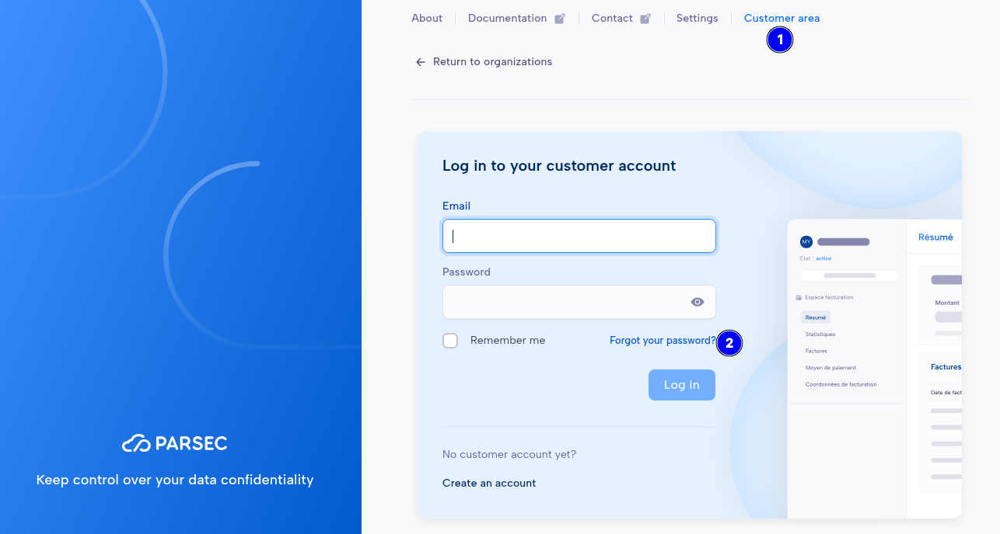

.. Parsec Cloud (https://parsec.cloud) Copyright (c) BUSL-1.1 2016-present Scille SAS

.. _doc_userguide_troubleshooting_cannot_login_customer_area:

Cannot login to my Customer Area (Parsec SaaS)
==============================================

The Customer Area is the home of your Parsec SaaS subscription, where you can find information about
your organization statistics, invoices, payment methods and billing address.

If you forgot your password, you can reset it from the Customer Area login page:

1. Go to the **Customer area** (1)
2. Click **Forgot your password?** (2)
3. Enter the e-mail address used for your Parsec SaaS subscription

You will receive an e-mail with instructions to reset your password. Check your spam folder in case
your e-mail service is filtering it.

If you don't receive the e-mail, or have other problems to login, please contact us at
`support@parsec.cloud <mailto:support@parsec.cloud?subject=Cannot%20login%20to%20my%20customer%20area>`_.
