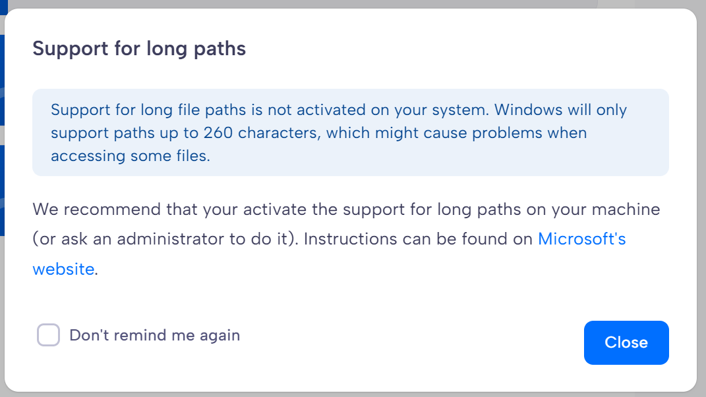

.. Parsec Cloud (https://parsec.cloud) Copyright (c) BUSL-1.1 2016-present Scille SAS

.. _doc_userguide_troubleshooting_ms_filename_too_long:

Microsoft Word or Similar Software Reports That the File Name Is Too Long
-------------------------------------------------------------------------

This error is caused by Microsoft's `Maximum File Path Limitation <https://learn.microsoft.com/en-us/windows/win32/fileio/maximum-file-path-limitation>`_.

When opening or saving a file, the full path must not exceed 260 characters. This limit includes the drive name (for example, D:), all intermediate folder names, the path separators (\) between folders, and the file name itself.

When Parsec starts, it automatically checks whether your system supports long file paths and displays an information dialog if it does not. It does not make the change for you.

Enabling long path support is a standard Windows configuration change. It is widely used, recommended by Microsoft, and we are not aware of any issues caused by enabling it.
