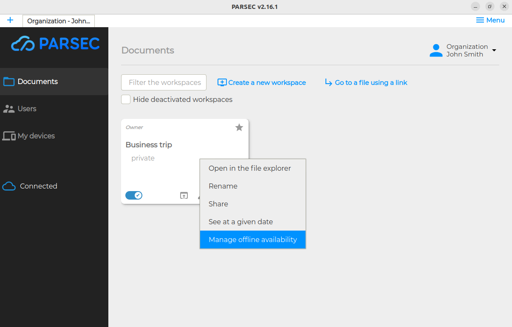

.. Parsec Cloud (https://parsec.cloud) Copyright (c) BUSL-1.1 2016-present Scille SAS

.. _doc_userguide_workspace_offline_mode:

Offline mode for Workspace
==========================

The offline mode allows you to access the workspace data even if you are not connected to the server.

To enable or disable the offline mode, right-click on a workspace and select ``Manage offline availability`` from the context menu.

From the dialog, enable or disable offline mode by clicking the toggle button ``Offline availability``.

- Offline mode is disabled:

  .. image:: screens/workspace_offline_modal_disabled.png
    :alt: Offline mode disabled

- Offline mode is enabled:

  .. image:: screens/workspace_offline_modal_enabled.png
    :alt: Offline mode enabled

In both cases, the dialog displays the amount of data available locally and the total amount of data in the workspace.
